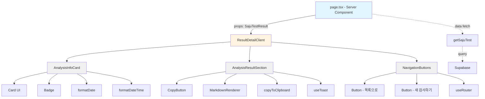
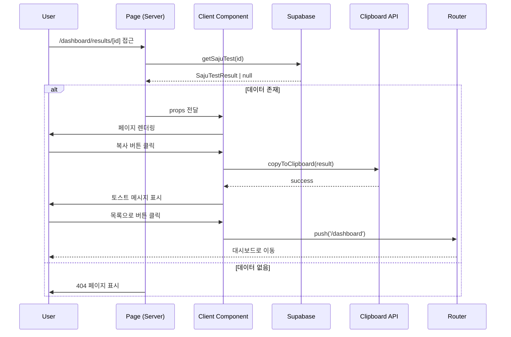
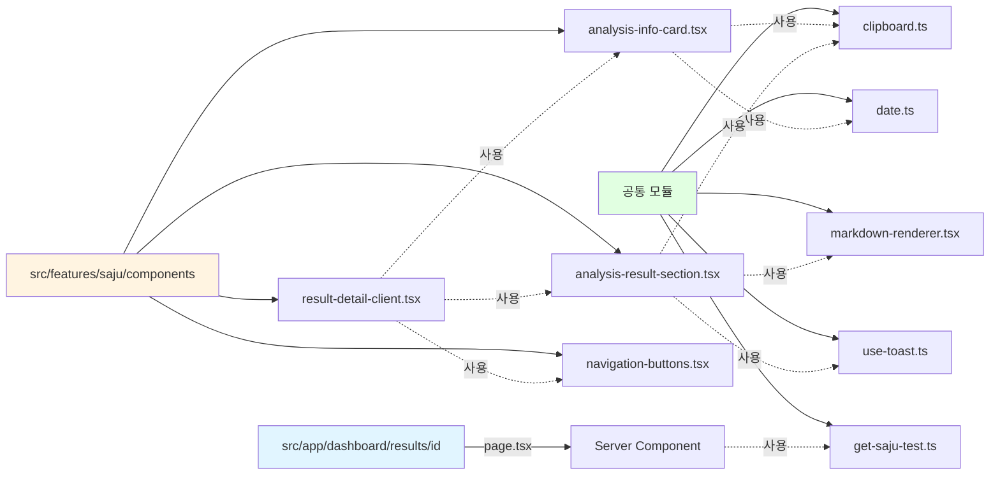

# 사주분석 상세 페이지 구현 계획

## 1. 페이지 개요 및 목적

### 1.1 목적
사용자가 과거에 생성한 사주분석 결과를 상세하게 조회하고, 분석 결과를 활용할 수 있도록 한다.

### 1.2 핵심 기능
- 특정 사주분석 결과의 상세 정보 조회
- 분석 대상 정보 표시 (이름, 생년월일, 출생시간, 성별, 분석 날짜)
- 마크다운 형식의 AI 분석 결과 렌더링
- 분석 결과 클립보드 복사 기능
- 다른 페이지로의 네비게이션 (목록, 새 검사)

### 1.3 제외 사항
- 분석 결과 수정 기능
- 분석 결과 삭제 기능
- PDF 다운로드 기능
- 소셜 공유 기능

---

## 2. 라우트 및 접근 권한

### 2.1 라우트
- **경로**: `/dashboard/results/[id]`
- **타입**: 동적 라우트 (Dynamic Route)
- **파라미터**: `id` (UUID 형식의 사주분석 ID)

### 2.2 접근 권한
- **로그인 필요**: 예
- **본인만 접근**: 예 (Supabase RLS 정책으로 보장)
- **미들웨어 보호**: Clerk middleware를 통해 인증 상태 확인

### 2.3 권한 검증 플로우
1. Clerk 미들웨어가 세션 확인
2. 비로그인 시 로그인 페이지로 리다이렉트
3. Supabase RLS 정책이 user_id 일치 여부 확인
4. 권한 없으면 null 반환 → 404 페이지 렌더링

---

## 3. 사용할 공통 모듈 목록

### 3.1 데이터 레이어
- **`@/features/saju/queries/get-saju-test.ts`**: 사주분석 상세 조회 함수 (이미 구현됨)
- **`@/features/saju/types/result.ts`**: `SajuTestResult` 타입 (이미 구현됨)
- **`@/lib/supabase/server-client.ts`**: Supabase 서버 클라이언트 (이미 구현됨)

### 3.2 UI 컴포넌트
- **`@/components/markdown-renderer.tsx`**: 마크다운 렌더러 (이미 구현됨)
- **`@/components/layout/dashboard-header.tsx`**: 대시보드 헤더 (이미 구현됨)
- **`@/components/ui/card.tsx`**: 분석 대상 정보 카드 (shadcn-ui)
- **`@/components/ui/button.tsx`**: 액션 버튼 (shadcn-ui)
- **`@/components/ui/badge.tsx`**: 성별 뱃지 (shadcn-ui)

### 3.3 유틸리티
- **`@/lib/utils/clipboard.ts`**: 클립보드 복사 함수 (이미 구현됨)
- **`@/lib/utils/date.ts`**: 날짜 포맷팅 함수 (이미 구현됨)
- **`@/hooks/use-toast.ts`**: 토스트 메시지 훅 (이미 구현됨)

### 3.4 아이콘
- **lucide-react**: `Copy`, `Check`, `ArrowLeft`, `Plus` 아이콘

---

## 4. 페이지 컴포넌트 구조

### 4.1 페이지 구조
```
/dashboard/results/[id]/
└── page.tsx (Server Component)
    ├── getSajuTest() 호출로 데이터 조회
    ├── 데이터 없으면 notFound() 호출
    └── ResultDetailClient 컴포넌트로 전달
```

### 4.2 컴포넌트 계층
```
page.tsx (Server Component)
└── ResultDetailClient (Client Component)
    ├── AnalysisInfoCard
    │   ├── Card
    │   ├── CardHeader
    │   ├── CardTitle
    │   └── CardContent
    │       ├── 이름
    │       ├── 생년월일
    │       ├── 출생시간
    │       ├── 성별 (Badge)
    │       └── 분석 날짜
    ├── AnalysisResultSection
    │   ├── CopyButton (상단 우측)
    │   └── MarkdownRenderer
    └── NavigationButtons
        ├── Button (목록으로)
        └── Button (새 검사하기)
```

### 4.3 컴포넌트 분리 이유
- **Server Component (page.tsx)**: 데이터 페칭, SEO 최적화
- **Client Component (ResultDetailClient)**: 클립보드 복사, 네비게이션 등 클라이언트 인터랙션
- **AnalysisInfoCard**: 재사용 가능한 정보 표시 카드
- **AnalysisResultSection**: 결과 렌더링 및 복사 기능
- **NavigationButtons**: 네비게이션 버튼 그룹

---

## 5. 구현할 기능 목록

### 5.1 데이터 조회 (Server Component)
- [x] 공통 모듈 사용: `getSajuTest(id)` 함수 활용
- [ ] 동적 라우트 파라미터 추출
- [ ] 데이터 존재 여부 확인
- [ ] 404 처리 (notFound() 호출)

### 5.2 분석 대상 정보 표시
- [ ] 이름 표시
- [ ] 생년월일 포맷팅 (`formatDate`)
- [ ] 출생시간 포맷팅 (있을 경우 `HH시 mm분`, 없으면 `미상`)
- [ ] 성별 뱃지 (남성/여성)
- [ ] 분석 날짜 포맷팅 (`formatDateTime`)

### 5.3 마크다운 결과 렌더링
- [x] 공통 모듈 사용: `MarkdownRenderer` 컴포넌트 활용
- [ ] prose 스타일 적용 (tailwindcss-typography)
- [ ] 최대 너비 제한 없음 (`prose-slate max-w-none`)

### 5.4 클립보드 복사 기능
- [x] 공통 모듈 사용: `copyToClipboard` 함수 활용
- [ ] 복사 버튼 구현 (상단 우측)
- [ ] 복사 성공 시 토스트 메시지 표시
- [ ] 복사 실패 시 에러 토스트 표시
- [ ] 버튼 아이콘 변경 (Copy → Check, 2초 후 복구)

### 5.5 네비게이션
- [ ] 목록으로 버튼 (대시보드로 이동)
- [ ] 새 검사하기 버튼 (새 검사 페이지로 이동)
- [ ] Next.js `useRouter` 사용

---

## 6. 상태 관리

### 6.1 필요한 상태
- **`copyIcon`**: 복사 버튼 아이콘 상태 (`'copy' | 'check'`)
- **목적**: 복사 성공 시 2초간 체크 아이콘 표시 후 원래 아이콘으로 복구

### 6.2 상태 관리 방법
- **useState 사용**: 단순 UI 상태이므로 zustand 불필요
- **타이머 관리**: `setTimeout`으로 2초 후 아이콘 복구

### 6.3 상태 관리 위치
- **ResultDetailClient 컴포넌트**: 클라이언트 컴포넌트에서 관리

---

## 7. API 호출

### 7.1 데이터 조회
- **함수**: `getSajuTest(id: string)`
- **호출 위치**: Server Component (`page.tsx`)
- **반환 타입**: `Promise<SajuTestResult | null>`
- **에러 처리**: null 반환 시 `notFound()` 호출

### 7.2 쿼리 구조 (이미 구현됨)
```typescript
const { data, error } = await supabase
  .from('saju_tests')
  .select('*')
  .eq('id', id)
  .eq('user_id', user.id)
  .single();
```

---

## 8. 파일 구조 및 경로

### 8.1 페이지 파일
```
src/app/dashboard/results/[id]/
└── page.tsx
```

### 8.2 컴포넌트 파일 (신규 생성)
```
src/features/saju/components/
├── analysis-info-card.tsx
├── analysis-result-section.tsx
├── navigation-buttons.tsx
└── result-detail-client.tsx
```

### 8.3 기존 공통 모듈 (재사용)
```
src/components/
├── markdown-renderer.tsx (기존)
└── layout/
    └── dashboard-header.tsx (기존)

src/features/saju/
├── queries/
│   └── get-saju-test.ts (기존)
├── types/
│   └── result.ts (기존)

src/lib/utils/
├── clipboard.ts (기존)
└── date.ts (기존)

src/hooks/
└── use-toast.ts (기존)
```

---

## 9. 구현 단계

### Phase 1: 페이지 구조 및 데이터 조회
1. `src/app/dashboard/results/[id]/page.tsx` 생성
   - Server Component로 구현
   - 동적 파라미터 `id` 추출
   - `getSajuTest(id)` 호출
   - null이면 `notFound()` 호출
   - 데이터가 있으면 Client Component로 전달

### Phase 2: Client Component 기본 구조
2. `src/features/saju/components/result-detail-client.tsx` 생성
   - `"use client"` 지시어 추가
   - `SajuTestResult` props 받기
   - 기본 레이아웃 구성

### Phase 3: 분석 대상 정보 카드
3. `src/features/saju/components/analysis-info-card.tsx` 생성
   - Card 컴포넌트 사용
   - 이름, 생년월일, 출생시간, 성별, 분석 날짜 표시
   - 날짜 포맷팅 함수 활용
   - 성별 Badge 적용

### Phase 4: 분석 결과 섹션
4. `src/features/saju/components/analysis-result-section.tsx` 생성
   - 복사 버튼 구현
   - MarkdownRenderer 사용
   - 클립보드 복사 로직
   - 토스트 메시지 표시
   - 버튼 아이콘 상태 관리

### Phase 5: 네비게이션 버튼
5. `src/features/saju/components/navigation-buttons.tsx` 생성
   - 목록으로 버튼
   - 새 검사하기 버튼
   - useRouter 사용

### Phase 6: 통합 및 테스트
6. 모든 컴포넌트 통합
7. 스타일링 및 반응형 확인
8. 기능 테스트

---

## 10. 주의사항

### 10.1 보안
- **RLS 정책 의존**: Supabase RLS로 본인 분석만 조회 보장
- **404 반환**: 타인의 분석 접근 시 데이터 존재 여부 노출 방지
- **XSS 방지**: ReactMarkdown이 자동으로 sanitize 처리
- **클라이언트 컴포넌트 지시**: AGENTS.md 지침에 따라 모든 컴포넌트를 `"use client"`로 유지

### 10.2 성능
- **Server Component 활용**: 데이터 페칭은 서버에서 수행
- **클라이언트 코드 최소화**: 인터랙션이 필요한 부분만 Client Component
- **lazy loading 불필요**: 페이지 단위 코드 스플리팅 자동 적용

### 10.3 사용자 경험
- **로딩 상태**: Server Component는 자동 스트리밍
- **에러 처리**: 데이터 없으면 즉시 404 페이지
- **복사 피드백**: 토스트 + 아이콘 변경으로 명확한 피드백

### 10.4 코드 규칙
- **함수형 패턴**: 순수 함수 및 조합 선호
- **Early Return**: 에러 케이스 먼저 처리
- **DRY 원칙**: 공통 모듈 최대한 재사용
- **Descriptive Names**: 명확한 변수/함수명 사용
- **클라이언트 컴포넌트**: AGENTS.md 지침에 따라 모든 컴포넌트에 `"use client"` 사용

### 10.5 타입 안정성
- **Zod 검증 불필요**: Server Component에서 이미 검증된 데이터 사용
- **타입 가드 불필요**: getSajuTest가 SajuTestResult | null 반환

### 10.6 접근성
- **키보드 네비게이션**: 모든 버튼 Tab 키로 접근 가능
- **ARIA 라벨**: 복사 버튼에 `aria-label` 추가
- **색상 대비**: WCAG AA 기준 준수
- **스크린 리더**: 토스트 메시지에 `aria-live` 적용

---

## 11. 모듈 개요

### 11.1 Server Component (page.tsx)
- **위치**: `src/app/dashboard/results/[id]/page.tsx`
- **역할**: 데이터 조회 및 SSR
- **의존성**: `getSajuTest`, `notFound`

### 11.2 Client Component (result-detail-client.tsx)
- **위치**: `src/features/saju/components/result-detail-client.tsx`
- **역할**: 클라이언트 인터랙션 통합
- **의존성**: 하위 컴포넌트들, `useRouter`

### 11.3 AnalysisInfoCard
- **위치**: `src/features/saju/components/analysis-info-card.tsx`
- **역할**: 분석 대상 정보 표시
- **의존성**: `Card`, `Badge`, `formatDate`, `formatDateTime`

### 11.4 AnalysisResultSection
- **위치**: `src/features/saju/components/analysis-result-section.tsx`
- **역할**: 결과 렌더링 및 복사 기능
- **의존성**: `MarkdownRenderer`, `copyToClipboard`, `useToast`

### 11.5 NavigationButtons
- **위치**: `src/features/saju/components/navigation-buttons.tsx`
- **역할**: 페이지 간 네비게이션
- **의존성**: `Button`, `useRouter`

---

## 12. Diagram

### 12.1 컴포넌트 관계 다이어그램



### 12.2 데이터 플로우 다이어그램



### 12.3 파일 구조 다이어그램



---

## 13. Implementation Plan

### 13.1 Server Component (page.tsx)

#### 13.1.1 파일 위치
`src/app/dashboard/results/[id]/page.tsx`

#### 13.1.2 구현 내용
```typescript
import { getSajuTest } from '@/features/saju/queries/get-saju-test';
import { notFound } from 'next/navigation';
import { ResultDetailClient } from '@/features/saju/components/result-detail-client';

type PageProps = {
  params: Promise<{ id: string }>;
};

export default async function ResultDetailPage({ params }: PageProps) {
  const { id } = await params;

  const sajuTest = await getSajuTest(id);

  if (!sajuTest) {
    notFound();
  }

  return <ResultDetailClient sajuTest={sajuTest} />;
}
```

#### 13.1.3 핵심 로직
1. 동적 파라미터 `id` 추출 (Promise 처리)
2. `getSajuTest` 호출로 데이터 조회
3. 데이터 없으면 `notFound()` 호출
4. 데이터 있으면 Client Component로 전달

#### 13.1.4 에러 처리
- **데이터 없음**: Next.js `notFound()` 함수 호출 → 404 페이지 표시
- **인증 실패**: `getSajuTest` 내부에서 null 반환 → 404 처리
- **권한 없음**: Supabase RLS 정책이 차단 → null 반환 → 404 처리

---

### 13.2 Client Component (result-detail-client.tsx)

#### 13.2.1 파일 위치
`src/features/saju/components/result-detail-client.tsx`

#### 13.2.2 구현 내용
```typescript
'use client';

import { SajuTestResult } from '@/features/saju/types/result';
import { DashboardHeader } from '@/components/layout/dashboard-header';
import { AnalysisInfoCard } from './analysis-info-card';
import { AnalysisResultSection } from './analysis-result-section';
import { NavigationButtons } from './navigation-buttons';

type ResultDetailClientProps = {
  sajuTest: SajuTestResult;
};

export function ResultDetailClient({ sajuTest }: ResultDetailClientProps) {
  return (
    <div className="min-h-screen flex flex-col">
      <DashboardHeader />

      <main className="container mx-auto py-8 px-4 flex-1">
        <div className="max-w-4xl mx-auto space-y-6">
          <AnalysisInfoCard sajuTest={sajuTest} />
          <AnalysisResultSection result={sajuTest.result} />
          <NavigationButtons />
        </div>
      </main>
    </div>
  );
}
```

#### 13.2.3 핵심 로직
1. `"use client"` 지시어로 클라이언트 컴포넌트 선언
2. 하위 컴포넌트들을 조합하여 레이아웃 구성
3. 반응형 레이아웃 (`max-w-4xl`, `mx-auto`)

---

### 13.3 AnalysisInfoCard Component

#### 13.3.1 파일 위치
`src/features/saju/components/analysis-info-card.tsx`

#### 13.3.2 구현 내용
```typescript
'use client';

import { SajuTestResult } from '@/features/saju/types/result';
import { Card, CardContent, CardHeader, CardTitle } from '@/components/ui/card';
import { Badge } from '@/components/ui/badge';
import { formatDate, formatDateTime } from '@/lib/utils/date';

type AnalysisInfoCardProps = {
  sajuTest: SajuTestResult;
};

export function AnalysisInfoCard({ sajuTest }: AnalysisInfoCardProps) {
  const formatBirthTime = (time: string | null) => {
    if (!time) return '미상';
    const [hour, minute] = time.split(':');
    return `${hour}시 ${minute}분`;
  };

  const genderLabel = sajuTest.gender === 'male' ? '남성' : '여성';
  const genderVariant = sajuTest.gender === 'male' ? 'default' : 'secondary';

  return (
    <Card>
      <CardHeader>
        <CardTitle>분석 대상 정보</CardTitle>
      </CardHeader>
      <CardContent className="space-y-3">
        <div className="flex items-center gap-2">
          <span className="text-sm text-muted-foreground min-w-[80px]">이름</span>
          <span className="font-semibold">{sajuTest.name}</span>
        </div>

        <div className="flex items-center gap-2">
          <span className="text-sm text-muted-foreground min-w-[80px]">생년월일</span>
          <span>{formatDate(sajuTest.birthDate)}</span>
        </div>

        <div className="flex items-center gap-2">
          <span className="text-sm text-muted-foreground min-w-[80px]">출생시간</span>
          <span>{formatBirthTime(sajuTest.birthTime)}</span>
        </div>

        <div className="flex items-center gap-2">
          <span className="text-sm text-muted-foreground min-w-[80px]">성별</span>
          <Badge variant={genderVariant}>{genderLabel}</Badge>
        </div>

        <div className="flex items-center gap-2">
          <span className="text-sm text-muted-foreground min-w-[80px]">분석 날짜</span>
          <span className="text-sm">{formatDateTime(sajuTest.createdAt)}</span>
        </div>
      </CardContent>
    </Card>
  );
}
```

#### 13.3.3 핵심 로직
1. 날짜 포맷팅: `formatDate`, `formatDateTime` 함수 활용
2. 출생시간 포맷팅: null이면 `미상`, 있으면 `HH시 mm분`
3. 성별 뱃지: 남성/여성에 따라 variant 변경

#### 13.3.4 Presentation QA Sheet

| 항목 | 테스트 케이스 | 기대 결과 |
|------|--------------|----------|
| 이름 표시 | 이름: "홍길동" | "홍길동" 표시 |
| 생년월일 포맷 | birthDate: "1990-01-15" | "1990년 01월 15일" 표시 |
| 출생시간 있음 | birthTime: "14:30" | "14시 30분" 표시 |
| 출생시간 없음 | birthTime: null | "미상" 표시 |
| 성별 남성 | gender: "male" | "남성" 뱃지 (default variant) |
| 성별 여성 | gender: "female" | "여성" 뱃지 (secondary variant) |
| 분석 날짜 | createdAt: "2025-10-27T10:30:00Z" | "2025년 10월 27일 10:30" 표시 |
| 반응형 레이아웃 | 모바일 화면 (320px) | 세로 레이아웃, 텍스트 줄바꿈 |
| 반응형 레이아웃 | 데스크톱 화면 (1024px) | 가로 레이아웃, 여백 적절 |

---

### 13.4 AnalysisResultSection Component

#### 13.4.1 파일 위치
`src/features/saju/components/analysis-result-section.tsx`

#### 13.4.2 구현 내용
```typescript
'use client';

import { useState } from 'react';
import { MarkdownRenderer } from '@/components/markdown-renderer';
import { Button } from '@/components/ui/button';
import { Copy, Check } from 'lucide-react';
import { copyToClipboard } from '@/lib/utils/clipboard';
import { useToast } from '@/hooks/use-toast';

type AnalysisResultSectionProps = {
  result: string;
};

export function AnalysisResultSection({ result }: AnalysisResultSectionProps) {
  const [copyIcon, setCopyIcon] = useState<'copy' | 'check'>('copy');
  const { toast } = useToast();

  const handleCopy = async () => {
    const success = await copyToClipboard(result);

    if (success) {
      toast({
        title: '복사 완료',
        description: '사주분석 결과가 클립보드에 복사되었습니다.',
      });

      setCopyIcon('check');
      setTimeout(() => {
        setCopyIcon('copy');
      }, 2000);
    } else {
      toast({
        title: '복사 실패',
        description: '복사에 실패했습니다. 다시 시도해주세요.',
        variant: 'destructive',
      });
    }
  };

  return (
    <div className="space-y-4">
      <div className="flex justify-between items-center">
        <h2 className="text-2xl font-bold">사주분석 결과</h2>
        <Button
          onClick={handleCopy}
          variant="outline"
          size="sm"
          className="gap-2"
          aria-label="사주분석 결과 복사"
        >
          {copyIcon === 'copy' ? (
            <Copy className="h-4 w-4" />
          ) : (
            <Check className="h-4 w-4" />
          )}
          결과 복사
        </Button>
      </div>

      <div className="border rounded-lg p-6">
        <MarkdownRenderer content={result} />
      </div>
    </div>
  );
}
```

#### 13.4.3 핵심 로직
1. 복사 버튼 클릭 시 `copyToClipboard` 호출
2. 성공 시 토스트 메시지 표시 + 아이콘 변경
3. 실패 시 에러 토스트 표시
4. 2초 후 아이콘 자동 복구 (`setTimeout`)

#### 13.4.4 Presentation QA Sheet

| 항목 | 테스트 케이스 | 기대 결과 |
|------|--------------|----------|
| 마크다운 렌더링 | result: "# 제목\n- 항목" | HTML로 렌더링 (h1, ul) |
| 복사 버튼 클릭 | 버튼 클릭 | 클립보드에 마크다운 텍스트 복사 |
| 복사 성공 토스트 | 복사 성공 | "복사 완료" 토스트 표시 |
| 복사 실패 토스트 | 복사 실패 | "복사 실패" 토스트 표시 (destructive) |
| 아이콘 변경 | 복사 성공 | Copy → Check 아이콘으로 변경 |
| 아이콘 복구 | 2초 대기 | Check → Copy 아이콘으로 복구 |
| 연속 클릭 방지 | 빠르게 여러 번 클릭 | 타이머 중첩 없이 정상 동작 |
| 키보드 접근 | Tab 키로 포커스 | 버튼 포커스 표시 |
| ARIA 라벨 | 스크린 리더 | "사주분석 결과 복사" 읽음 |

---

### 13.5 NavigationButtons Component

#### 13.5.1 파일 위치
`src/features/saju/components/navigation-buttons.tsx`

#### 13.5.2 구현 내용
```typescript
'use client';

import { useRouter } from 'next/navigation';
import { Button } from '@/components/ui/button';
import { ArrowLeft, Plus } from 'lucide-react';

export function NavigationButtons() {
  const router = useRouter();

  const handleBackToDashboard = () => {
    router.push('/dashboard');
  };

  const handleNewTest = () => {
    router.push('/dashboard/new');
  };

  return (
    <div className="flex flex-col sm:flex-row gap-4 justify-between">
      <Button
        onClick={handleBackToDashboard}
        variant="outline"
        className="gap-2"
      >
        <ArrowLeft className="h-4 w-4" />
        목록으로
      </Button>

      <Button
        onClick={handleNewTest}
        className="gap-2"
      >
        <Plus className="h-4 w-4" />
        새 검사하기
      </Button>
    </div>
  );
}
```

#### 13.5.3 핵심 로직
1. `useRouter` 훅 사용
2. 목록으로 버튼: `/dashboard`로 이동
3. 새 검사하기 버튼: `/dashboard/new`로 이동

#### 13.5.4 Presentation QA Sheet

| 항목 | 테스트 케이스 | 기대 결과 |
|------|--------------|----------|
| 목록으로 클릭 | 버튼 클릭 | `/dashboard`로 이동 |
| 새 검사하기 클릭 | 버튼 클릭 | `/dashboard/new`로 이동 |
| 반응형 (모바일) | 320px 화면 | 세로 레이아웃 (flex-col) |
| 반응형 (데스크톱) | 768px 이상 | 가로 레이아웃 (flex-row) |
| 아이콘 표시 | 렌더링 | ArrowLeft, Plus 아이콘 표시 |
| 버튼 스타일 | 목록으로 | outline variant |
| 버튼 스타일 | 새 검사하기 | default (primary) variant |

---

## 14. 테스트 시나리오

### 14.1 성공 케이스

| 테스트 ID | 전제 조건 | 테스트 단계 | 기대 결과 |
|----------|----------|----------|----------|
| TC-01 | 로그인 상태, 본인의 유효한 분석 ID | 대시보드에서 이력 카드 클릭 | 상세 페이지 로드, 정보 카드 및 분석 결과 정상 표시 |
| TC-02 | 상세 페이지 표시 상태 | "결과 복사" 버튼 클릭 | 클립보드에 마크다운 텍스트 복사, 성공 토스트 표시 |
| TC-03 | 상세 페이지 표시 상태 | "목록으로" 버튼 클릭 | 대시보드 페이지로 이동 |
| TC-04 | 상세 페이지 표시 상태 | "새 검사하기" 버튼 클릭 | 새 검사하기 페이지로 이동 |
| TC-05 | 새 검사 완료 직후 | 자동 리다이렉트 | 방금 생성한 분석의 상세 페이지 표시 |
| TC-06 | 출생시간 없는 분석 | 상세 페이지 접근 | 출생시간 필드에 "미상" 표시 |

### 14.2 실패 케이스

| 테스트 ID | 전제 조건 | 테스트 단계 | 기대 결과 |
|----------|----------|----------|----------|
| TC-07 | 비로그인 상태 | URL 직접 입력하여 상세 페이지 접근 | 로그인 페이지로 리다이렉트 |
| TC-08 | 로그인 상태 | 존재하지 않는 분석 ID로 접근 | 404 페이지 표시 |
| TC-09 | 로그인 상태 | 다른 사용자의 분석 ID로 접근 | 404 페이지 표시 |
| TC-10 | 로그인 상태 | 잘못된 UUID 형식으로 접근 | 404 페이지 표시 |
| TC-11 | Supabase 서비스 중단 | 상세 페이지 접근 | 에러 메시지 표시 |
| TC-12 | 클립보드 API 미지원 브라우저 | "결과 복사" 버튼 클릭 | 폴백 메서드로 복사 성공 또는 에러 토스트 |

### 14.3 엣지 케이스

| 테스트 ID | 전제 조건 | 테스트 단계 | 기대 결과 |
|----------|----------|----------|----------|
| TC-13 | 매우 긴 분석 결과 (10,000자 이상) | 상세 페이지 접근 | 스크롤 가능, 성능 저하 없이 렌더링 |
| TC-14 | 특수문자가 많은 이름 | 상세 페이지 접근 | XSS 없이 정상 표시 |
| TC-15 | 동시에 여러 브라우저 탭에서 접근 | 동일 분석 상세 페이지 접근 | 모든 탭에서 정상 표시 |
| TC-16 | 모바일 환경 | 상세 페이지 접근 및 복사 | 반응형 레이아웃, 터치 친화적 버튼 |

---

## 15. 구현 체크리스트

### Phase 1: 페이지 구조
- [ ] `src/app/dashboard/results/[id]/page.tsx` 생성
- [ ] 동적 파라미터 추출 (Promise 처리)
- [ ] `getSajuTest` 호출
- [ ] 404 처리 (`notFound()`)

### Phase 2: Client Component
- [ ] `result-detail-client.tsx` 생성
- [ ] `"use client"` 지시어 추가
- [ ] 기본 레이아웃 구성

### Phase 3: 정보 카드
- [ ] `analysis-info-card.tsx` 생성
- [ ] 날짜 포맷팅 구현
- [ ] 성별 뱃지 구현
- [ ] 출생시간 포맷팅 (미상 처리)

### Phase 4: 결과 섹션
- [ ] `analysis-result-section.tsx` 생성
- [ ] 복사 버튼 구현
- [ ] 클립보드 복사 로직
- [ ] 토스트 메시지 연동
- [ ] 아이콘 상태 관리

### Phase 5: 네비게이션
- [ ] `navigation-buttons.tsx` 생성
- [ ] 목록으로 버튼
- [ ] 새 검사하기 버튼
- [ ] 라우팅 구현

### Phase 6: 테스트 및 검증
- [ ] 성공 케이스 테스트
- [ ] 실패 케이스 테스트
- [ ] 엣지 케이스 테스트
- [ ] 반응형 확인
- [ ] 접근성 확인

---

## 16. 추가 고려사항

### 16.1 향후 개선 가능성
- PDF 다운로드 기능
- 소셜 공유 기능
- 분석 결과 삭제 기능
- 분석 결과 수정 기능

### 16.2 성능 최적화
- Server Component로 초기 렌더링 최적화
- 클라이언트 코드 최소화
- Vercel Edge Network 자동 캐싱 활용

### 16.3 SEO
- Server Component로 SEO 최적화
- 메타 데이터 설정 가능 (향후)

---

## 문서 이력

| 버전 | 날짜 | 작성자 | 변경 내역 |
|------|------|--------|----------|
| 1.0 | 2025-10-27 | Claude Code | 초안 작성 |
