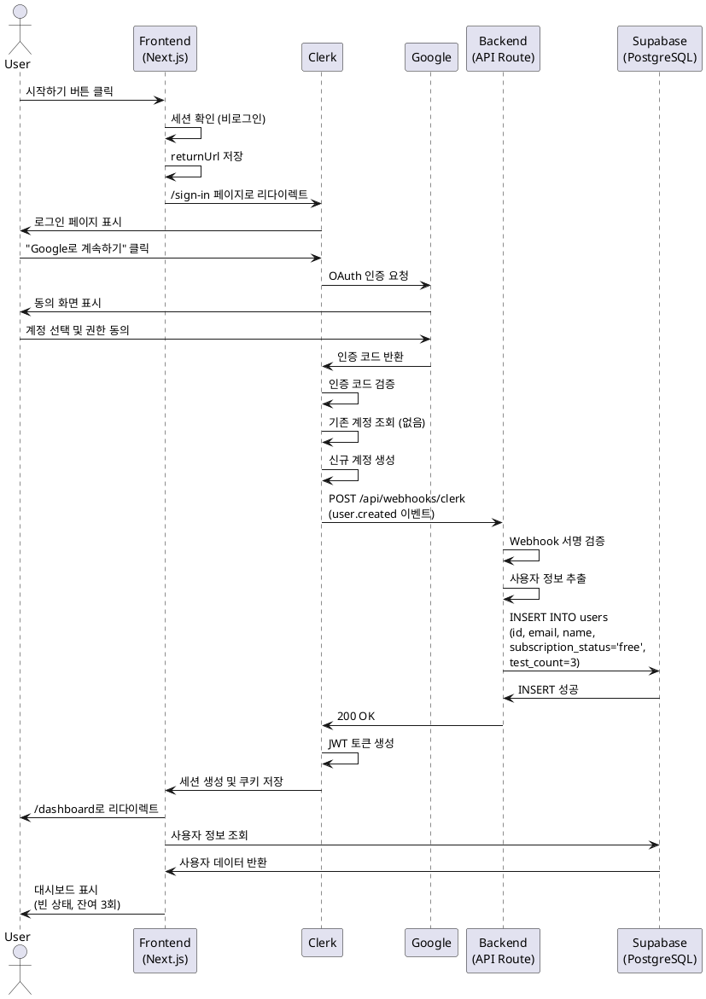
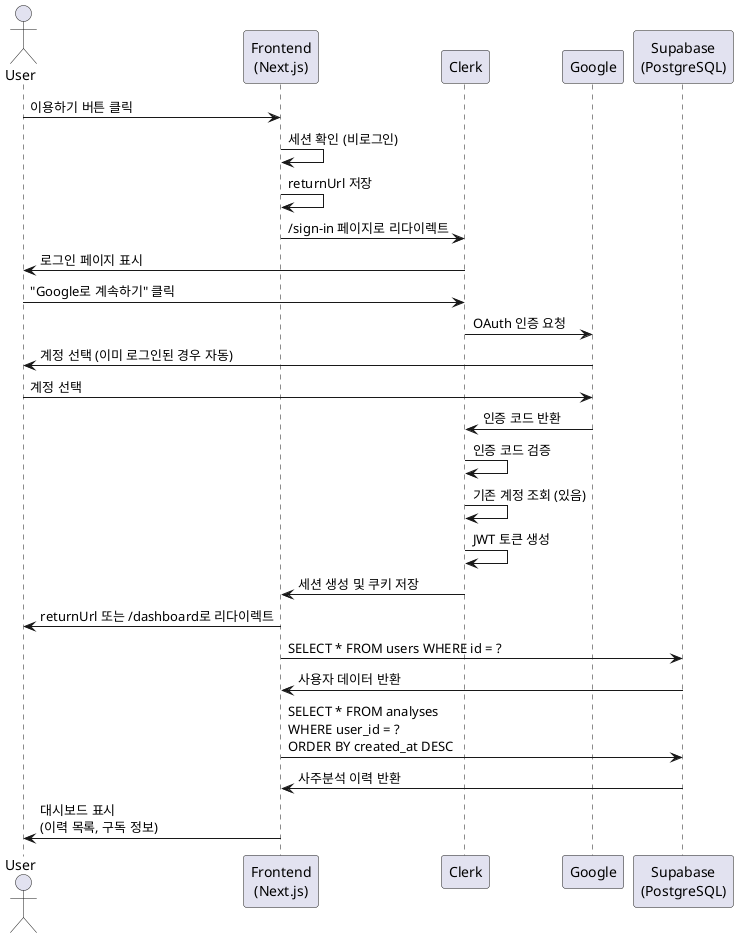
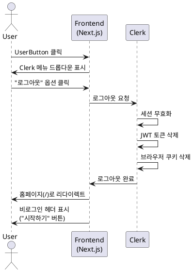

# 유스케이스: 회원가입 및 로그인

## 목차
- [UC-001: Google OAuth 회원가입](#uc-001-google-oauth-회원가입)
- [UC-002: Google OAuth 로그인](#uc-002-google-oauth-로그인)
- [UC-003: 로그아웃](#uc-003-로그아웃)

---

## UC-001: Google OAuth 회원가입

### 개요
신규 사용자가 Google 계정을 사용하여 Vibe Fortune 서비스에 가입하고, 무료 요금제로 시작하는 프로세스입니다.

### Primary Actor
신규 사용자 (미가입 사용자)

### Precondition
- 사용자가 유효한 Google 계정을 보유하고 있어야 합니다.
- 사용자의 브라우저가 인터넷에 연결되어 있어야 합니다.

### Trigger
사용자가 홈페이지에서 "시작하기" 버튼을 클릭하거나, 인증이 필요한 페이지(예: 대시보드)에 직접 접근을 시도합니다.

---

### Main Scenario

#### 1. 회원가입 시작
1. **User**: 홈페이지에서 "시작하기" 버튼 또는 보호된 페이지에 접근
2. **FE**: Clerk 세션 확인 - 비로그인 상태 감지
3. **FE**: 현재 URL을 returnUrl 파라미터로 저장
4. **FE**: Clerk SignIn 컴포넌트로 리다이렉트 (`/sign-in`)

#### 2. Google OAuth 인증
5. **User**: Clerk 로그인 페이지에서 "Google로 계속하기" 버튼 클릭
6. **FE**: Google OAuth 동의 화면으로 리다이렉트
7. **User**: Google 계정 선택 및 권한 동의
8. **Google**: 인증 코드를 Clerk로 반환

#### 3. 신규 사용자 생성
9. **Clerk**: 인증 코드 검증 완료
10. **Clerk**: 해당 이메일의 기존 계정 조회 - 없음 확인
11. **Clerk**: 신규 사용자 계정 자동 생성
12. **Clerk**: `user.created` Webhook 이벤트 발행

#### 4. 사용자 데이터 동기화
13. **Clerk**: 배포된 웹훅 엔드포인트로 POST 요청 (`/api/webhooks/clerk`)
14. **BE**: Webhook 서명 검증 (CLERK_WEBHOOK_SECRET 사용)
15. **BE**: 사용자 정보 추출 (id, email, name)
16. **BE**: Supabase users 테이블에 INSERT
    ```sql
    INSERT INTO users (id, email, name, subscription_status, test_count)
    VALUES (clerk_user_id, email, name, 'free', 3)
    ```
17. **BE**: 200 OK 응답 반환

#### 5. 로그인 완료
18. **Clerk**: JWT 토큰 생성 및 세션 생성
19. **Clerk**: 브라우저 쿠키에 세션 저장
20. **FE**: returnUrl 또는 기본 대시보드(`/dashboard`)로 리다이렉트
21. **FE**: 대시보드 페이지 렌더링
22. **FE**: 빈 상태 화면 표시 ("아직 사주분석 이력이 없습니다")
23. **FE**: 사이드바에 무료 요금제 정보 표시 (잔여 3회)

---

### Edge Cases

#### E1. Google OAuth 인증 취소
- **조건**: 사용자가 Google 동의 화면에서 "취소" 버튼 클릭
- **처리**:
  - Clerk 로그인 페이지로 리턴
  - 에러 메시지 표시: "로그인이 취소되었습니다"
  - 사용자는 다시 로그인 시도 가능

#### E2. Google 계정 없음
- **조건**: 사용자가 Google 계정을 보유하지 않음
- **처리**:
  - OAuth 프로세스 중단
  - Google 계정 생성 안내 표시

#### E3. 네트워크 에러
- **조건**: 로그인 중 네트워크 연결 끊김
- **처리**:
  - 에러 메시지 표시: "네트워크 연결을 확인해주세요"
  - "재시도" 버튼 제공

#### E4. Webhook 전송 실패
- **조건**: 배포 환경 엔드포인트 접근 불가 또는 서버 오류
- **처리**:
  - Clerk가 자동 재시도 (exponential backoff)
  - 사용자 플로우는 계속 진행 (Clerk 세션은 정상 작동)
  - Supabase 데이터는 백그라운드에서 동기화
  - 최대 재시도 후 실패 시 수동 동기화 필요

#### E5. Webhook 검증 실패
- **조건**: 잘못된 서명, 만료된 요청, 악의적인 요청
- **처리**:
  - 서버에서 요청 거부 (400 Bad Request)
  - 에러 로그 기록
  - 보안 강화 목적으로 사용자에게 알리지 않음

#### E6. 중복 이메일 (동시 요청)
- **조건**: 동일 사용자가 동시에 여러 번 가입 시도
- **처리**:
  - PostgreSQL UNIQUE 제약으로 중복 INSERT 방지
  - 첫 번째 요청만 성공
  - 나머지 요청은 무시 (이미 존재하는 사용자로 간주)

---

### Business Rules

#### BR1. 무료 요금제 기본 제공
- 모든 신규 사용자는 무료 요금제로 시작
- 초기 3회 사주분석 제공 (`test_count = 3`)
- `gemini-2.5-flash` 모델 사용

#### BR2. 인증 방식 제한
- Google OAuth만 지원
- 이메일/비밀번호 인증은 지원하지 않음
- 다른 OAuth 제공자(Facebook, Apple 등)는 지원하지 않음

#### BR3. 필수 정보
- 이메일 주소 (필수)
- 사용자 이름 (필수)
- Google에서 제공하는 정보만 수집

#### BR4. 자동 회원가입
- 로그인 시도 시 계정이 없으면 자동으로 생성
- 별도의 회원가입 페이지 없음
- 사용자는 "로그인"과 "회원가입"을 구분하지 않음

---

### Sequence Diagram



---

## UC-002: Google OAuth 로그인

### 개요
기존 사용자가 Google 계정을 사용하여 Vibe Fortune 서비스에 로그인하는 프로세스입니다.

### Primary Actor
기존 사용자 (가입 완료 사용자)

### Precondition
- 사용자가 이미 Vibe Fortune에 가입되어 있어야 합니다.
- 사용자가 유효한 Google 계정을 보유하고 있어야 합니다.
- Supabase users 테이블에 사용자 레코드가 존재해야 합니다.

### Trigger
사용자가 홈페이지에서 "이용하기" 버튼을 클릭하거나, 인증이 필요한 페이지(예: 대시보드)에 직접 접근을 시도합니다.

---

### Main Scenario

#### 1. 로그인 시작
1. **User**: 홈페이지에서 "이용하기" 버튼 또는 보호된 페이지에 접근
2. **FE**: Clerk 세션 확인 - 비로그인 상태 감지
3. **FE**: 현재 URL을 returnUrl 파라미터로 저장
4. **FE**: Clerk SignIn 컴포넌트로 리다이렉트 (`/sign-in`)

#### 2. Google OAuth 인증
5. **User**: Clerk 로그인 페이지에서 "Google로 계속하기" 버튼 클릭
6. **FE**: Google OAuth 동의 화면으로 리다이렉트
7. **User**: Google 계정 선택 (이미 로그인되어 있으면 자동 선택)
8. **Google**: 인증 코드를 Clerk로 반환

#### 3. 기존 사용자 확인
9. **Clerk**: 인증 코드 검증 완료
10. **Clerk**: 해당 이메일의 기존 계정 조회 - 있음 확인
11. **Clerk**: 기존 사용자로 로그인 처리
12. **Clerk**: JWT 토큰 생성 및 세션 생성

#### 4. 로그인 완료
13. **Clerk**: 브라우저 쿠키에 세션 저장
14. **FE**: returnUrl 또는 기본 대시보드(`/dashboard`)로 리다이렉트
15. **FE**: 대시보드 페이지 렌더링
16. **FE**: Supabase에서 사용자 ID로 사주분석 이력 조회
17. **Database**: 사용자 데이터 및 이력 반환
18. **FE**: 이력 카드 목록 표시 (created_at 기준 내림차순 정렬)
19. **FE**: 사이드바에 구독 정보 표시 (요금제, 잔여 횟수, 다음 결제일)

---

### Edge Cases

#### E1. Google 계정 선택 취소
- **조건**: 사용자가 Google 계정 선택 화면에서 취소
- **처리**:
  - Clerk 로그인 페이지로 복귀
  - 사용자는 다시 로그인 시도 가능

#### E2. OAuth 권한 거부
- **조건**: 사용자가 필수 권한을 거부
- **처리**:
  - 에러 메시지 표시: "필수 권한이 필요합니다"
  - 사용자는 다시 로그인 시도 가능

#### E3. 네트워크 단절
- **조건**: 로그인 중 네트워크 연결 끊김
- **처리**:
  - 재시도 안내 메시지 표시
  - "재시도" 버튼 제공

#### E4. 세션 만료 (재로그인)
- **조건**: 보호된 페이지 접근 중 세션 만료 감지
- **처리**:
  - 미들웨어가 세션 만료 감지
  - 현재 URL을 returnUrl로 저장
  - 작업 중인 데이터가 있으면 로컬 스토리지에 임시 저장
  - Clerk 로그인 페이지로 리다이렉트
  - 재로그인 후 returnUrl로 복귀
  - 임시 저장된 데이터 복구

#### E5. 다른 OAuth 제공자 클릭
- **조건**: 사용자가 지원하지 않는 OAuth 제공자 선택
- **처리**:
  - 에러 메시지 표시: "현재 Google 로그인만 지원합니다"

#### E6. 데이터베이스 연결 실패
- **조건**: 로그인 후 사용자 데이터 조회 중 Supabase 연결 실패
- **처리**:
  - 스켈레톤 로딩 표시 (시도 중)
  - 재시도 로직 (최대 3회)
  - 실패 시 에러 메시지: "일시적인 오류가 발생했습니다"
  - "재시도" 버튼 제공

---

### Business Rules

#### BR1. 자동 로그인 유지
- Clerk 세션이 유효한 동안 자동 로그인 상태 유지
- 브라우저 세션 기반 (브라우저 종료 시 세션 유지)

#### BR2. 원래 목적지로 복귀
- 로그인 후 사용자가 원래 접근하려던 페이지로 자동 리다이렉트
- returnUrl 파라미터 사용

#### BR3. 구독 정보 실시간 표시
- 로그인 후 사이드바에 현재 구독 상태 표시
  - 무료: 잔여 3회
  - Pro: 잔여 횟수, 다음 결제일
  - Pro (취소 예약): 다음 결제일까지 유지

---

### Sequence Diagram



---

## UC-003: 로그아웃

### 개요
로그인된 사용자가 Vibe Fortune 서비스에서 로그아웃하는 프로세스입니다.

### Primary Actor
로그인된 사용자

### Precondition
- 사용자가 로그인 상태여야 합니다.
- Clerk 세션이 유효해야 합니다.

### Trigger
사용자가 헤더의 UserButton(프로필 아바타)을 클릭하고, 드롭다운 메뉴에서 "로그아웃" 옵션을 선택합니다.

---

### Main Scenario

#### 1. 로그아웃 요청
1. **User**: 헤더의 UserButton (프로필 아바타) 클릭
2. **FE**: Clerk 메뉴 드롭다운 표시
3. **User**: "로그아웃" 옵션 클릭

#### 2. 세션 무효화
4. **Clerk**: 세션 무효화 처리
5. **Clerk**: JWT 토큰 삭제
6. **Clerk**: 브라우저 쿠키 삭제

#### 3. 홈페이지 리다이렉트
7. **FE**: 홈페이지(`/`)로 리다이렉트
8. **FE**: 비로그인 상태 헤더 렌더링 ("시작하기" 버튼 표시)
9. **User**: 홈페이지 표시

---

### Edge Cases

#### E1. 네트워크 에러
- **조건**: 로그아웃 요청 중 네트워크 연결 끊김
- **처리**:
  - 로컬 세션만 삭제 (브라우저 쿠키 제거)
  - 백그라운드에서 서버 세션 무효화 재시도
  - 사용자는 홈페이지로 리다이렉트
  - 다음 로그인 시 정상 동작

#### E2. 이미 만료된 세션
- **조건**: 로그아웃 시도 시 세션이 이미 만료됨
- **처리**:
  - 정상 처리로 간주
  - 홈페이지로 리다이렉트
  - 에러 메시지 표시하지 않음

#### E3. 작업 중인 데이터
- **조건**: 사용자가 폼 입력 중에 로그아웃
- **처리**:
  - 경고 메시지 표시하지 않음
  - 입력 데이터는 저장되지 않음
  - 다음 로그인 시 새로운 세션으로 시작

---

### Business Rules

#### BR1. 즉시 로그아웃
- 로그아웃 요청 시 즉시 처리
- 확인 다이얼로그 표시하지 않음
- 작업 중인 데이터 자동 저장 안 함

#### BR2. 홈페이지 리다이렉트
- 로그아웃 후 항상 홈페이지(`/`)로 이동
- 다른 페이지는 인증 필요로 인해 접근 불가

#### BR3. 세션 완전 삭제
- 클라이언트와 서버 모두에서 세션 삭제
- 브라우저 쿠키 제거
- 재로그인 필요

---

### Sequence Diagram



---

## 비기능 요구사항

### 성능
- **로그인 응답 시간**: Google OAuth 인증 포함 5초 이내
- **Webhook 처리**: 3초 이내 (비동기 처리)
- **페이지 리다이렉트**: 1초 이내

### 보안
- **인증 방식**: Clerk JWT 기반
- **HTTPS 강제**: 모든 인증 플로우는 HTTPS 통신
- **Webhook 검증**: CLERK_WEBHOOK_SECRET으로 서명 검증
- **XSS 방지**: React 자동 이스케이프
- **CSRF 방지**: Clerk 자동 처리

### 가용성
- **Clerk 서비스 의존성**: 99.9% 가용성 (Clerk SLA)
- **Webhook 재시도**: Exponential backoff로 자동 재시도
- **에러 복구**: 사용자는 재시도 가능

---

## 관련 유스케이스

### 선행 유스케이스
없음 (시스템 진입점)

### 후행 유스케이스
- UC-004: 새 사주분석 요청
- UC-005: 사주분석 이력 조회
- UC-006: 구독 관리

---

## 변경 이력

| 버전 | 날짜 | 작성자 | 변경 내용 |
|------|------|--------|-----------|
| 1.0  | 2025-10-28 | Claude Code | 초기 작성 |

---

## 참고 자료

### 관련 문서
- [Userflow 명세서](/docs/userflow.md) - 2. 회원가입/로그인 플로우
- [PRD 문서](/docs/prd.md) - 6.1 인증 (Clerk)
- [데이터베이스 설계](/docs/database.md) - users 테이블
- [Clerk 연동 가이드](/docs/external/clerk.md)

### 외부 링크
- [Clerk Documentation](https://clerk.com/docs)
- [Clerk App Router Quickstart](https://clerk.com/docs/quickstarts/nextjs)
- [Google OAuth 2.0](https://developers.google.com/identity/protocols/oauth2)
