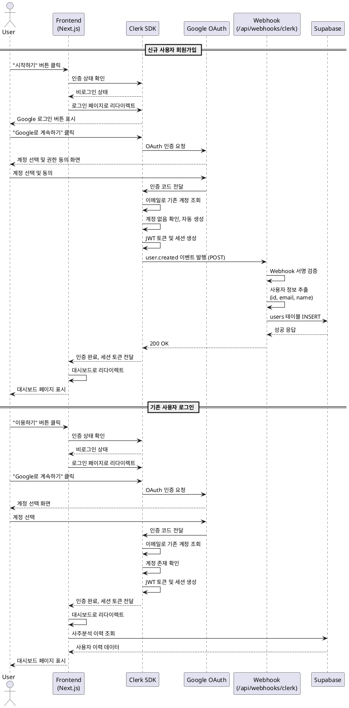

# 유스케이스: UC-001

## 제목
Google OAuth를 통한 회원가입/로그인

---

## 1. 개요

### 1.1 목적
신규 사용자가 Google 계정을 통해 간편하게 회원가입하고, 기존 사용자가 빠르게 로그인하여 사주분석 서비스를 이용할 수 있도록 한다.

### 1.2 범위
- Google OAuth를 통한 소셜 로그인
- Clerk SDK 기반 인증 처리
- 자동 회원가입 (최초 로그인 시)
- Webhook을 통한 Supabase 사용자 데이터 동기화
- 세션 관리 및 인증 상태 유지

### 1.3 액터
- 주요 액터: 서비스 이용 희망자 (신규/기존 사용자)
- 부 액터: Clerk (인증 제공자), Google OAuth, Supabase (데이터 저장소)

---

## 2. 선행 조건

- 사용자가 유효한 Google 계정을 보유하고 있어야 함
- 사용자의 브라우저가 JavaScript를 지원하고 쿠키가 활성화되어 있어야 함
- Clerk 서비스가 정상 작동 중이어야 함
- 배포된 Webhook 엔드포인트가 접근 가능해야 함

---

## 3. 참여 컴포넌트

- Clerk SDK: 인증 플로우 관리, 세션 생성 및 JWT 토큰 발행
- Google OAuth: 사용자 계정 인증
- Webhook 엔드포인트 (/api/webhooks/clerk): Clerk 이벤트 수신 및 처리
- Supabase: 사용자 정보 저장 (users 테이블)
- Next.js 미들웨어: 인증 상태 확인 및 페이지 접근 제어

---

## 4. 기본 플로우 (Basic Flow)

### 4.1 단계별 흐름

#### 신규 사용자 회원가입 플로우

1. 사용자: 홈페이지 또는 보호된 페이지 접근
   - 입력: "시작하기" 또는 "이용하기" 버튼 클릭
   - 처리: Clerk가 인증 상태 확인
   - 출력: 비로그인 상태 감지

2. 시스템: Clerk 로그인 페이지로 리다이렉트
   - 입력: 현재 URL (returnUrl 저장)
   - 처리: Clerk SignIn 컴포넌트 렌더링
   - 출력: Google 로그인 버튼 표시

3. 사용자: Google 로그인 선택
   - 입력: "Google로 계속하기" 버튼 클릭
   - 처리: Google OAuth 동의 화면으로 이동
   - 출력: Google 계정 선택 화면

4. 사용자: Google 계정 선택 및 권한 동의
   - 입력: 계정 선택 및 필수 권한 (이메일, 기본 프로필) 동의
   - 처리: Google이 인증 코드 발행
   - 출력: Clerk로 인증 코드 전달

5. Clerk: 신규 사용자 자동 생성
   - 입력: Google 인증 코드
   - 처리:
     - 이메일로 기존 계정 조회
     - 계정 없음 확인 시 자동 생성
     - JWT 토큰 생성 및 세션 생성
   - 출력: user.created Webhook 이벤트 발행

6. Webhook 엔드포인트: 사용자 정보 Supabase 동기화
   - 입력: user.created 이벤트 페이로드
   - 처리:
     - Webhook 서명 검증 (svix)
     - 사용자 정보 추출 (id, email, name)
     - Supabase users 테이블에 INSERT
   - 출력: 200 OK 응답

7. 시스템: 대시보드로 리다이렉트
   - 입력: 인증 완료 및 세션 생성
   - 처리: returnUrl 또는 기본 대시보드로 이동
   - 출력: 대시보드 페이지 (빈 상태)

#### 기존 사용자 로그인 플로우

1-4단계 동일

5. Clerk: 기존 사용자 인증
   - 입력: Google 인증 코드
   - 처리:
     - 이메일로 기존 계정 조회
     - 계정 존재 확인
     - JWT 토큰 생성 및 세션 생성
   - 출력: 로그인 성공

6. 시스템: 대시보드로 리다이렉트
   - 입력: 인증 완료 및 세션 생성
   - 처리: returnUrl 또는 기본 대시보드로 이동
   - 출력: 대시보드 페이지 (사주분석 이력 표시)

### 4.2 시퀀스 다이어그램

---

## 5. 대안 플로우 (Alternative Flows)

### 5.1 대안 플로우 1: 보호된 페이지 직접 접근

시작 조건: 사용자가 대시보드 또는 새 검사 페이지 URL을 직접 입력

단계:
1. Next.js 미들웨어가 인증 상태 확인
2. 비로그인 상태 감지
3. 현재 URL을 returnUrl로 저장
4. Clerk 로그인 페이지로 자동 리다이렉트
5. 로그인 완료 후 원래 접근하려던 페이지로 복귀

결과: 사용자는 로그인 후 원래 의도한 페이지에서 작업 시작

### 5.2 대안 플로우 2: 이미 로그인된 사용자

시작 조건: 유효한 세션이 존재하는 상태에서 로그인 페이지 접근

단계:
1. 사용자가 "시작하기" 또는 로그인 페이지 접근 시도
2. Clerk가 유효한 세션 감지
3. 로그인 페이지 대신 대시보드로 자동 리다이렉트

결과: 불필요한 로그인 과정 생략, 바로 대시보드 접근

---

## 6. 예외 플로우 (Exception Flows)

### 6.1 예외 상황 1: Google OAuth 인증 취소

발생 조건: 사용자가 Google 계정 선택 화면에서 취소 버튼 클릭

처리 방법:
1. Google이 취소 상태 코드를 Clerk에 전달
2. Clerk가 로그인 페이지로 복귀
3. 사용자에게 "로그인이 취소되었습니다" 메시지 표시

에러 코드: N/A (사용자 의도적 취소)

사용자 메시지: "Google 로그인이 취소되었습니다. 다시 시도해 주세요."

### 6.2 예외 상황 2: Google OAuth 권한 거부

발생 조건: 사용자가 필수 권한 (이메일, 프로필) 거부

처리 방법:
1. Google이 권한 거부 상태를 Clerk에 전달
2. Clerk가 에러 메시지와 함께 로그인 페이지로 복귀
3. 필수 권한 동의 필요성 안내

에러 코드: OAUTH_PERMISSION_DENIED

사용자 메시지: "서비스 이용을 위해 이메일 및 프로필 정보 접근 권한이 필요합니다."

### 6.3 예외 상황 3: Webhook 전송 실패

발생 조건: 배포된 Webhook 엔드포인트에 접근 불가 또는 서버 오류

처리 방법:
1. Clerk가 Webhook 전송 실패 감지
2. Exponential backoff 재시도 (최대 3회)
3. 모든 재시도 실패 시 Clerk 대시보드에 실패 로그 기록
4. 사용자 로그인 플로우는 정상 진행 (Clerk 세션 유지)
5. 백그라운드에서 수동 동기화 또는 다음 로그인 시 재시도

에러 코드: WEBHOOK_DELIVERY_FAILED (HTTP 500/503)

영향: 사용자는 정상적으로 로그인하지만, Supabase에 사용자 데이터가 동기화되지 않아 사주분석 생성 시 에러 발생 가능

### 6.4 예외 상황 4: Supabase INSERT 실패

발생 조건: Webhook이 Supabase에 사용자 정보 저장 시 DB 연결 실패 또는 제약 조건 위반

처리 방법:
1. Webhook이 Supabase 에러 캐치
2. 에러 로그 기록
3. Clerk에 500 응답 반환 (재시도 유도)
4. Clerk가 자동 재시도 수행

에러 코드: DATABASE_INSERT_FAILED (HTTP 500)

영향: 재시도로 해결되지 않을 경우 사용자는 로그인했지만 서비스 이용 불가

### 6.5 예외 상황 5: 네트워크 에러

발생 조건: 사용자의 인터넷 연결 끊김 또는 불안정

처리 방법:
1. Clerk SDK가 네트워크 에러 감지
2. 로딩 스피너 유지 또는 타임아웃 처리
3. 사용자에게 연결 에러 메시지 표시
4. 재시도 버튼 제공

에러 코드: NETWORK_ERROR

사용자 메시지: "네트워크 연결을 확인해 주세요. 다시 시도해 주세요."

### 6.6 예외 상황 6: 세션 만료

발생 조건: 로그인 후 일정 시간 경과로 JWT 토큰 만료

처리 방법:
1. Next.js 미들웨어가 세션 만료 감지
2. 현재 페이지 URL을 returnUrl로 저장
3. Clerk 로그인 페이지로 자동 리다이렉트
4. 재로그인 후 원래 페이지로 복귀

에러 코드: SESSION_EXPIRED (HTTP 401)

사용자 메시지: "세션이 만료되었습니다. 다시 로그인해 주세요."

---

## 7. 후행 조건 (Post-conditions)

### 7.1 성공 시

- 데이터베이스 변경:
  - Supabase users 테이블에 신규 레코드 생성 (신규 가입의 경우)
  - 컬럼: id (Clerk user ID), email, name, created_at
- 시스템 상태:
  - Clerk 세션 생성 및 JWT 토큰 발행
  - 브라우저 쿠키에 세션 정보 저장
  - 인증된 상태로 모든 보호된 페이지 접근 가능
- 외부 시스템:
  - Google OAuth에 사용자 동의 기록 저장

### 7.2 실패 시

- 데이터 롤백:
  - Webhook 실패 시 Clerk 계정은 생성되었으나 Supabase에 미동기화 상태
  - 재시도 또는 수동 동기화 필요
- 시스템 상태:
  - 인증 실패 시 비로그인 상태 유지
  - 로그인 페이지에 에러 메시지 표시

---

## 8. 비기능 요구사항

### 8.1 성능

- OAuth 인증 완료 시간: 5초 이내
- Webhook 처리 시간: 2초 이내
- 세션 생성 및 리다이렉트: 1초 이내
- 전체 로그인 플로우: 10초 이내 (사용자 동의 시간 제외)

### 8.2 보안

- JWT 토큰 기반 인증: Clerk가 자동 관리
- HTTPS 통신: 모든 인증 요청은 TLS 암호화
- CSRF 방지: Clerk SDK가 자동 처리
- Webhook 서명 검증: svix 라이브러리를 통한 서명 검증 필수
- XSS 방지: React 자동 이스케이프 활용
- 환경 변수 보호: API 키 및 시크릿은 서버 사이드에서만 사용

### 8.3 가용성

- Clerk 서비스 SLA: 99.9% uptime (Clerk 제공)
- Webhook 재시도: 최대 3회 exponential backoff
- Fallback: Webhook 실패 시에도 사용자 로그인 플로우는 정상 작동

---

## 9. UI/UX 요구사항

### 9.1 화면 구성

- Clerk 로그인 페이지 (Clerk 제공):
  - 서비스 로고
  - "Google로 계속하기" 버튼 (Google 아이콘 포함)
  - 간결한 안내 문구: "간편하게 시작하세요"
  - 이용약관 및 개인정보처리방침 링크 (선택)

- Google OAuth 동의 화면 (Google 제공):
  - 앱 이름 및 로고
  - 요청 권한 목록 (이메일, 기본 프로필)
  - 계정 선택 드롭다운
  - 동의 및 취소 버튼

- 로딩 상태:
  - 스피너 또는 프로그레스 바
  - "로그인 중..." 메시지

### 9.2 사용자 경험

- 원클릭 로그인: Google 계정으로 빠르게 로그인
- 자동 리다이렉트: 로그인 후 원래 의도한 페이지로 자동 이동
- 명확한 피드백: 로딩, 성공, 에러 상태를 명확히 표시
- 모바일 최적화: 터치 친화적 버튼 크기 (최소 44x44px)
- 접근성: 키보드 네비게이션 지원, ARIA 라벨 적용

---

## 10. 비즈니스 규칙

1. Google OAuth만 지원: 다른 소셜 로그인 (Facebook, Apple 등) 미지원
2. 이메일 필수: Google 계정의 이메일 정보 접근 권한 필수
3. 자동 회원가입: 별도 회원가입 절차 없이 최초 로그인 시 자동 생성
4. 단일 계정: 하나의 이메일로 하나의 계정만 생성 가능
5. 세션 유효 기간: Clerk 기본 설정 (7일) 적용
6. 재로그인 없음: 세션 유효 기간 내에는 자동 로그인 유지
7. 로그아웃 후 데이터 유지: 로그아웃해도 사주분석 이력은 보존

---

## 11. Edge Cases

발생할 수 있는 주요 오류 및 처리:

- Google OAuth 인증 취소: 로그인 페이지로 복귀, 재시도 안내
- Google 권한 거부: 필수 권한 동의 필요성 설명
- Webhook 전송 실패: 백그라운드 재시도, 사용자 플로우는 정상 진행
- Supabase 연결 실패: 재시도 메커니즘, 에러 로깅
- 네트워크 에러: 연결 확인 안내 메시지
- 세션 만료: 자동 로그인 페이지 리다이렉트
- 중복 가입 시도: Clerk가 자동으로 기존 계정 로그인 처리
- Webhook 서명 불일치: 요청 거부, 보안 로그 기록
- 동시 다중 로그인: 마지막 로그인 세션이 유효

---

## 12. 관련 유스케이스

- 후행 유스케이스:
  - UC-002: 새 사주분석 요청 (로그인 후 첫 작업)
  - UC-003: 사주분석 이력 조회
- 연관 유스케이스:
  - UC-004: 로그아웃
  - UC-005: 사용자 프로필 관리

---

## 13. 변경 이력

| 버전 | 날짜 | 작성자 | 변경 내용 |
|------|------|--------|-----------|
| 1.0  | 2025-10-27 | Claude Code | 초기 작성 |

---

## 부록

### A. 용어 정의

- OAuth: Open Authorization, 제3자 애플리케이션이 사용자 인증 정보 없이 접근 권한을 위임받는 개방형 표준
- JWT: JSON Web Token, 인증 정보를 JSON 형태로 안전하게 전송하기 위한 토큰
- Clerk: 인증 및 사용자 관리 SaaS 플랫폼
- Webhook: 이벤트 발생 시 지정된 URL로 HTTP POST 요청을 보내는 방식
- RLS: Row Level Security, PostgreSQL의 행 단위 보안 정책
- Exponential Backoff: 재시도 간격을 지수적으로 증가시키는 재시도 전략

### B. 참고 자료

- [Clerk Documentation](https://clerk.com/docs)
- [Google OAuth 2.0 Guide](https://developers.google.com/identity/protocols/oauth2)
- [Supabase Auth Integration](https://supabase.com/docs/guides/auth)
- [Next.js Middleware Authentication](https://nextjs.org/docs/app/building-your-application/routing/middleware)
- [Webhook Best Practices](https://clerk.com/docs/webhooks/overview)
