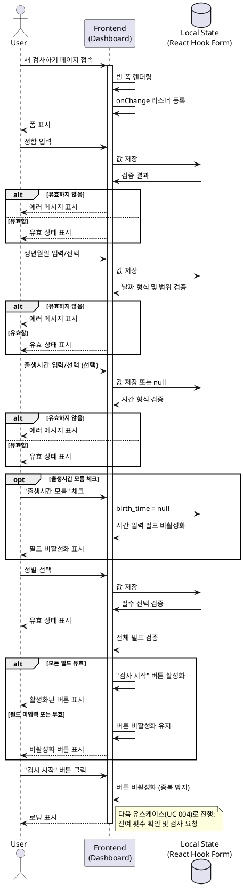
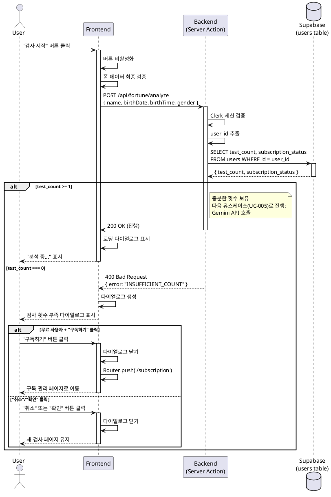
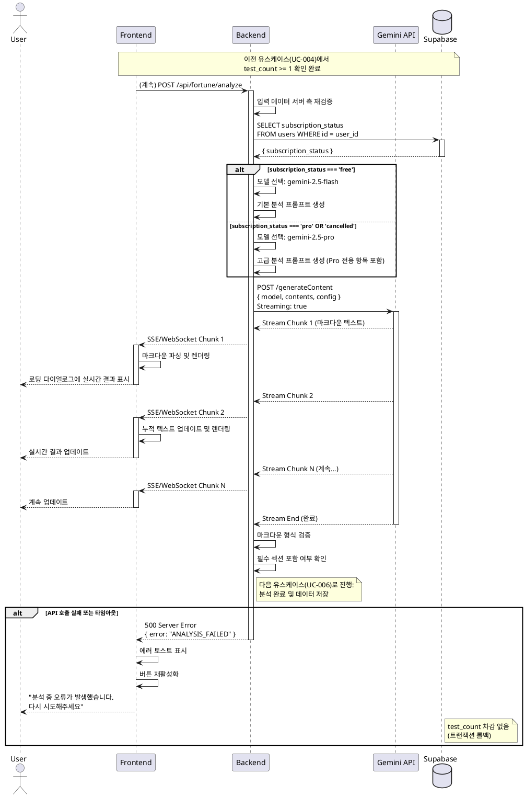
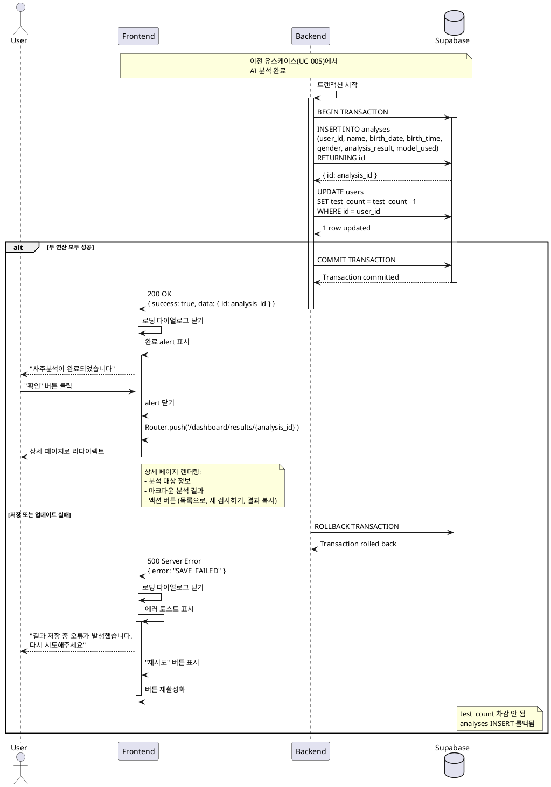
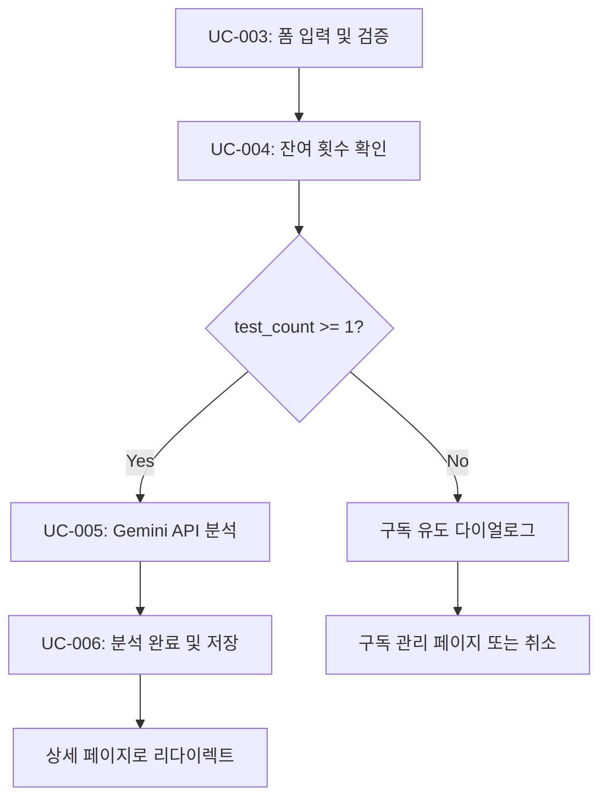

# 새 사주분석 요청 기능 유스케이스

## 목차
- [UC-003: 새 사주분석 폼 입력 및 검증](#uc-003-새-사주분석-폼-입력-및-검증)
- [UC-004: 잔여 횟수 확인 및 검사 요청](#uc-004-잔여-횟수-확인-및-검사-요청)
- [UC-005: Gemini API를 통한 AI 분석 (스트리밍)](#uc-005-gemini-api를-통한-ai-분석-스트리밍)
- [UC-006: 분석 완료 및 데이터 저장](#uc-006-분석-완료-및-데이터-저장)

---

# UC-003: 새 사주분석 폼 입력 및 검증

## 개요

사용자가 새 사주분석을 요청하기 위해 필수 정보를 입력하고, 시스템이 실시간으로 유효성을 검증하여 올바른 입력만 제출할 수 있도록 보장한다.

### Primary Actor
- 로그인한 사용자 (무료 또는 Pro 구독자)

### Precondition
- 사용자가 로그인된 상태
- `/dashboard/new` 페이지에 접근
- 사이드바에 잔여 검사 횟수 표시

### Trigger
- 대시보드에서 "새 검사하기" 버튼 클릭
- 또는 직접 `/dashboard/new` URL 접근

---

## Main Scenario

### 단계별 흐름

1. **사용자**: 새 검사하기 페이지 접속
   - 빈 폼 렌더링 (성함, 생년월일, 출생시간, 성별)
   - 모든 필드에 onChange 이벤트 리스너 등록

2. **사용자**: 성함 입력 (1-50자)
   - **검증**: 실시간 길이 체크
   - **에러**: "성함을 입력해주세요" (미입력 시)
   - **에러**: "성함은 50자 이내로 입력해주세요" (초과 시)

3. **사용자**: 생년월일 입력 또는 선택
   - **형식**: YYYY-MM-DD
   - **범위**: 1900-01-01 ~ 오늘
   - **검증**: 날짜 형식 및 범위 확인
   - **에러**: "올바른 생년월일을 입력해주세요"
   - **에러**: "1900년 이후 날짜만 입력 가능합니다"
   - **에러**: "생년월일은 오늘 이전이어야 합니다"

4. **사용자**: 출생시간 입력 또는 선택 (선택 사항)
   - **형식**: HH:mm (24시간 형식)
   - **옵션**: "출생시간 모름" 체크박스
   - **동작**: 체크 시 시간 입력 필드 비활성화, 값 null로 설정
   - **동작**: 체크 해제 시 시간 입력 필드 재활성화

5. **사용자**: 성별 선택 (라디오 버튼)
   - **옵션**: 남성 / 여성
   - **에러**: "성별을 선택해주세요" (미선택 시)

6. **시스템**: 전체 필드 검증
   - 모든 필수 필드 입력 상태 체크
   - 각 필드 유효성 체크
   - **조건 충족 시**: "검사 시작" 버튼 활성화
   - **조건 미충족 시**: 버튼 비활성화 유지

7. **사용자**: "검사 시작" 버튼 클릭
   - 다음 유스케이스(UC-004)로 진행

---

## Edge Cases

### 1. 복사/붙여넣기 데이터
- **처리**: 붙여넣기 후 검증 수행
- **메시지**: 잘못된 형식인 경우 해당 필드 에러 표시

### 2. 날짜 수동 입력 시 잘못된 형식
- **예**: "2024/10/28" 또는 "24-10-28"
- **처리**: 형식 에러 메시지 표시
- **메시지**: "YYYY-MM-DD 형식으로 입력해주세요"

### 3. 미래 날짜 입력
- **처리**: 오늘 이전만 허용
- **메시지**: "생년월일은 오늘 이전이어야 합니다"

### 4. 1900년 이전 날짜
- **처리**: 1900년 이후만 허용
- **메시지**: "1900년 이후 날짜만 입력 가능합니다"

### 5. 출생시간 모름 체크 후 체크 해제
- **처리**: 필드 재활성화, 이전 값 유지되지 않음
- **동작**: 빈 상태로 시작

### 6. 네트워크 지연 중 중복 제출 시도
- **처리**: 버튼 비활성화 및 로딩 표시
- **방지**: 중복 요청 방지 로직

---

## Business Rules

### BR-003-1: 필수 입력 필드
- 성함, 생년월일, 성별은 필수
- 출생시간은 선택 사항

### BR-003-2: 유효성 검증 규칙
- 성함: 1-50자 (공백 포함)
- 생년월일: 1900-01-01 ~ 오늘
- 출생시간: HH:mm 형식 (00:00-23:59)
- 성별: male 또는 female

### BR-003-3: 실시간 검증
- 각 필드는 onChange 이벤트로 실시간 검증
- 에러 메시지는 필드 아래에 즉시 표시
- 모든 필드 유효 시에만 제출 버튼 활성화

### BR-003-4: 접근 제어
- 로그인하지 않은 사용자는 Clerk 로그인 페이지로 리다이렉트
- 로그인한 사용자만 폼 접근 가능

---

## Sequence Diagram



---

## Post-conditions

### 성공 시
- 폼 데이터가 로컬 상태에 저장됨
- "검사 시작" 버튼이 활성화됨
- 다음 단계(UC-004)로 진행 준비 완료

### 실패 시
- 에러 메시지가 해당 필드 아래 표시됨
- "검사 시작" 버튼이 비활성화 상태 유지
- 사용자가 입력을 수정할 수 있음

---

## Non-functional Requirements

### 성능
- 폼 렌더링: 1초 이내
- 실시간 검증: 200ms 이내 (타이핑 지연 없음)

### 접근성
- 키보드 네비게이션 지원 (Tab, Enter)
- 스크린 리더 지원 (ARIA 라벨)
- 포커스 표시 명확화

### UX
- 에러 메시지는 필드 아래 빨간색으로 표시
- 유효한 필드는 초록색 체크 표시 (선택)
- 버튼 비활성화 시 그레이 스타일

---

# UC-004: 잔여 횟수 확인 및 검사 요청

## 개요

사용자가 "검사 시작" 버튼을 클릭하면 서버에서 잔여 검사 횟수를 확인하고, 충분한 횟수가 있는 경우 AI 분석을 진행한다. 횟수가 부족한 경우 구독 유도 다이얼로그를 표시한다.

### Primary Actor
- 로그인한 사용자

### Precondition
- UC-003 완료 (폼 검증 통과)
- 사용자가 "검사 시작" 버튼 클릭
- 서버에 사용자 인증 세션 존재

### Trigger
- "검사 시작" 버튼 클릭

---

## Main Scenario

### 단계별 흐름

1. **사용자**: "검사 시작" 버튼 클릭
   - 버튼 비활성화 (중복 방지)
   - 폼 데이터 최종 검증

2. **FE → BE**: 서버 액션 함수 호출
   - 엔드포인트: `POST /api/fortune/analyze`
   - 페이로드: `{ name, birthDate, birthTime, gender }`

3. **BE**: 사용자 인증 상태 확인
   - Clerk 세션 검증
   - user_id 추출

4. **BE → DB**: users.test_count 조회
   - `SELECT test_count, subscription_status FROM users WHERE id = {user_id}`
   - 현재 잔여 횟수 확인

5. **BE**: 잔여 횟수 판단
   - **케이스 A**: `test_count >= 1` → 다음 단계(UC-005) 진행
   - **케이스 B**: `test_count === 0` → 부족 처리

---

## Alternative Flow: 잔여 횟수 부족 (test_count === 0)

### 단계별 흐름

1. **BE → FE**: 에러 응답 반환
   - HTTP 400
   - `{ error: "INSUFFICIENT_COUNT", message: "검사 횟수가 부족합니다" }`

2. **FE**: 다이얼로그 표시
   - **제목**: "검사 횟수가 부족합니다"
   - **메시지**:
     - **무료 사용자**: "Pro 구독을 통해 월 10회 고급 분석을 이용하세요"
     - **Pro 구독자**: "다음 결제일에 검사 횟수가 충전됩니다 (다음 결제일: {date})"
   - **버튼**:
     - **무료 사용자**: "구독하기", "취소"
     - **Pro 구독자**: "확인"

3. **사용자**: 버튼 선택
   - **"구독하기" 선택**: `/subscription` 페이지로 이동
   - **"취소"/"확인" 선택**: 다이얼로그 닫힘, 새 검사 페이지 유지

---

## Edge Cases

### 1. 동시 다중 요청으로 test_count 0이 되는 경우
- **처리**: 데이터베이스 트랜잭션으로 방지
- **결과**: 첫 요청만 성공, 나머지는 부족 메시지

### 2. 검증 중 세션 만료
- **처리**: Clerk 자동 로그인 페이지로 리다이렉트
- **데이터**: 입력 데이터 로컬 스토리지에 임시 저장
- **복구**: 재로그인 후 데이터 복구

### 3. 네트워크 에러
- **처리**: 에러 토스트 메시지 표시
- **메시지**: "네트워크 연결을 확인해주세요"
- **액션**: "재시도" 버튼 제공

### 4. 서버 타임아웃
- **타임아웃**: 10초
- **처리**: 타임아웃 에러 메시지
- **메시지**: "요청 시간이 초과되었습니다. 다시 시도해주세요"

---

## Business Rules

### BR-004-1: 잔여 횟수 확인 시점
- 반드시 서버에서 확인 (클라이언트 값은 참고용)
- 매 요청마다 실시간 조회

### BR-004-2: 구독 상태별 메시지
- 무료 사용자: 구독 유도
- Pro 구독자 (active): 다음 결제일 안내
- Pro 구독자 (cancelled): 해지 예정 안내

### BR-004-3: 트랜잭션 보장
- 횟수 확인과 차감은 atomic 연산
- 실패 시 횟수 차감 안 함

---

## Sequence Diagram



---

## Post-conditions

### 성공 시 (test_count >= 1)
- 다음 유스케이스(UC-005)로 진행
- 로딩 다이얼로그 표시
- 버튼 비활성화 유지

### 실패 시 (test_count === 0)
- 검사 횟수 부족 다이얼로그 표시
- 데이터베이스 변경 없음
- 사용자가 구독 페이지로 이동하거나 다이얼로그 닫음

---

## Non-functional Requirements

### 성능
- 잔여 횟수 조회: 500ms 이내
- 전체 검증 프로세스: 1초 이내

### 보안
- 서버에서만 test_count 조회 (클라이언트 위조 방지)
- Clerk JWT 토큰 검증 필수

---

# UC-005: Gemini API를 통한 AI 분석 (스트리밍)

## 개요

잔여 횟수 확인 후, 서버에서 사용자의 구독 상태에 따라 적절한 Gemini 모델을 선택하고 AI 사주분석을 수행한다. 분석 결과는 실시간 스트리밍으로 사용자에게 전달된다.

### Primary Actor
- 백엔드 시스템

### Precondition
- UC-004 완료 (잔여 횟수 확인 통과)
- 사용자 폼 데이터 유효
- Gemini API 키 설정됨

### Trigger
- UC-004에서 test_count >= 1 확인 완료

---

## Main Scenario

### 단계별 흐름

1. **BE**: 입력 데이터 서버 측 재검증
   - 필수 필드 존재 확인
   - 데이터 형식 검증
   - SQL Injection 방지 처리

2. **BE**: 사용자 구독 상태 확인
   - `subscription_status` 조회
   - 모델 선택:
     - `free`: gemini-2.5-flash
     - `pro` 또는 `cancelled`: gemini-2.5-pro

3. **BE**: 프롬프트 생성
   - 입력 데이터 포맷팅
   - 구독 상태에 따른 프롬프트 템플릿 선택:
     - **무료**: 기본 분석 (천간지지, 오행, 대운세운, 성격/재운/건강운/연애운)
     - **Pro**: 고급 분석 추가 (직업운, 사업운, 월별 운세)

4. **BE → Gemini API**: API 호출
   - 모델: `gemini-2.5-flash` 또는 `gemini-2.5-pro`
   - 설정:
     - `temperature: 0.7` (적절한 창의성)
     - `maxOutputTokens: 4096`
     - `thinkingConfig.thinkingBudget: 0` (빠른 응답)
   - 스트리밍 모드 활성화

5. **Gemini API → BE**: 스트리밍 응답 수신
   - 청크 단위로 텍스트 수신
   - 마크다운 형식 유지

6. **BE → FE**: 실시간 스트리밍 전달
   - Server-Sent Events (SSE) 또는 WebSocket
   - 청크 단위로 클라이언트에 전송

7. **FE**: 로딩 다이얼로그에서 실시간 표시
   - 받은 청크를 누적하여 화면에 렌더링
   - 마크다운 파서로 실시간 렌더링

8. **Gemini API**: 응답 완료
   - 최종 텍스트 전송
   - 스트림 종료 신호

9. **BE**: 마크다운 형식 검증
   - 필수 섹션 포함 여부 확인
   - 다음 유스케이스(UC-006)로 진행

---

## Edge Cases

### 1. API 호출 실패
- **원인**: 네트워크 오류, API 키 만료, 할당량 초과
- **처리**:
  - 1회 재시도 (exponential backoff)
  - 재시도 실패 시 에러 반환
- **메시지**: "분석 중 오류가 발생했습니다. 다시 시도해주세요"
- **결과**: test_count 차감 안 함 (트랜잭션 롤백)

### 2. 타임아웃 (60초 초과)
- **처리**: 요청 중단, 타임아웃 에러 반환
- **메시지**: "요청 시간이 초과되었습니다. 다시 시도해주세요"
- **결과**: test_count 차감 안 함

### 3. 네트워크 단절 (스트리밍 중)
- **처리**: 연결 에러 감지, 재연결 시도
- **메시지**: "연결이 끊어졌습니다. 다시 시도해주세요"
- **결과**: test_count 차감 안 함

### 4. 응답 형식 불일치 (마크다운 파싱 에러)
- **처리**: 파싱 가능한 부분만 사용
- **로그**: 에러 로그 기록, 관리자 알림
- **결과**: 부분 분석 결과 반환 또는 재시도

### 5. 스트리밍 중 세션 만료
- **처리**: 분석 완료까지 진행, 완료 후 재로그인 유도
- **데이터**: 분석 결과는 데이터베이스에 저장
- **메시지**: "로그인이 만료되었습니다. 다시 로그인해주세요"

### 6. 동시 다중 요청 방지
- **처리**: 버튼 비활성화, 진행 중 표시
- **클라이언트**: 중복 요청 차단
- **서버**: 사용자별 요청 락 (선택)

### 7. Pro 모델 실패 시 flash 모델 폴백
- **처리**: gemini-2.5-pro 실패 시 gemini-2.5-flash로 재시도
- **메시지**: "고급 분석이 일시적으로 불가능하여 기본 분석으로 진행합니다"
- **결과**: test_count 정상 차감

---

## Business Rules

### BR-005-1: 모델 선택 규칙
- 무료 사용자: gemini-2.5-flash (빠른 응답)
- Pro 구독자: gemini-2.5-pro (고급 분석)
- Pro 취소 예약: gemini-2.5-pro (다음 결제일까지)

### BR-005-2: 프롬프트 구조
- **공통**: 천간지지, 오행, 대운세운, 성격/재운/건강운/연애운
- **Pro 전용**: 직업운, 사업운, 월별 운세
- **출력 형식**: 마크다운 (제목, 목록, 강조 활용)

### BR-005-3: API 타임아웃
- 최대 대기 시간: 60초
- 초과 시 요청 중단 및 에러 반환

### BR-005-4: 에러 시 횟수 차감 없음
- API 실패, 타임아웃, 네트워크 에러 시
- 트랜잭션 롤백으로 test_count 보존

### BR-005-5: 스트리밍 실시간 전달
- 청크 단위로 즉시 클라이언트에 전달
- 지연 없이 사용자에게 표시

---

## Sequence Diagram



---

## Post-conditions

### 성공 시
- AI 분석 결과가 완전히 수신됨
- 마크다운 형식 검증 완료
- 다음 유스케이스(UC-006)로 진행
- 사용자가 실시간으로 분석 과정 확인

### 실패 시
- 에러 메시지가 사용자에게 표시됨
- test_count 차감 안 됨 (트랜잭션 롤백)
- 버튼 재활성화
- 사용자가 재시도 가능

---

## Non-functional Requirements

### 성능
- **gemini-2.5-flash**: 10-20초 응답 목표
- **gemini-2.5-pro**: 20-40초 응답 목표
- **타임아웃**: 60초

### 안정성
- API 실패 시 1회 재시도
- Pro 모델 실패 시 flash 모델 폴백
- 네트워크 에러 시 재연결 시도

### 보안
- Gemini API 키는 서버 환경 변수에만 저장
- 클라이언트에 노출 금지

---

# UC-006: 분석 완료 및 데이터 저장

## 개요

AI 분석이 완료되면 결과를 데이터베이스에 저장하고 잔여 횟수를 차감한 후, 사용자를 분석 상세 페이지로 리다이렉트한다.

### Primary Actor
- 백엔드 시스템

### Precondition
- UC-005 완료 (AI 분석 완료)
- 마크다운 형식 검증 완료
- 사용자 세션 유효

### Trigger
- Gemini API 스트리밍 완료

---

## Main Scenario

### 단계별 흐름

1. **BE**: 트랜잭션 시작
   - 원자적 연산 보장 (분석 저장 + 횟수 차감)

2. **BE → DB**: analyses 테이블에 INSERT
   - 쿼리:
     ```sql
     INSERT INTO analyses (
       user_id, name, birth_date, birth_time,
       gender, analysis_result, model_used
     ) VALUES (
       {user_id}, {name}, {birth_date}, {birth_time},
       {gender}, {ai_result}, {model}
     ) RETURNING id;
     ```
   - `model_used`: 'flash' 또는 'pro'

3. **BE → DB**: users.test_count 1 감소
   - 쿼리:
     ```sql
     UPDATE users
     SET test_count = test_count - 1
     WHERE id = {user_id};
     ```

4. **BE**: 트랜잭션 커밋
   - 두 연산 모두 성공 시 커밋
   - 하나라도 실패 시 롤백

5. **BE → FE**: 저장된 레코드 ID 반환
   - HTTP 200
   - `{ success: true, data: { id: "{analysis_id}" } }`

6. **FE**: 완료 alert 표시
   - 메시지: "사주분석이 완료되었습니다"
   - 버튼: "확인"

7. **사용자**: 확인 버튼 클릭

8. **FE**: 상세 페이지로 리다이렉트
   - `Router.push('/dashboard/results/{analysis_id}')`
   - 로딩 다이얼로그 닫기

9. **FE**: 상세 페이지 렌더링
   - 분석 대상 정보 표시
   - 마크다운 렌더링된 분석 결과 표시
   - 액션 버튼 표시 (목록으로, 새 검사하기, 결과 복사)

---

## Edge Cases

### 1. 데이터베이스 저장 실패
- **원인**: 연결 에러, 제약 조건 위반, 권한 문제
- **처리**: 트랜잭션 롤백
- **결과**: test_count 차감 안 됨, AI 분석 결과 손실
- **메시지**: "결과 저장 중 오류가 발생했습니다. 다시 시도해주세요"
- **액션**: 재시도 버튼 제공

### 2. test_count 업데이트 실패
- **원인**: 동시성 문제, 데이터베이스 에러
- **처리**: 전체 트랜잭션 롤백
- **결과**: analyses INSERT도 롤백됨
- **메시지**: "처리 중 오류가 발생했습니다. 다시 시도해주세요"

### 3. 리다이렉트 실패
- **원인**: 클라이언트 라우터 에러
- **처리**: 수동 링크 제공
- **메시지**: "분석이 완료되었습니다. [여기를 클릭]하여 결과를 확인하세요"
- **링크**: `/dashboard/results/{analysis_id}`

### 4. ID 누락 (서버 응답 이상)
- **처리**: 대시보드로 이동, 최신 분석 자동 표시
- **메시지**: "결과를 불러오는 중..."
- **대안**: 최신 created_at 기준 조회

### 5. 분석 완료 후 세션 만료
- **처리**: 분석은 저장 완료, 재로그인 유도
- **메시지**: "분석이 완료되었습니다. 다시 로그인해주세요"
- **데이터**: 재로그인 후 대시보드에서 확인 가능

---

## Business Rules

### BR-006-1: 원자적 연산
- analyses INSERT와 users UPDATE는 트랜잭션으로 묶임
- 하나라도 실패 시 전체 롤백

### BR-006-2: 횟수 차감 시점
- 분석 완료 및 저장 성공 시에만 차감
- API 실패, 저장 실패 시 차감 안 함

### BR-006-3: 분석 결과 저장 형식
- analysis_result: 마크다운 텍스트 (text 타입)
- model_used: 'flash' 또는 'pro'
- created_at: 현재 시각 (자동)

### BR-006-4: 자동 리다이렉트
- 완료 alert 확인 후 즉시 상세 페이지 이동
- 사용자 수동 네비게이션 불필요

---

## Sequence Diagram



---

## Post-conditions

### 성공 시
- **Database**:
  - analyses 테이블에 새 레코드 생성됨
  - users.test_count 1 감소됨
- **System State**:
  - 사용자가 상세 페이지에 있음
  - 분석 결과가 화면에 표시됨
- **User**:
  - 분석 결과를 확인할 수 있음
  - 잔여 횟수가 업데이트됨 (사이드바)

### 실패 시
- **Database**:
  - 트랜잭션 롤백으로 변경 사항 없음
  - test_count 유지됨
- **System State**:
  - 사용자가 새 검사 페이지에 있음
  - 에러 메시지 표시됨
- **User**:
  - 재시도 가능

---

## Non-functional Requirements

### 성능
- 데이터베이스 INSERT + UPDATE: 500ms 이내
- 전체 완료 프로세스: 1초 이내 (리다이렉트 포함)

### 안정성
- 트랜잭션으로 데이터 무결성 보장
- 실패 시 자동 롤백

### 보안
- RLS (Row Level Security) 적용
- 본인 데이터만 INSERT 가능

---

## Related Use Cases

### 선행 유스케이스
- UC-003: 새 사주분석 폼 입력 및 검증
- UC-004: 잔여 횟수 확인 및 검사 요청
- UC-005: Gemini API를 통한 AI 분석 (스트리밍)

### 후행 유스케이스
- UC-007: 사주분석 상세 조회 (향후 작성 예정)
- UC-008: 사주분석 이력 조회 (향후 작성 예정)

---

## 전체 플로우 요약



---

## 변경 이력

| 버전 | 날짜 | 작성자 | 변경 내용 |
|------|------|--------|-----------|
| 1.0 | 2025-10-28 | Claude Code | 초기 작성 |

---

## 참고 자료

- [PRD 문서](/docs/prd.md)
- [Userflow 명세서](/docs/userflow.md) - 섹션 3
- [데이터베이스 설계](/docs/database.md)
- [Gemini API 가이드](/docs/external/gemini.md)
- [Clerk 인증 가이드](/docs/external/clerk.md)
