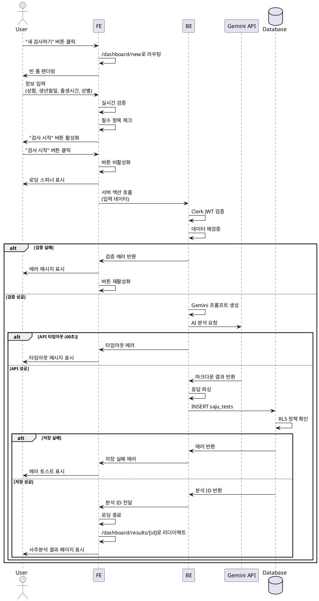

# UC-002: 새 사주분석 요청

## Primary Actor
로그인한 사용자

## Precondition
- 사용자가 Clerk를 통해 Google 계정으로 로그인되어 있음
- 사용자가 대시보드 또는 새 검사하기 페이지에 접근 가능한 상태

## Trigger
사용자가 대시보드 또는 네비게이션에서 "새 검사하기" 버튼을 클릭

## Main Scenario

### 1. 폼 접근
**User**: 대시보드에서 "새 검사하기" 버튼 클릭
**FE**: `/dashboard/new` 페이지로 라우팅
**FE**: 빈 사주분석 입력 폼 렌더링

### 2. 정보 입력
**User**: 다음 정보 입력
- 성함 (필수, 1-50자 텍스트)
- 생년월일 (필수, YYYY-MM-DD 형식, 1900-01-01 ~ 현재)
- 출생시간 (선택, HH:mm 형식 또는 "출생시간 모름" 체크)
- 성별 (필수, 남성/여성 라디오 버튼)

**FE**: 각 필드 입력 시 실시간 검증 수행
- 성함: 1-50자 범위 확인
- 생년월일: 날짜 형식 및 범위 검증
- 출생시간: 시간 형식 검증 (입력 시)
- 성별: 선택 여부 확인

**FE**: 필수 항목 모두 입력되고 유효한 경우 "검사 시작" 버튼 활성화

### 3. 분석 요청
**User**: "검사 시작" 버튼 클릭
**FE**: 버튼 비활성화 및 로딩 스피너 표시
**FE**: 서버 액션 호출 (입력 데이터 전송)

**BE**: 사용자 인증 상태 재확인 (Clerk JWT)
**BE**: 입력 데이터 서버 측 재검증
- 필수 항목 존재 여부
- 데이터 타입 및 형식 검증
- 생년월일 범위 확인

### 4. AI 사주분석 실행
**BE**: Gemini API 프롬프트 생성
- 시스템 역할: 20년 경력 사주팔자 상담사
- 입력 정보: 성함, 생년월일, 출생시간(또는 미상), 성별
- 분석 요구사항: 천간/지지, 오행, 대운/세운, 성격/재운/건강운/연애운
- 출력 형식: 마크다운

**BE**: Gemini API 호출 (타임아웃: 60초)
**Gemini API**: AI 사주분석 수행 (예상 시간: 10-30초)
**Gemini API**: 마크다운 형식의 분석 결과 반환

### 5. 결과 저장
**BE**: 응답 데이터 파싱 및 검증
**BE**: Supabase에 분석 결과 저장
- 테이블: `saju_tests`
- 데이터:
  - user_id: 현재 로그인 사용자 ID
  - name: 입력한 성함
  - birth_date: 생년월일
  - birth_time: 출생시간 (nullable)
  - gender: 성별 (male/female)
  - result: AI 분석 결과 (마크다운 텍스트)
  - created_at: 현재 시각 (자동)

**Database**: INSERT 쿼리 실행
**Database**: RLS 정책 확인 (user_id = auth.uid())
**Database**: 생성된 레코드 ID 반환

### 6. 결과 페이지 이동
**BE**: 생성된 분석 ID를 클라이언트에 반환
**FE**: 로딩 상태 종료
**FE**: `/dashboard/results/[id]`로 자동 리다이렉트
**FE**: 사주분석 상세 페이지 렌더링 및 결과 표시

## Edge Cases

### EC-1: 폼 검증 실패
**발생**: 사용자가 잘못된 형식의 데이터 입력
**처리**:
- 해당 필드 아래 에러 메시지 표시
- 필드 테두리 빨간색으로 변경
- "검사 시작" 버튼 비활성화 유지
- 예시 메시지: "올바른 생년월일을 입력해주세요 (YYYY-MM-DD)"

### EC-2: Gemini API 호출 실패
**발생**: API 키 오류, 할당량 초과, 네트워크 에러
**처리**:
- 1회 자동 재시도
- 재시도 실패 시 에러 토스트 메시지 표시
- 로딩 상태 종료 및 버튼 재활성화
- 메시지: "분석 중 오류가 발생했습니다. 다시 시도해주세요."

### EC-3: API 타임아웃
**발생**: 60초 내 응답 없음
**처리**:
- 요청 자동 취소
- 타임아웃 메시지 표시
- 재시도 버튼 제공
- 메시지: "요청 시간이 초과되었습니다. 다시 시도해주세요."

### EC-4: 데이터베이스 저장 실패
**발생**: 네트워크 문제, 제약 조건 위반, 권한 문제
**처리**:
- 에러 로깅
- 사용자에게 에러 토스트 표시
- 재시도 버튼 또는 대시보드로 돌아가기 버튼 제공
- 메시지: "결과 저장 중 오류가 발생했습니다."

### EC-5: 세션 만료
**발생**: 폼 작성 중 Clerk 세션 만료
**처리**:
- 입력 데이터를 로컬 스토리지에 임시 저장
- Clerk 로그인 페이지로 리다이렉트
- returnUrl 파라미터에 `/dashboard/new` 설정
- 재로그인 후 임시 저장 데이터 복원

### EC-6: 중복 요청 방지
**발생**: 사용자가 "검사 시작" 버튼 여러 번 클릭
**처리**:
- 버튼 클릭 즉시 비활성화
- 진행 중 상태 표시 유지
- API 호출 완료 전까지 추가 요청 차단

### EC-7: 응답 형식 불일치
**발생**: Gemini API가 마크다운이 아닌 형식으로 응답
**처리**:
- 응답 파싱 시도
- 파싱 실패 시 원본 텍스트 그대로 저장
- 에러 로그 기록 (관리자 모니터링용)

## Business Rules

### BR-1: 입력 데이터 검증
- 성함: 1-50자, 필수
- 생년월일: YYYY-MM-DD 형식, 1900-01-01 ~ 현재, 필수
- 출생시간: HH:mm 형식 또는 null, 선택
- 성별: 'male' 또는 'female', 필수

### BR-2: AI 프롬프트 구조
- 시스템 역할: 20년 경력 전문 사주팔자 상담사
- 분석 범위: 천간/지지, 오행, 대운/세운, 성격/재운/건강운/연애운
- 출력 형식: 마크다운
- 금지 사항: 의료/법률 조언, 확정적 미래 예측, 부정적 표현

### BR-3: 성능 요구사항
- AI 분석 예상 시간: 10-30초
- 최대 타임아웃: 60초
- 재시도: 1회

### BR-4: 보안
- 모든 요청에 Clerk JWT 검증 필수
- 클라이언트 측 검증 + 서버 측 재검증
- Supabase RLS로 본인 데이터만 생성 가능
- API 키는 서버 환경 변수로만 관리

### BR-5: 데이터 저장
- 분석 결과는 불변 (UPDATE 불가)
- user_id는 현재 로그인 사용자만 허용
- created_at은 서버 시각 자동 기록

## Sequence Diagram

## Post-conditions

### 성공 시
- `saju_tests` 테이블에 새 레코드 생성
- 사용자가 사주분석 상세 페이지에서 결과 확인 가능
- 대시보드 이력 목록에 새 분석 추가됨

### 실패 시
- 데이터베이스에 레코드 생성되지 않음
- 사용자는 새 검사하기 페이지에 머물러 있음
- 에러 메시지 표시 및 재시도 가능

## UI/UX 요구사항

### 폼 레이아웃
- 세로 스택 레이아웃
- 레이블 + 입력 필드 쌍
- 필수 항목에 별표(*) 표시
- 에러 메시지는 필드 아래 빨간색으로 표시

### 로딩 상태
- 로딩 스피너 중앙 배치
- 예상 대기 시간 안내 텍스트
- "분석 중입니다. 잠시만 기다려주세요 (10-30초 소요)"
- 버튼 비활성화 상태 명확히 표시

### 반응형 디자인
- 모바일: 단일 컬럼 레이아웃
- 태블릿/데스크톱: 최대 너비 600px로 중앙 정렬
- 터치 친화적 버튼 크기 (최소 44x44px)

### 접근성
- 키보드 네비게이션 지원 (Tab, Enter)
- ARIA 레이블 및 role 속성
- 에러 메시지에 aria-live="polite"
- 로딩 상태에 aria-busy="true"

## 관련 유스케이스
- **선행**: UC-001 회원가입/로그인
- **후행**: UC-003 사주분석 상세 조회
- **연관**: UC-004 사주분석 이력 조회

## 변경 이력

| 버전 | 날짜 | 작성자 | 변경 내용 |
|------|------|--------|-----------|
| 1.0  | 2025-10-27 | Claude Code | 초기 작성 |
