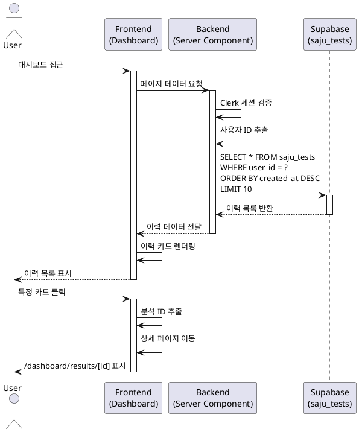

# 유스케이스: UC-003

## 제목
사주분석 이력 조회

---

## 1. 개요

### 1.1 목적
사용자가 대시보드에서 과거에 수행한 사주분석 결과 목록을 조회하고, 원하는 분석의 상세 내용을 다시 확인할 수 있도록 한다.

### 1.2 범위
- 대시보드 페이지에서 사주분석 이력 목록 표시
- 최신순 정렬 및 페이지네이션
- 이력 카드 클릭을 통한 상세 페이지 이동
- 빈 상태(이력 없음) 처리

**제외 사항:**
- 이력 삭제 기능
- 이력 검색 및 필터링
- 이력 수정 기능

### 1.3 액터
- **주요 액터**: 로그인한 사용자
- **부 액터**: Supabase (데이터베이스), Clerk (인증)

---

## 2. 선행 조건

- 사용자가 Google 계정으로 로그인되어 있어야 함
- 유효한 Clerk 세션이 존재해야 함
- 데이터베이스 연결이 정상 작동해야 함

---

## 3. 참여 컴포넌트

- **대시보드 페이지 (`/dashboard`)**: 사주분석 이력 목록 렌더링
- **Clerk SDK**: 사용자 인증 상태 확인 및 user ID 제공
- **Supabase Client**: 데이터베이스 쿼리 실행
- **saju_tests 테이블**: 사주분석 이력 데이터 저장소
- **이력 카드 컴포넌트**: 각 분석 항목의 요약 정보 표시

---

## 4. 기본 플로우 (Basic Flow)

### 4.1 Primary Actor
로그인한 사용자

### 4.2 Precondition
- 사용자가 로그인 상태
- Clerk 세션이 유효함

### 4.3 Trigger
- 사용자가 대시보드 URL(`/dashboard`)에 접근
- 네비게이션 메뉴에서 "대시보드" 클릭
- 홈페이지에서 "이용하기" 버튼 클릭

### 4.4 Main Scenario

1. **사용자**: 대시보드 페이지에 접근
   - 입력: URL 접근 또는 버튼 클릭
   - 처리: 대시보드 라우트 활성화
   - 출력: 페이지 로딩 시작

2. **시스템 (미들웨어)**: 인증 상태 확인
   - 입력: 페이지 요청
   - 처리: Clerk 세션 검증
   - 출력: 인증 성공, 페이지 렌더링 진행

3. **시스템 (서버 컴포넌트)**: 사용자 ID 추출
   - 입력: Clerk 세션 토큰
   - 처리: `auth()` 함수로 현재 사용자 ID 획득
   - 출력: user_id

4. **시스템 (Supabase)**: 사주분석 이력 조회
   - 입력: user_id
   - 처리:
     ```sql
     SELECT id, name, birth_date, gender, created_at
     FROM saju_tests
     WHERE user_id = $user_id
     ORDER BY created_at DESC
     LIMIT 10
     ```
   - 출력: 사주분석 이력 배열 (최대 10개)

5. **시스템 (대시보드 페이지)**: 이력 목록 렌더링
   - 입력: 사주분석 이력 배열
   - 처리:
     - 이력이 있는 경우: 각 항목을 카드로 렌더링
     - 이력이 없는 경우: 빈 상태 화면 표시
   - 출력:
     - 이력 카드 목록 또는 빈 상태 UI
     - 각 카드에 표시되는 정보:
       - 분석 대상 이름
       - 생년월일 (YYYY-MM-DD 형식)
       - 성별 (남성/여성)
       - 분석 날짜 (상대적 시간 또는 절대 시간)

6. **사용자**: 특정 이력 카드 클릭
   - 입력: 카드 클릭 이벤트
   - 처리: 해당 분석 ID 추출
   - 출력: 상세 페이지 이동 요청

7. **시스템 (라우터)**: 상세 페이지로 네비게이션
   - 입력: 분석 ID
   - 처리: `/dashboard/results/[id]` 경로로 이동
   - 출력: 사주분석 상세 페이지 표시

### 4.5 Sequence Diagram



---

## 5. 대안 플로우 (Alternative Flows)

### 5.1 대안 플로우 1: 이력 없음 (빈 상태)

**시작 조건**: 기본 플로우 4단계에서 조회된 이력이 0건인 경우

**단계**:
1. 시스템이 빈 배열 수신
2. 대시보드 페이지에서 빈 상태 UI 렌더링:
   - 안내 메시지: "아직 사주분석 이력이 없습니다"
   - CTA 버튼: "첫 검사 시작하기"
3. 사용자가 버튼 클릭 시 `/dashboard/new`로 이동

**결과**: 사용자가 새 사주분석을 시작할 수 있도록 유도

### 5.2 대안 플로우 2: 페이지네이션 (10개 이상 이력)

**시작 조건**: 사용자의 이력이 10개를 초과하는 경우

**단계**:
1. 초기 10개 이력 표시
2. 목록 하단에 "더보기" 버튼 또는 무한 스크롤 트리거 표시
3. 사용자가 "더보기" 클릭 또는 스크롤:
   - OFFSET을 10씩 증가시켜 추가 데이터 페칭
   - 예: LIMIT 10 OFFSET 10, LIMIT 10 OFFSET 20, ...
4. 추가 이력 카드를 기존 목록에 append
5. 더 이상 데이터가 없으면 "더보기" 버튼 숨김

**결과**: 대량의 이력을 효율적으로 조회 가능

### 5.3 대안 플로우 3: 헤더에서 대시보드 재접근

**시작 조건**: 이미 대시보드에 있는 상태에서 헤더의 "대시보드" 메뉴 클릭

**단계**:
1. 라우터가 현재 경로 확인
2. 이미 `/dashboard`인 경우 페이지 새로고침 없이 유지
3. 다른 경로인 경우 대시보드로 이동 후 이력 재조회

**결과**: 불필요한 리로딩 방지, UX 향상

---

## 6. 예외 플로우 (Exception Flows)

### 6.1 예외 상황 1: 세션 만료

**발생 조건**: 대시보드 접근 시 Clerk 세션이 만료된 경우

**처리 방법**:
1. 미들웨어가 세션 만료 감지
2. 현재 URL(`/dashboard`)을 returnUrl로 저장
3. Clerk 로그인 페이지로 리다이렉트
4. 재로그인 후 대시보드로 자동 복귀

**에러 코드**: 302 (Redirect)

**사용자 메시지**: 로그인 페이지로 자동 이동

### 6.2 예외 상황 2: 데이터베이스 연결 실패

**발생 조건**: Supabase 쿼리 실행 중 네트워크 에러 또는 서비스 장애

**처리 방법**:
1. try-catch 블록에서 에러 캐치
2. 에러 로그 기록
3. 재시도 로직 실행 (최대 3회)
4. 모든 재시도 실패 시 에러 UI 표시:
   - 에러 메시지 표시
   - "다시 시도" 버튼 제공

**에러 코드**: 500

**사용자 메시지**: "데이터를 불러오는 중 오류가 발생했습니다. 다시 시도해주세요."

### 6.3 예외 상황 3: 권한 없는 접근 (다른 사용자 이력 조회 시도)

**발생 조건**: RLS 정책에 의해 차단되거나 직접 URL 조작 시도

**처리 방법**:
1. Supabase RLS가 자동으로 필터링 (user_id 불일치 데이터 제외)
2. 쿼리 결과는 항상 본인 데이터만 반환
3. 추가 검증 로직 불필요 (RLS가 처리)

**에러 코드**: 없음 (RLS가 자동 처리)

**사용자 메시지**: 없음 (본인 데이터만 보임)

### 6.4 예외 상황 4: 느린 쿼리 (네트워크 지연)

**발생 조건**: 데이터베이스 응답이 2초 이상 지연되는 경우

**처리 방법**:
1. 페이지 로딩 시 스켈레톤 UI 표시
2. React Suspense 활용하여 로딩 상태 관리
3. 데이터 도착 시 스켈레톤을 실제 카드로 교체

**에러 코드**: 없음 (정상 처리)

**사용자 메시지**: 스켈레톤 로딩 표시

---

## 7. 후행 조건 (Post-conditions)

### 7.1 성공 시

- **데이터베이스 변경**: 없음 (읽기 전용)
- **시스템 상태**: 대시보드 페이지 렌더링 완료
- **사용자 상태**: 사주분석 이력 목록 확인 가능
- **다음 액션**: 특정 이력 카드 클릭 시 UC-004 (사주분석 상세 조회)로 이동 가능

### 7.2 실패 시

- **데이터 롤백**: 해당 없음 (읽기 전용)
- **시스템 상태**: 에러 UI 또는 로그인 페이지 표시
- **사용자 상태**: 이력 조회 실패, 재시도 필요

---

## 8. 비기능 요구사항

### 8.1 성능
- 초기 페이지 로드 시간: 3초 이내 (First Contentful Paint)
- 데이터베이스 쿼리 응답 시간: 1초 이내
- 페이지네이션 추가 로딩: 500ms 이내
- 인덱스 활용: `idx_saju_tests_user_created` (user_id + created_at DESC)

### 8.2 보안
- RLS 정책 적용: 본인 이력만 조회 가능
- Clerk JWT 기반 인증: 모든 요청에 유효한 토큰 필요
- SQL 인젝션 방지: Supabase 파라미터화된 쿼리 사용

### 8.3 가용성
- 데이터베이스 연결 재시도: 최대 3회
- 에러 발생 시 사용자에게 명확한 피드백 제공
- 부분 장애 격리: 대시보드 외 페이지는 정상 작동

### 8.4 확장성
- 페이지네이션을 통한 대량 데이터 처리
- 인덱스 최적화로 수천 건 이력도 빠른 조회
- Vercel Edge Network 캐싱 활용

---

## 9. UI/UX 요구사항

### 9.1 화면 구성

**헤더**:
- 로고 (좌측)
- 네비게이션 메뉴: 대시보드, 새 검사
- UserButton (우측, Clerk 제공)

**메인 컨텐츠**:
- 페이지 제목: "내 사주분석 이력"
- "새 검사하기" 버튼 (우측 상단)
- 이력 카드 목록 (그리드 또는 리스트 레이아웃)
- 페이지네이션 컨트롤 (10개 이상 시)

**이력 카드**:
- 분석 대상 이름 (Bold, 상단)
- 생년월일 (YYYY-MM-DD)
- 성별 아이콘 또는 텍스트
- 분석 날짜 (상대적 시간: "3일 전", 절대 시간: "2025-10-20")
- 호버 시 카드 상승 효과 (elevation)
- 클릭 가능 표시 (커서 포인터)

**빈 상태**:
- 중앙 정렬 메시지: "아직 사주분석 이력이 없습니다"
- 부가 설명: "첫 사주분석을 시작해보세요"
- "첫 검사 시작하기" 버튼

**로딩 상태**:
- 스켈레톤 카드 (10개)
- 부드러운 애니메이션 효과

### 9.2 사용자 경험

**인터랙션**:
- 카드 호버: 배경색 변경, 약간의 그림자 효과
- 카드 클릭: 상세 페이지로 부드러운 전환
- "새 검사하기" 버튼: Primary 스타일, 우측 상단 고정
- 스크롤: 부드러운 무한 스크롤 또는 명확한 페이지네이션

**반응형 디자인**:
- 모바일 (320px~767px): 1열 리스트 레이아웃
- 태블릿 (768px~1023px): 2열 그리드
- 데스크톱 (1024px 이상): 3열 그리드

**접근성**:
- 키보드 네비게이션: Tab으로 카드 이동, Enter로 선택
- ARIA 라벨: 각 카드에 명확한 설명 (예: "김철수님의 사주분석 결과, 2025년 10월 20일 생성")
- 포커스 표시: 키보드 포커스 시 명확한 아웃라인

**에러 처리 UI**:
- 에러 메시지: 중앙 정렬, 아이콘 포함
- "다시 시도" 버튼: Secondary 스타일
- "대시보드로 돌아가기" 링크 (세션 만료 시)

---

## 10. 비즈니스 규칙 (Business Rules)

### 10.1 데이터 조회 규칙
- 본인이 생성한 사주분석만 조회 가능
- 최신순 정렬 (created_at DESC) 고정
- 초기 로드 시 최대 10개만 표시
- 추가 데이터는 사용자 요청 시에만 로드

### 10.2 권한 규칙
- 로그인하지 않은 사용자는 대시보드 접근 불가
- 다른 사용자의 이력은 조회 불가 (RLS로 강제)
- 세션 만료 시 자동으로 로그인 페이지로 리다이렉트

### 10.3 표시 규칙
- 이력이 없는 경우 빈 상태 화면 필수 표시
- 분석 날짜는 사용자 타임존 기준으로 표시
- 생년월일은 YYYY-MM-DD 형식으로 통일
- 성별은 "남성" 또는 "여성"으로 한글 표시

---

## 11. 관련 유스케이스

- **선행 유스케이스**:
  - UC-001: 회원가입 및 로그인
  - UC-002: 새 사주분석 생성 (이력 데이터 생성)

- **후행 유스케이스**:
  - UC-004: 사주분석 상세 조회 (카드 클릭 시)
  - UC-002: 새 사주분석 생성 ("새 검사하기" 버튼 클릭 시)

- **연관 유스케이스**:
  - UC-005: 사주분석 결과 복사 (상세 페이지 내 기능)

---

## 12. 엣지케이스 요약

| 상황 | 처리 방법 |
|------|----------|
| 이력 없음 | 빈 상태 화면 + "첫 검사 시작하기" 버튼 |
| 세션 만료 | 로그인 페이지로 리다이렉트, returnUrl 저장 |
| DB 연결 실패 | 재시도 3회, 실패 시 에러 메시지 + "다시 시도" 버튼 |
| 느린 쿼리 | 스켈레톤 로딩 표시 |
| 10개 이상 이력 | 페이지네이션 또는 무한 스크롤 |
| 네트워크 단절 | 에러 메시지 + 재시도 안내 |
| 카드 클릭 시 ID 없음 | 에러 로그, 대시보드 유지 |

---

## 13. 테스트 시나리오

### 13.1 성공 케이스

| 테스트 케이스 ID | 사전 조건 | 실행 단계 | 기대 결과 |
|----------------|----------|----------|----------|
| TC-003-01 | 로그인 상태, 이력 5개 존재 | 대시보드 접근 | 5개 이력 카드 표시, 최신순 정렬 |
| TC-003-02 | 로그인 상태, 이력 15개 존재 | 대시보드 접근 후 "더보기" 클릭 | 초기 10개 표시, 클릭 후 추가 5개 표시 |
| TC-003-03 | 로그인 상태, 이력 3개 존재 | 특정 카드 클릭 | 해당 분석 상세 페이지로 이동 |
| TC-003-04 | 로그인 상태, 이력 없음 | 대시보드 접근 | 빈 상태 화면 표시 |
| TC-003-05 | 로그인 상태, 이력 없음 | "첫 검사 시작하기" 클릭 | `/dashboard/new`로 이동 |

### 13.2 실패 케이스

| 테스트 케이스 ID | 사전 조건 | 실행 단계 | 기대 결과 |
|----------------|----------|----------|----------|
| TC-003-06 | 비로그인 상태 | 대시보드 URL 직접 접근 | Clerk 로그인 페이지로 리다이렉트 |
| TC-003-07 | 로그인 상태, DB 연결 끊김 | 대시보드 접근 | 재시도 후 에러 메시지 + "다시 시도" 버튼 |
| TC-003-08 | 로그인 상태, 세션 만료 | 대시보드 접근 | 로그인 페이지로 리다이렉트, returnUrl 저장 |
| TC-003-09 | 로그인 상태, 느린 네트워크 | 대시보드 접근 | 스켈레톤 로딩 3초 이상 표시 후 데이터 로드 |

---

## 14. 변경 이력

| 버전 | 날짜 | 작성자 | 변경 내용 |
|------|------|--------|-----------|
| 1.0  | 2025-10-27 | Claude Code | 초기 작성 |

---

## 부록

### A. 용어 정의

- **이력 (History)**: 과거에 생성된 사주분석 결과의 메타데이터 및 전체 내용
- **카드 (Card)**: 사주분석 이력을 요약하여 표시하는 UI 컴포넌트
- **RLS (Row Level Security)**: Supabase의 행 수준 보안 정책, 본인 데이터만 조회 가능하도록 강제
- **페이지네이션 (Pagination)**: 대량의 데이터를 일정 개수씩 나누어 표시하는 방식
- **무한 스크롤 (Infinite Scroll)**: 스크롤 시 자동으로 추가 데이터를 로드하는 UX 패턴
- **스켈레톤 로딩 (Skeleton Loading)**: 실제 컨텐츠 로드 전 빈 뼈대 UI를 표시하여 로딩 체감 속도 개선

### B. 참고 자료

- PRD: `/docs/prd.md`
- Userflow: `/docs/userflow.md`
- Database Schema: `/docs/database.md`
- Supabase RLS 문서: https://supabase.com/docs/guides/auth/row-level-security
- Clerk 인증 문서: https://clerk.com/docs/authentication/overview
- Next.js App Router: https://nextjs.org/docs/app
