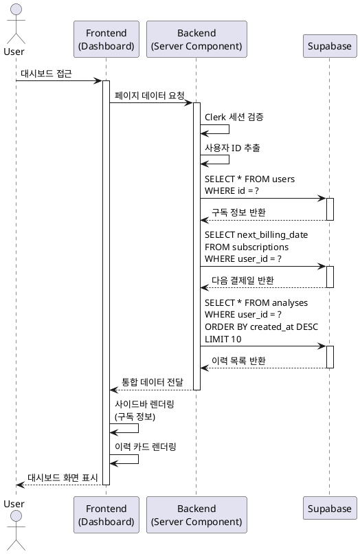
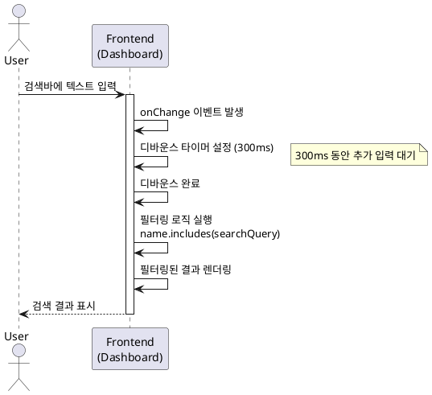
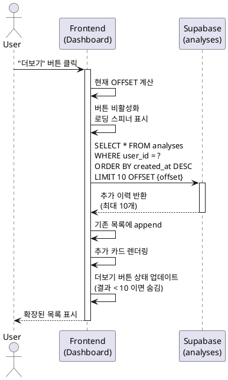
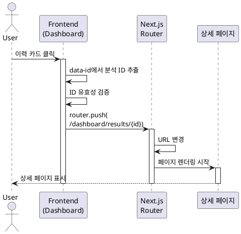

# 사주분석 이력 조회 유스케이스 명세서

## 개요

본 문서는 Vibe Fortune 서비스의 **사주분석 이력 조회** 기능에 대한 상세 유스케이스를 정의합니다. 대시보드 페이지에서 사용자가 과거 사주분석 이력을 조회, 검색, 필터링하고 상세 페이지로 이동하는 전체 플로우를 다룹니다.

---

# UC-007: 대시보드 접근 및 이력 목록 조회

## 1. 개요

### 1.1 목적
사용자가 대시보드 페이지에 접근하여 본인의 사주분석 이력 목록을 최신순으로 조회하고, 현재 구독 상태를 확인할 수 있도록 합니다.

### 1.2 범위
- 대시보드 URL 접근 및 인증 검증
- 사용자 구독 정보 조회 및 사이드바 표시
- 사주분석 이력 목록 조회 (최신순 정렬)
- 이력 카드 렌더링 (최대 10개)
- 빈 상태(이력 없음) 처리

**제외 사항:**
- 검색 및 필터링 (UC-008에서 다룸)
- 페이지네이션 (UC-009에서 다룸)
- 이력 카드 클릭 (UC-010에서 다룸)

### 1.3 액터
- **주요 액터**: 로그인한 사용자
- **부 액터**: Clerk (인증), Supabase (데이터베이스)

---

## 2. 선행 조건

- 사용자가 Google 계정으로 로그인되어 있음
- 유효한 Clerk 세션이 존재함
- Supabase 데이터베이스 연결이 정상임

---

## 3. 참여 컴포넌트

- **대시보드 페이지** (`/dashboard`): 이력 목록 렌더링
- **Clerk SDK**: 사용자 인증 및 user ID 제공
- **Supabase Client**: 데이터베이스 쿼리 실행
- **users 테이블**: 구독 상태 및 잔여 횟수 조회
- **analyses 테이블**: 사주분석 이력 저장소
- **사이드바 컴포넌트**: 구독 정보 표시 (이메일, 요금제, 잔여 횟수, 다음 결제일)
- **이력 카드 컴포넌트**: 각 분석 항목의 요약 정보 표시

---

## 4. 기본 플로우 (Basic Flow)

### 4.1 Primary Actor
로그인한 사용자

### 4.2 Precondition
- 사용자가 로그인 상태
- Clerk 세션이 유효함

### 4.3 Trigger
- 사용자가 대시보드 URL (`/dashboard`) 접근
- 네비게이션 메뉴에서 "대시보드" 클릭
- 홈페이지에서 "이용하기" 버튼 클릭

### 4.4 Main Scenario

1. **사용자**: 대시보드 페이지 접근
   - 입력: URL 접근 또는 버튼 클릭
   - 처리: 대시보드 라우트 활성화
   - 출력: 페이지 로딩 시작

2. **시스템 (미들웨어)**: 인증 상태 확인
   - 입력: 페이지 요청
   - 처리: Clerk 세션 검증
   - 출력: 인증 성공, 페이지 렌더링 진행

3. **시스템 (서버 컴포넌트)**: 사용자 ID 추출
   - 입력: Clerk 세션 토큰
   - 처리: `auth()` 함수로 현재 사용자 ID 획득
   - 출력: user_id

4. **시스템 (Supabase)**: 구독 정보 조회
   - 입력: user_id
   - 처리:
     ```sql
     SELECT email, subscription_status, test_count
     FROM users
     WHERE id = $user_id
     ```
   - 출력: 구독 정보 객체

5. **시스템 (Supabase)**: 다음 결제일 조회 (Pro 구독자인 경우)
   - 입력: user_id
   - 처리:
     ```sql
     SELECT next_billing_date
     FROM subscriptions
     WHERE user_id = $user_id AND status IN ('active', 'cancelled')
     ```
   - 출력: next_billing_date (없으면 NULL)

6. **시스템 (Supabase)**: 사주분석 이력 조회
   - 입력: user_id
   - 처리:
     ```sql
     SELECT id, name, birth_date, gender, created_at
     FROM analyses
     WHERE user_id = $user_id
     ORDER BY created_at DESC
     LIMIT 10
     ```
   - 출력: 사주분석 이력 배열 (최대 10개)

7. **시스템 (사이드바 컴포넌트)**: 구독 정보 렌더링
   - 입력: 구독 정보, 다음 결제일
   - 처리:
     - 이메일 주소 표시
     - 요금제 표시 (무료/Pro/Pro(취소 예약))
     - 잔여 검사 횟수 표시
     - 다음 결제일 표시 (Pro인 경우)
   - 출력: 사이드바에 구독 상태 표시

8. **시스템 (대시보드 페이지)**: 이력 목록 렌더링
   - 입력: 사주분석 이력 배열
   - 처리:
     - 이력이 있는 경우: 각 항목을 카드로 렌더링
     - 이력이 없는 경우: 빈 상태 화면 표시
   - 출력:
     - 이력 카드 목록 또는 빈 상태 UI
     - 각 카드 정보:
       - 분석 대상 이름
       - 생년월일 (YYYY-MM-DD)
       - 성별 (남성/여성)
       - 분석 날짜 (상대적 시간)

9. **사용자**: 대시보드 화면 확인
   - 입력: 렌더링된 페이지
   - 처리: 시각적 확인
   - 출력: 다음 액션 선택 가능 (검색, 카드 클릭, 새 검사하기)

### 4.5 Sequence Diagram



---

## 5. 대안 플로우 (Alternative Flows)

### 5.1 대안 플로우 1: 이력 없음 (빈 상태)

**시작 조건**: 기본 플로우 6단계에서 조회된 이력이 0건인 경우

**단계**:
1. 시스템이 빈 배열 수신
2. 대시보드 페이지에서 빈 상태 UI 렌더링:
   - 안내 메시지: "아직 사주분석 이력이 없습니다"
   - 부가 설명: "첫 사주분석을 시작해보세요"
   - CTA 버튼: "첫 검사 시작하기"
3. 사용자가 버튼 클릭 시 `/dashboard/new`로 이동 (UC-002)

**결과**: 사용자가 새 사주분석을 시작할 수 있도록 유도

### 5.2 대안 플로우 2: Pro 구독자 취소 예약 상태

**시작 조건**: 구독 상태가 'cancelled'인 경우

**단계**:
1. 기본 플로우 4~5단계에서 구독 정보 조회
2. subscription_status가 'cancelled' 확인
3. 사이드바에 "Pro (취소 예약)" 표시
4. 다음 결제일까지 Pro 혜택 유지 안내
5. "구독 재개" 버튼 제공 (구독 관리 페이지로 이동)

**결과**: 사용자가 구독 상태를 명확히 인지하고 재개 가능

### 5.3 대안 플로우 3: 무료 사용자 잔여 횟수 0회

**시작 조건**: subscription_status가 'free'이고 test_count가 0인 경우

**단계**:
1. 기본 플로우 4단계에서 구독 정보 조회
2. test_count가 0 확인
3. 사이드바에 "잔여 0회" 표시
4. "새 검사하기" 버튼 클릭 시 검사 횟수 부족 다이얼로그 표시 (UC-002)
5. 구독 관리 페이지로 이동 유도

**결과**: 사용자가 Pro 구독으로 전환할 수 있도록 안내

---

## 6. 예외 플로우 (Exception Flows)

### 6.1 예외 상황 1: 세션 만료

**발생 조건**: 대시보드 접근 시 Clerk 세션이 만료된 경우

**처리 방법**:
1. 미들웨어가 세션 만료 감지
2. 현재 URL (`/dashboard`)을 returnUrl로 저장
3. Clerk 로그인 페이지로 리다이렉트
4. 재로그인 후 대시보드로 자동 복귀

**에러 코드**: 302 (Redirect)

**사용자 메시지**: 로그인 페이지로 자동 이동

### 6.2 예외 상황 2: 데이터베이스 연결 실패

**발생 조건**: Supabase 쿼리 실행 중 네트워크 에러 또는 서비스 장애

**처리 방법**:
1. try-catch 블록에서 에러 캐치
2. 에러 로그 기록 (서버 사이드)
3. 재시도 로직 실행 (최대 3회)
4. 모든 재시도 실패 시 에러 UI 표시:
   - 에러 메시지 표시
   - "다시 시도" 버튼 제공
   - "고객센터" 링크 제공

**에러 코드**: 500

**사용자 메시지**: "데이터를 불러오는 중 오류가 발생했습니다. 다시 시도해주세요."

### 6.3 예외 상황 3: 구독 정보 조회 실패

**발생 조건**: users 테이블 조회 중 에러 발생

**처리 방법**:
1. 에러 로그 기록
2. 사이드바에 기본 정보만 표시 (이메일만)
3. 구독 정보 표시 영역에 "정보를 불러올 수 없음" 메시지
4. 이력 조회는 정상 진행
5. 백그라운드에서 재시도

**에러 코드**: 부분 실패 (일부 데이터만 표시)

**사용자 메시지**: "구독 정보를 불러오는 중 오류가 발생했습니다."

### 6.4 예외 상황 4: 느린 쿼리 (네트워크 지연)

**발생 조건**: 데이터베이스 응답이 2초 이상 지연되는 경우

**처리 방법**:
1. 페이지 로딩 시 스켈레톤 UI 표시
2. React Suspense 활용하여 로딩 상태 관리
3. 데이터 도착 시 스켈레톤을 실제 카드로 교체
4. 타임아웃 10초 설정
5. 10초 초과 시 에러 처리 (예외 6.2)

**에러 코드**: 없음 (정상 처리)

**사용자 메시지**: 스켈레톤 로딩 표시

---

## 7. 후행 조건 (Post-conditions)

### 7.1 성공 시

- **데이터베이스 변경**: 없음 (읽기 전용)
- **시스템 상태**: 대시보드 페이지 렌더링 완료
- **사용자 상태**:
  - 사주분석 이력 목록 확인 가능
  - 구독 상태 및 잔여 횟수 확인 가능
  - 다음 결제일 확인 가능 (Pro인 경우)
- **다음 액션**:
  - 검색 및 필터링 (UC-008)
  - 이력 카드 클릭 (UC-010)
  - 새 검사하기 (UC-002)
  - 구독 관리 페이지 이동

### 7.2 실패 시

- **데이터 롤백**: 해당 없음 (읽기 전용)
- **시스템 상태**: 에러 UI 또는 로그인 페이지 표시
- **사용자 상태**: 이력 조회 실패, 재시도 필요

---

## 8. 비기능 요구사항

### 8.1 성능
- 초기 페이지 로드 시간: 3초 이내 (First Contentful Paint)
- 데이터베이스 쿼리 응답 시간: 1초 이내
- 구독 정보 + 이력 조회: 병렬 처리로 지연 최소화
- 인덱스 활용:
  - `idx_analyses_user_created` (user_id + created_at DESC)
  - users 테이블 PK 인덱스 (id)
  - subscriptions 테이블 user_id 인덱스

### 8.2 보안
- RLS 정책 적용: 본인 이력만 조회 가능
- Clerk JWT 기반 인증: 모든 요청에 유효한 토큰 필요
- SQL 인젝션 방지: Supabase 파라미터화된 쿼리 사용
- 세션 검증: 미들웨어에서 모든 요청 검증

### 8.3 가용성
- 데이터베이스 연결 재시도: 최대 3회
- 부분 장애 격리: 구독 정보 실패 시에도 이력은 표시
- 에러 발생 시 사용자에게 명확한 피드백 제공
- 로그인 만료 시 자동 리다이렉트로 UX 유지

### 8.4 확장성
- 초기 10개 제한으로 대량 데이터 방지
- 페이지네이션 준비 (UC-009)
- 인덱스 최적화로 수천 건 이력도 빠른 조회
- Vercel Edge Network 캐싱 활용

---

## 9. UI/UX 요구사항

### 9.1 화면 구성

**헤더**:
- 로고 (좌측, 클릭 시 대시보드로 이동)
- 네비게이션 메뉴: 대시보드, 구독관리
- UserButton (우측, Clerk 제공)

**사이드바**:
- 메뉴: "대시보드", "새 검사"
- 하단 구독 정보:
  - 이메일 주소
  - 잔여 검사 횟수 (예: "3회 남음")
  - 요금제 (무료/Pro/Pro(취소 예약))
  - 다음 결제일 (Pro인 경우, YYYY-MM-DD)

**메인 컨텐츠**:
- 페이지 제목: "내 사주분석 이력"
- 페이지 설명: "과거에 수행한 사주분석 결과를 확인하세요"
- 검색바 (상단, UC-008)
- "새 검사하기" 버튼 (우측 상단, Primary 스타일)
- 이력 카드 목록 (3 column grid)

**이력 카드**:
- 분석 대상 이름 (Bold, 18px, 상단)
- 생년월일 (YYYY-MM-DD, 회색, 14px)
- 성별 아이콘 (남성/여성)
- 분석 날짜 (상대적 시간: "3일 전", 회색, 12px)
- 호버 시 카드 상승 효과 (elevation, shadow)
- 클릭 가능 표시 (커서 포인터)

**빈 상태**:
- 중앙 정렬 아이콘 (문서 아이콘)
- 메시지: "아직 사주분석 이력이 없습니다"
- 부가 설명: "첫 사주분석을 시작해보세요"
- "첫 검사 시작하기" 버튼 (Primary 스타일)

**로딩 상태**:
- 스켈레톤 카드 (10개, 3열 그리드)
- 부드러운 애니메이션 효과 (shimmer)
- 사이드바도 스켈레톤 표시

### 9.2 사용자 경험

**인터랙션**:
- 카드 호버: 배경색 변경, 그림자 효과
- 카드 클릭: 상세 페이지로 부드러운 전환
- "새 검사하기" 버튼: 우측 상단 고정, Primary 스타일
- 사이드바 구독 정보: 클릭 시 구독 관리 페이지 이동

**반응형 디자인**:
- 모바일 (320px~767px): 1열 리스트, 사이드바는 하단 네비게이션
- 태블릿 (768px~1023px): 2열 그리드
- 데스크톱 (1024px 이상): 3열 그리드

**접근성**:
- 키보드 네비게이션: Tab으로 카드 이동, Enter로 선택
- ARIA 라벨: 각 카드에 명확한 설명
- 포커스 표시: 키보드 포커스 시 명확한 아웃라인
- 스크린 리더 지원: 의미 있는 HTML 구조

**에러 처리 UI**:
- 에러 메시지: 중앙 정렬, 경고 아이콘 포함
- "다시 시도" 버튼: Secondary 스타일
- "고객센터" 링크 (세션 만료 시)

---

## 10. 비즈니스 규칙 (Business Rules)

### 10.1 데이터 조회 규칙
- 본인이 생성한 사주분석만 조회 가능 (RLS 강제)
- 최신순 정렬 (created_at DESC) 고정
- 초기 로드 시 최대 10개만 표시
- 추가 데이터는 사용자 요청 시에만 로드 (UC-009)

### 10.2 권한 규칙
- 로그인하지 않은 사용자는 대시보드 접근 불가
- 세션 만료 시 자동으로 로그인 페이지로 리다이렉트
- 다른 사용자의 이력은 조회 불가 (RLS로 강제)

### 10.3 표시 규칙
- 이력이 없는 경우 빈 상태 화면 필수 표시
- 분석 날짜는 사용자 타임존 기준으로 표시
- 생년월일은 YYYY-MM-DD 형식으로 통일
- 성별은 "남성" 또는 "여성"으로 한글 표시
- 구독 상태는 한글로 표시 (무료/Pro/Pro(취소 예약))
- 잔여 횟수는 "N회 남음" 형식으로 표시

### 10.4 구독 정보 표시 규칙
- 무료 사용자: 요금제 "무료", 잔여 횟수, 다음 결제일 없음
- Pro 구독자 (활성): 요금제 "Pro", 잔여 횟수, 다음 결제일 표시
- Pro 구독자 (취소 예약): 요금제 "Pro (취소 예약)", 잔여 횟수, 해지 예정일 표시

---

## 11. 관련 유스케이스

- **선행 유스케이스**:
  - UC-001: 회원가입 및 로그인
  - UC-002: 새 사주분석 생성 (이력 데이터 생성)

- **후행 유스케이스**:
  - UC-008: 이력 검색 및 필터링 (검색바 사용)
  - UC-009: 이력 페이지네이션 (더보기 클릭)
  - UC-010: 이력 카드 클릭 및 상세 조회로 이동
  - UC-002: 새 사주분석 생성 ("새 검사하기" 버튼 클릭)

- **연관 유스케이스**:
  - UC-006: 구독 관리 (사이드바 구독 정보 클릭)

---

## 12. 엣지케이스 요약

| 상황 | 처리 방법 |
|------|----------|
| 이력 없음 | 빈 상태 화면 + "첫 검사 시작하기" 버튼 |
| 세션 만료 | 로그인 페이지로 리다이렉트, returnUrl 저장 |
| DB 연결 실패 | 재시도 3회, 실패 시 에러 메시지 + "다시 시도" 버튼 |
| 구독 정보 조회 실패 | 사이드바에 기본 정보만 표시, 이력은 정상 조회 |
| 느린 쿼리 | 스켈레톤 로딩 표시, 10초 타임아웃 |
| Pro 취소 예약 | "Pro (취소 예약)" 표시, 다음 결제일까지 혜택 유지 안내 |
| 무료 사용자 0회 | "잔여 0회" 표시, 구독 유도 다이얼로그 |
| 10개 이상 이력 | 초기 10개만 표시, 페이지네이션 버튼 제공 (UC-009) |

---

## 13. 테스트 시나리오

### 13.1 성공 케이스

| 테스트 케이스 ID | 사전 조건 | 실행 단계 | 기대 결과 |
|----------------|----------|----------|----------|
| TC-007-01 | 로그인 상태, 무료, 이력 5개 | 대시보드 접근 | 구독 정보 + 5개 이력 카드 표시, 최신순 정렬 |
| TC-007-02 | 로그인 상태, Pro, 이력 없음 | 대시보드 접근 | Pro 구독 정보 + 빈 상태 화면 표시 |
| TC-007-03 | 로그인 상태, Pro(취소 예약), 이력 3개 | 대시보드 접근 | "Pro (취소 예약)" + 3개 이력 표시 |
| TC-007-04 | 로그인 상태, 무료 0회, 이력 3개 | 대시보드 접근 | "잔여 0회" 표시 + 3개 이력 표시 |
| TC-007-05 | 로그인 상태, Pro, 이력 15개 | 대시보드 접근 | 초기 10개 이력 표시, "더보기" 버튼 존재 |

### 13.2 실패 케이스

| 테스트 케이스 ID | 사전 조건 | 실행 단계 | 기대 결과 |
|----------------|----------|----------|----------|
| TC-007-06 | 비로그인 상태 | 대시보드 URL 직접 접근 | Clerk 로그인 페이지로 리다이렉트 |
| TC-007-07 | 로그인 상태, DB 연결 끊김 | 대시보드 접근 | 재시도 후 에러 메시지 + "다시 시도" 버튼 |
| TC-007-08 | 로그인 상태, 세션 만료 | 대시보드 접근 | 로그인 페이지로 리다이렉트, returnUrl 저장 |
| TC-007-09 | 로그인 상태, 느린 네트워크 | 대시보드 접근 | 스켈레톤 3초 이상 표시 후 데이터 로드 |
| TC-007-10 | 로그인 상태, 구독 정보 조회 실패 | 대시보드 접근 | 이메일만 표시, 이력은 정상 조회 |

---

## 14. 변경 이력

| 버전 | 날짜 | 작성자 | 변경 내용 |
|------|------|--------|-----------|
| 1.0  | 2025-10-28 | Claude Code | 초기 작성 - UC-007 대시보드 접근 및 이력 목록 조회 |

---

# UC-008: 이력 검색 및 필터링

## 1. 개요

### 1.1 목적
사용자가 검색바에 검사자 이름을 입력하여 사주분석 이력 목록을 실시간으로 필터링할 수 있도록 합니다.

### 1.2 범위
- 검색바에 텍스트 입력
- 실시간 클라이언트 측 필터링 (디바운스 적용)
- 검색 결과 표시 (일치하는 이력만)
- 빈 검색 결과 처리

**제외 사항:**
- 서버 측 검색 (클라이언트 측만)
- 고급 필터링 (날짜 범위, 성별 등)
- 검색 히스토리 저장

### 1.3 액터
- **주요 액터**: 로그인한 사용자
- **부 액터**: 없음 (클라이언트 측 처리)

---

## 2. 선행 조건

- UC-007 완료 (대시보드 이력 목록 조회)
- 이력 목록 데이터가 클라이언트에 로드됨
- 검색바 컴포넌트가 렌더링됨

---

## 3. 참여 컴포넌트

- **검색바 컴포넌트**: 텍스트 입력 받기
- **이력 목록 컴포넌트**: 필터링된 결과 렌더링
- **클라이언트 측 필터링 로직**: JavaScript filter() 함수

---

## 4. 기본 플로우 (Basic Flow)

### 4.1 Primary Actor
로그인한 사용자

### 4.2 Precondition
- 대시보드 페이지가 렌더링됨
- 이력 목록 데이터가 로드됨

### 4.3 Trigger
- 사용자가 검색바에 텍스트 입력

### 4.4 Main Scenario

1. **사용자**: 검색바에 텍스트 입력
   - 입력: 검사자 이름 (예: "김철수")
   - 처리: onChange 이벤트 발생
   - 출력: 입력된 텍스트

2. **시스템 (검색바 컴포넌트)**: 디바운스 적용
   - 입력: 입력된 텍스트
   - 처리: 300ms 디바운스 타이머 설정
   - 출력: 300ms 후 필터링 함수 호출

3. **시스템 (필터링 로직)**: 이력 필터링
   - 입력: 검색어, 전체 이력 배열
   - 처리:
     ```typescript
     const filteredHistory = allHistory.filter(item =>
       item.name.toLowerCase().includes(searchQuery.toLowerCase())
     );
     ```
   - 출력: 필터링된 이력 배열

4. **시스템 (이력 목록 컴포넌트)**: 필터링된 결과 렌더링
   - 입력: 필터링된 이력 배열
   - 처리:
     - 결과가 있는 경우: 일치하는 카드만 표시
     - 결과가 없는 경우: 빈 검색 결과 메시지 표시
   - 출력: 필터링된 이력 카드 목록

5. **사용자**: 검색 결과 확인
   - 입력: 렌더링된 결과
   - 처리: 시각적 확인
   - 출력: 다음 액션 선택 (카드 클릭, 검색어 수정, 검색어 삭제)

### 4.5 Sequence Diagram



---

## 5. 대안 플로우 (Alternative Flows)

### 5.1 대안 플로우 1: 검색 결과 없음

**시작 조건**: 기본 플로우 3단계에서 필터링된 결과가 0건인 경우

**단계**:
1. 시스템이 빈 배열 수신
2. 빈 검색 결과 UI 렌더링:
   - 메시지: "'{검색어}'에 대한 검색 결과가 없습니다"
   - 부가 설명: "다른 검색어를 입력해보세요"
   - 검색어 삭제 버튼 (X 아이콘)
3. 사용자가 X 아이콘 클릭 시 검색어 초기화, 전체 목록 표시

**결과**: 사용자가 검색어를 수정하거나 삭제할 수 있도록 유도

### 5.2 대안 플로우 2: 검색어 삭제

**시작 조건**: 검색바에 텍스트가 입력된 상태

**단계**:
1. 사용자가 검색바 우측의 X 아이콘 클릭
2. 검색어 초기화 (빈 문자열)
3. 전체 이력 목록 다시 표시
4. 검색바 포커스 해제

**결과**: 초기 상태로 복귀

### 5.3 대안 플로우 3: 특수문자 입력

**시작 조건**: 사용자가 특수문자 또는 공백만 입력한 경우

**단계**:
1. 시스템이 입력 감지
2. trim() 처리로 공백 제거
3. 빈 문자열인 경우 전체 목록 표시
4. 특수문자는 이스케이프 처리하여 검색 진행

**결과**: 안전한 검색 실행

---

## 6. 예외 플로우 (Exception Flows)

### 6.1 예외 상황 1: 디바운스 중 추가 입력

**발생 조건**: 300ms 타이머 진행 중 사용자가 추가 입력

**처리 방법**:
1. 기존 타이머 취소
2. 새 타이머 설정 (300ms)
3. 마지막 입력 후 300ms 경과 시 필터링 실행

**에러 코드**: 없음 (정상 동작)

**사용자 메시지**: 없음

### 6.2 예외 상황 2: 검색어가 매우 긴 경우

**발생 조건**: 검색어가 100자를 초과하는 경우

**처리 방법**:
1. 검색어 길이 검증
2. 100자로 자동 truncate
3. 경고 메시지 표시: "검색어는 최대 100자까지 입력 가능합니다"

**에러 코드**: 없음 (자동 처리)

**사용자 메시지**: "검색어는 최대 100자까지 입력 가능합니다"

---

## 7. 후행 조건 (Post-conditions)

### 7.1 성공 시

- **데이터베이스 변경**: 없음 (클라이언트 측 처리)
- **시스템 상태**: 필터링된 이력 목록 표시
- **사용자 상태**: 검색 결과 확인 가능
- **다음 액션**:
  - 검색어 수정 (재필터링)
  - 검색어 삭제 (전체 목록 복귀)
  - 특정 이력 카드 클릭 (UC-010)

### 7.2 실패 시

- **데이터 롤백**: 해당 없음
- **시스템 상태**: 빈 검색 결과 메시지 표시
- **사용자 상태**: 검색어 수정 필요

---

## 8. 비기능 요구사항

### 8.1 성능
- 디바운스 시간: 300ms
- 필터링 처리 시간: 10ms 이내 (1000개 이력 기준)
- 렌더링 지연 없이 실시간 업데이트

### 8.2 보안
- 특수문자 이스케이프 처리
- XSS 방지 (React 자동 이스케이프)

### 8.3 가용성
- 클라이언트 측 처리로 네트워크 무관
- 에러 발생 가능성 최소화

---

## 9. UI/UX 요구사항

### 9.1 화면 구성

**검색바**:
- 위치: 페이지 제목 아래, 이력 목록 상단
- 플레이스홀더: "검사자 이름으로 검색"
- 검색 아이콘 (좌측)
- X 아이콘 (우측, 검색어 있을 때만 표시)
- 포커스 시 파란색 테두리

**빈 검색 결과**:
- 중앙 정렬 아이콘 (검색 아이콘)
- 메시지: "'{검색어}'에 대한 검색 결과가 없습니다"
- 부가 설명: "다른 검색어를 입력해보세요"

### 9.2 사용자 경험

**인터랙션**:
- 검색바 클릭: 포커스, 파란색 테두리
- 텍스트 입력: 디바운스 300ms 후 필터링
- X 아이콘 클릭: 검색어 초기화

**반응형 디자인**:
- 모바일: 검색바 전체 너비
- 데스크톱: 최대 400px, 좌측 정렬

**접근성**:
- 키보드 네비게이션: Tab으로 검색바 포커스
- ARIA 라벨: "검사자 이름으로 검색"
- 스크린 리더: 검색 결과 개수 안내

---

## 10. 비즈니스 규칙 (Business Rules)

### 10.1 검색 규칙
- 검색어는 검사자 이름(name) 필드만 대상
- 대소문자 구분 없음
- 부분 일치 검색
- 공백 trim 처리
- 특수문자 허용 (이스케이프 처리)

### 10.2 표시 규칙
- 검색 결과는 최신순 정렬 유지
- 검색 결과가 10개 초과 시 페이지네이션 적용 (UC-009)

---

## 11. 관련 유스케이스

- **선행 유스케이스**:
  - UC-007: 대시보드 접근 및 이력 목록 조회

- **후행 유스케이스**:
  - UC-009: 이력 페이지네이션 (검색 결과가 10개 초과 시)
  - UC-010: 이력 카드 클릭

---

## 12. 엣지케이스 요약

| 상황 | 처리 방법 |
|------|----------|
| 검색 결과 없음 | 빈 검색 결과 메시지 + 검색어 삭제 버튼 |
| 검색어 삭제 | 전체 목록 표시 |
| 특수문자 입력 | 이스케이프 처리 후 검색 |
| 검색어 100자 초과 | 자동 truncate, 경고 메시지 |
| 디바운스 중 추가 입력 | 기존 타이머 취소, 새 타이머 설정 |

---

## 13. 테스트 시나리오

### 13.1 성공 케이스

| 테스트 케이스 ID | 사전 조건 | 실행 단계 | 기대 결과 |
|----------------|----------|----------|----------|
| TC-008-01 | 이력 10개 존재 | "김철수" 입력 | 일치하는 3개 이력만 표시 |
| TC-008-02 | 이력 5개 존재 | "KIM" 입력 (대소문자) | 대소문자 구분 없이 일치하는 2개 표시 |
| TC-008-03 | 이력 5개 존재 | "없는이름" 입력 | 빈 검색 결과 메시지 표시 |
| TC-008-04 | 검색어 "김철수" 입력됨 | X 아이콘 클릭 | 검색어 초기화, 전체 목록 표시 |

### 13.2 실패 케이스

| 테스트 케이스 ID | 사전 조건 | 실행 단계 | 기대 결과 |
|----------------|----------|----------|----------|
| TC-008-05 | 이력 5개 존재 | 100자 초과 입력 | 자동 truncate, 경고 메시지 |
| TC-008-06 | 이력 5개 존재 | 특수문자만 입력 | 이스케이프 처리 후 검색 |

---

## 14. 변경 이력

| 버전 | 날짜 | 작성자 | 변경 내용 |
|------|------|--------|-----------|
| 1.0  | 2025-10-28 | Claude Code | 초기 작성 - UC-008 이력 검색 및 필터링 |

---

# UC-009: 이력 페이지네이션

## 1. 개요

### 1.1 목적
사용자의 이력이 10개를 초과하는 경우 추가 이력을 효율적으로 로드하고 표시할 수 있도록 페이지네이션을 제공합니다.

### 1.2 범위
- 초기 10개 이력 표시
- "더보기" 버튼 표시 (10개 초과 시)
- 추가 이력 로드 (OFFSET 증가)
- 로딩 상태 표시
- 끝 도달 시 버튼 숨김

**제외 사항:**
- 무한 스크롤 (버튼 방식만)
- 페이지 번호 방식 (더보기 방식만)

### 1.3 액터
- **주요 액터**: 로그인한 사용자
- **부 액터**: Supabase (데이터베이스)

---

## 2. 선행 조건

- UC-007 완료 (초기 10개 이력 로드)
- 사용자의 이력이 10개 초과
- 대시보드 페이지가 렌더링됨

---

## 3. 참여 컴포넌트

- **대시보드 페이지**: 페이지네이션 로직 관리
- **더보기 버튼**: 클릭 이벤트 트리거
- **Supabase Client**: 추가 이력 조회
- **analyses 테이블**: 사주분석 이력 저장소

---

## 4. 기본 플로우 (Basic Flow)

### 4.1 Primary Actor
로그인한 사용자

### 4.2 Precondition
- 초기 10개 이력이 로드됨
- 전체 이력이 10개 초과

### 4.3 Trigger
- 사용자가 목록 하단의 "더보기" 버튼 클릭

### 4.4 Main Scenario

1. **사용자**: "더보기" 버튼 클릭
   - 입력: 버튼 클릭 이벤트
   - 처리: onClick 핸들러 실행
   - 출력: 추가 데이터 페칭 요청

2. **시스템 (대시보드 페이지)**: 현재 OFFSET 계산
   - 입력: 현재 로드된 이력 개수
   - 처리: OFFSET = 현재 개수 (예: 10, 20, 30...)
   - 출력: OFFSET 값

3. **시스템 (대시보드 페이지)**: 버튼 비활성화 및 로딩 표시
   - 입력: 클릭 이벤트
   - 처리: 버튼 disabled 상태로 변경, 로딩 스피너 표시
   - 출력: "로딩 중..." 버튼 상태

4. **시스템 (Supabase)**: 추가 이력 조회
   - 입력: user_id, OFFSET
   - 처리:
     ```sql
     SELECT id, name, birth_date, gender, created_at
     FROM analyses
     WHERE user_id = $user_id
     ORDER BY created_at DESC
     LIMIT 10 OFFSET $offset
     ```
   - 출력: 추가 이력 배열 (최대 10개)

5. **시스템 (대시보드 페이지)**: 기존 목록에 append
   - 입력: 추가 이력 배열
   - 처리: 기존 배열과 병합
   - 출력: 통합된 이력 배열

6. **시스템 (대시보드 페이지)**: 추가 카드 렌더링
   - 입력: 통합된 이력 배열
   - 처리: 새로운 카드를 기존 목록 하단에 추가
   - 출력: 확장된 이력 카드 목록

7. **시스템 (대시보드 페이지)**: 더보기 버튼 상태 업데이트
   - 입력: 추가 조회 결과 개수
   - 처리:
     - 10개 반환: 버튼 활성화 유지
     - 10개 미만 반환: 더 이상 데이터 없음, 버튼 숨김
   - 출력: 버튼 표시 여부 결정

8. **사용자**: 확장된 목록 확인
   - 입력: 렌더링된 추가 카드
   - 처리: 스크롤하여 새 카드 확인
   - 출력: 다음 액션 선택 (카드 클릭, 추가 더보기)

### 4.5 Sequence Diagram



---

## 5. 대안 플로우 (Alternative Flows)

### 5.1 대안 플로우 1: 마지막 페이지 도달

**시작 조건**: 기본 플로우 4단계에서 조회된 결과가 10개 미만인 경우

**단계**:
1. 시스템이 10개 미만의 이력 수신 (예: 3개)
2. 기존 목록에 3개 추가
3. "더보기" 버튼 숨김
4. "모든 이력을 불러왔습니다" 메시지 표시 (선택 사항)

**결과**: 사용자가 더 이상 데이터가 없음을 인지

### 5.2 대안 플로우 2: 검색 결과에 대한 페이지네이션

**시작 조건**: UC-008 검색 수행 후 검색 결과가 10개 초과

**단계**:
1. 검색어를 포함한 이력이 10개 초과
2. 초기 10개 검색 결과 표시
3. "더보기" 버튼 클릭 시:
   - 서버에서 추가 검색 결과 조회 (WHERE name LIKE '%검색어%')
   - LIMIT 10 OFFSET {offset}
4. 기존 검색 결과에 append
5. 검색 결과가 끝나면 버튼 숨김

**결과**: 검색 결과도 페이지네이션 지원

---

## 6. 예외 플로우 (Exception Flows)

### 6.1 예외 상황 1: 데이터베이스 연결 실패

**발생 조건**: Supabase 쿼리 실행 중 에러 발생

**처리 방법**:
1. try-catch 블록에서 에러 캐치
2. 버튼 활성화 복구
3. 에러 토스트 메시지 표시: "추가 이력을 불러오는 중 오류가 발생했습니다"
4. "다시 시도" 버튼 제공
5. 재시도 시 동일 OFFSET으로 재요청

**에러 코드**: 500

**사용자 메시지**: "추가 이력을 불러오는 중 오류가 발생했습니다. 다시 시도해주세요."

### 6.2 예외 상황 2: 중복 요청 방지

**발생 조건**: 사용자가 로딩 중 "더보기" 버튼 중복 클릭

**처리 방법**:
1. 버튼 disabled 상태 확인
2. disabled인 경우 클릭 이벤트 무시
3. 로딩 완료 후 버튼 활성화

**에러 코드**: 없음 (UI 제어)

**사용자 메시지**: 없음

### 6.3 예외 상황 3: 빈 결과 반환

**발생 조건**: 추가 쿼리 결과가 0건인 경우

**처리 방법**:
1. 빈 배열 수신
2. 기존 목록 유지
3. "더보기" 버튼 숨김
4. "모든 이력을 불러왔습니다" 메시지 표시

**에러 코드**: 없음 (정상 처리)

**사용자 메시지**: "모든 이력을 불러왔습니다"

---

## 7. 후행 조건 (Post-conditions)

### 7.1 성공 시

- **데이터베이스 변경**: 없음 (읽기 전용)
- **시스템 상태**: 확장된 이력 목록 표시
- **사용자 상태**: 추가 이력 확인 가능
- **다음 액션**:
  - 추가 "더보기" 클릭 (더 있는 경우)
  - 특정 이력 카드 클릭 (UC-010)

### 7.2 실패 시

- **데이터 롤백**: 해당 없음 (읽기 전용)
- **시스템 상태**: 기존 목록 유지, 에러 토스트 표시
- **사용자 상태**: 재시도 필요

---

## 8. 비기능 요구사항

### 8.1 성능
- 추가 이력 조회: 1초 이내
- 카드 렌더링: 300ms 이내
- OFFSET 쿼리 최적화: 인덱스 활용

### 8.2 보안
- RLS 정책 적용: 본인 이력만 조회
- SQL 인젝션 방지: 파라미터화된 쿼리

### 8.3 가용성
- 네트워크 에러 시 재시도 가능
- 중복 요청 방지로 서버 부하 최소화

---

## 9. UI/UX 요구사항

### 9.1 화면 구성

**더보기 버튼**:
- 위치: 이력 목록 하단 중앙
- 스타일: Secondary 버튼
- 텍스트: "더보기 (10개씩)"
- 로딩 상태: 스피너 + "로딩 중..."

**끝 도달 메시지**:
- 위치: 목록 하단 중앙
- 텍스트: "모든 이력을 불러왔습니다"
- 스타일: 회색, 작은 폰트

### 9.2 사용자 경험

**인터랙션**:
- 버튼 클릭: 로딩 스피너 표시
- 추가 카드 렌더링 후 스크롤 위치 유지
- 부드러운 카드 추가 애니메이션 (fade-in)

**반응형 디자인**:
- 모든 화면 크기에서 동일한 동작

**접근성**:
- 키보드 네비게이션: Tab으로 버튼 포커스, Enter로 클릭
- ARIA 라벨: "추가 이력 불러오기"
- 스크린 리더: 추가된 이력 개수 안내

---

## 10. 비즈니스 규칙 (Business Rules)

### 10.1 페이지네이션 규칙
- 초기 로드: 최대 10개
- 추가 로드: 10개씩 증가
- OFFSET 증가 방식: 누적 (10, 20, 30...)
- 끝 도달: 10개 미만 반환 시

### 10.2 성능 규칙
- 최대 로드 개수 제한 없음
- 인덱스 활용 필수
- 중복 요청 방지

---

## 11. 관련 유스케이스

- **선행 유스케이스**:
  - UC-007: 대시보드 접근 및 이력 목록 조회
  - UC-008: 이력 검색 및 필터링 (검색 결과 페이지네이션)

- **후행 유스케이스**:
  - UC-010: 이력 카드 클릭

---

## 12. 엣지케이스 요약

| 상황 | 처리 방법 |
|------|----------|
| 마지막 페이지 도달 | "더보기" 버튼 숨김, 끝 도달 메시지 |
| 중복 클릭 | 버튼 disabled로 방지 |
| DB 연결 실패 | 에러 토스트 + 재시도 버튼 |
| 빈 결과 반환 | 끝 도달 처리 |
| 검색 결과 페이지네이션 | 검색어 포함 쿼리로 추가 조회 |

---

## 13. 테스트 시나리오

### 13.1 성공 케이스

| 테스트 케이스 ID | 사전 조건 | 실행 단계 | 기대 결과 |
|----------------|----------|----------|----------|
| TC-009-01 | 이력 25개 존재, 초기 10개 표시 | "더보기" 클릭 | 추가 10개 표시, 총 20개 |
| TC-009-02 | 이력 20개 표시 중 | "더보기" 클릭 | 추가 5개 표시, 버튼 숨김 |
| TC-009-03 | 검색 결과 15개 | "더보기" 클릭 | 검색 결과 추가 5개 표시 |

### 13.2 실패 케이스

| 테스트 케이스 ID | 사전 조건 | 실행 단계 | 기대 결과 |
|----------------|----------|----------|----------|
| TC-009-04 | 이력 15개 존재 | 로딩 중 중복 클릭 | 중복 요청 무시 |
| TC-009-05 | 이력 15개 존재 | DB 연결 끊김 상태에서 클릭 | 에러 토스트 + 재시도 버튼 |

---

## 14. 변경 이력

| 버전 | 날짜 | 작성자 | 변경 내용 |
|------|------|--------|-----------|
| 1.0  | 2025-10-28 | Claude Code | 초기 작성 - UC-009 이력 페이지네이션 |

---

# UC-010: 이력 카드 클릭 및 상세 조회로 이동

## 1. 개요

### 1.1 목적
사용자가 대시보드의 특정 사주분석 이력 카드를 클릭하여 해당 분석의 상세 페이지로 이동할 수 있도록 합니다.

### 1.2 범위
- 이력 카드 클릭 이벤트 처리
- 분석 ID 추출
- 상세 페이지로 네비게이션
- URL 파라미터 전달

**제외 사항:**
- 상세 페이지 렌더링 (UC-004에서 다룸)
- 권한 검증 (상세 페이지에서 처리)

### 1.3 액터
- **주요 액터**: 로그인한 사용자
- **부 액터**: Next.js Router

---

## 2. 선행 조건

- UC-007 완료 (이력 목록 렌더링)
- 이력 카드가 화면에 표시됨
- 각 카드에 분석 ID가 data 속성으로 포함됨

---

## 3. 참여 컴포넌트

- **이력 카드 컴포넌트**: 클릭 이벤트 리스너
- **Next.js Router**: 페이지 네비게이션
- **사주분석 상세 페이지**: 목적지 페이지 (`/dashboard/results/[id]`)

---

## 4. 기본 플로우 (Basic Flow)

### 4.1 Primary Actor
로그인한 사용자

### 4.2 Precondition
- 대시보드 페이지가 렌더링됨
- 이력 카드가 화면에 표시됨

### 4.3 Trigger
- 사용자가 특정 이력 카드 클릭

### 4.4 Main Scenario

1. **사용자**: 특정 이력 카드 클릭
   - 입력: 마우스 클릭 이벤트
   - 처리: onClick 핸들러 실행
   - 출력: 클릭 이벤트

2. **시스템 (이력 카드 컴포넌트)**: 분석 ID 추출
   - 입력: 클릭 이벤트
   - 처리: 카드의 data-id 속성에서 분석 ID 추출
   - 출력: 분석 ID (UUID)

3. **시스템 (이력 카드 컴포넌트)**: ID 유효성 검증
   - 입력: 분석 ID
   - 처리: UUID 형식 검증
   - 출력: 유효한 ID 확인

4. **시스템 (Next.js Router)**: 상세 페이지로 네비게이션
   - 입력: 분석 ID
   - 처리: `router.push(/dashboard/results/${id})`
   - 출력: URL 변경

5. **시스템 (Next.js)**: 상세 페이지 라우트 활성화
   - 입력: 새 URL
   - 처리: 동적 라우트 파싱, 페이지 컴포넌트 로드
   - 출력: 상세 페이지 렌더링 시작

6. **사용자**: 상세 페이지 확인
   - 입력: 렌더링된 페이지
   - 처리: 분석 결과 확인 (UC-004)
   - 출력: 다음 액션 선택 (목록으로, 새 검사하기, 복사 등)

### 4.5 Sequence Diagram



---

## 5. 대안 플로우 (Alternative Flows)

### 5.1 대안 플로우 1: 키보드 네비게이션

**시작 조건**: 사용자가 키보드로 카드 선택

**단계**:
1. 사용자가 Tab 키로 카드 포커스
2. 카드에 포커스 표시 (아웃라인)
3. 사용자가 Enter 키 또는 Space 키 입력
4. onClick 핸들러 실행
5. 기본 플로우 2~6단계 동일하게 진행

**결과**: 키보드 사용자도 동일한 기능 사용 가능

### 5.2 대안 플로우 2: 새 탭에서 열기

**시작 조건**: 사용자가 Ctrl+클릭 (Mac: Cmd+클릭)

**단계**:
1. 사용자가 Ctrl 키를 누른 상태에서 카드 클릭
2. 시스템이 Ctrl 키 감지
3. 새 탭에서 상세 페이지 열기
4. 대시보드 페이지는 유지

**결과**: 멀티태스킹 지원

---

## 6. 예외 플로우 (Exception Flows)

### 6.1 예외 상황 1: 분석 ID 없음

**발생 조건**: 카드의 data-id 속성이 없거나 비어있는 경우

**처리 방법**:
1. ID 추출 실패 감지
2. 에러 로그 기록 (콘솔 또는 서버)
3. 에러 토스트 메시지 표시: "이력을 불러올 수 없습니다"
4. 네비게이션 중단
5. 대시보드 페이지 유지

**에러 코드**: 클라이언트 에러

**사용자 메시지**: "이력을 불러올 수 없습니다. 다시 시도해주세요."

### 6.2 예외 상황 2: 잘못된 ID 형식

**발생 조건**: 추출된 ID가 UUID 형식이 아닌 경우

**처리 방법**:
1. ID 유효성 검증 실패
2. 에러 로그 기록
3. 에러 토스트 메시지 표시: "잘못된 분석 ID입니다"
4. 네비게이션 중단
5. 대시보드 페이지 유지

**에러 코드**: 클라이언트 에러

**사용자 메시지**: "잘못된 분석 ID입니다. 다시 시도해주세요."

### 6.3 예외 상황 3: 네비게이션 실패

**발생 조건**: router.push() 실행 중 에러 발생

**처리 방법**:
1. try-catch 블록에서 에러 캐치
2. 에러 로그 기록
3. 에러 토스트 메시지 표시: "페이지 이동에 실패했습니다"
4. 수동 링크 제공 (클릭하여 다시 시도)

**에러 코드**: 클라이언트 에러

**사용자 메시지**: "페이지 이동에 실패했습니다. [여기]를 클릭하여 다시 시도해주세요."

---

## 7. 후행 조건 (Post-conditions)

### 7.1 성공 시

- **데이터베이스 변경**: 없음
- **시스템 상태**: 사주분석 상세 페이지로 이동
- **사용자 상태**: 선택한 분석 결과 확인 가능
- **다음 액션**:
  - 분석 결과 확인 (UC-004)
  - 결과 복사 (UC-006)
  - 목록으로 돌아가기

### 7.2 실패 시

- **데이터 롤백**: 해당 없음
- **시스템 상태**: 대시보드 페이지 유지
- **사용자 상태**: 에러 메시지 확인, 재시도 필요

---

## 8. 비기능 요구사항

### 8.1 성능
- 클릭 반응 시간: 100ms 이내
- 페이지 전환 시간: 500ms 이내
- 부드러운 전환 애니메이션

### 8.2 보안
- ID 유효성 검증 (클라이언트 + 서버)
- 권한 검증은 상세 페이지에서 처리 (UC-004)

### 8.3 가용성
- 네비게이션 실패 시 수동 링크 제공
- 에러 발생 시 명확한 피드백

---

## 9. UI/UX 요구사항

### 9.1 화면 구성

**이력 카드**:
- 전체 카드 영역이 클릭 가능
- 호버 시 배경색 변경, 그림자 효과
- 커서 포인터 표시
- 포커스 시 명확한 아웃라인

### 9.2 사용자 경험

**인터랙션**:
- 카드 호버: 시각적 피드백 (배경색, 그림자)
- 카드 클릭: 즉시 페이지 전환
- 페이지 전환: 부드러운 애니메이션

**반응형 디자인**:
- 모바일: 터치 친화적 카드 크기 (최소 44x44px)
- 데스크톱: 마우스 호버 효과

**접근성**:
- 키보드 네비게이션: Tab + Enter/Space
- ARIA 라벨: "김철수님의 사주분석 결과 보기"
- 포커스 표시: 명확한 아웃라인

---

## 10. 비즈니스 규칙 (Business Rules)

### 10.1 네비게이션 규칙
- 본인 분석만 접근 가능 (상세 페이지에서 검증)
- URL에 ID 포함 필수
- ID는 UUID 형식 필수

### 10.2 UX 규칙
- 카드 전체 영역이 클릭 가능
- 호버 시 시각적 피드백 필수
- 키보드 네비게이션 지원 필수

---

## 11. 관련 유스케이스

- **선행 유스케이스**:
  - UC-007: 대시보드 접근 및 이력 목록 조회

- **후행 유스케이스**:
  - UC-004: 사주분석 상세 조회
  - UC-006: 사주분석 결과 복사

---

## 12. 엣지케이스 요약

| 상황 | 처리 방법 |
|------|----------|
| ID 없음 | 에러 토스트, 대시보드 유지 |
| 잘못된 ID 형식 | 에러 토스트, 대시보드 유지 |
| 네비게이션 실패 | 에러 토스트 + 수동 링크 |
| 키보드 네비게이션 | Tab + Enter/Space 지원 |
| 새 탭에서 열기 | Ctrl+클릭 지원 |

---

## 13. 테스트 시나리오

### 13.1 성공 케이스

| 테스트 케이스 ID | 사전 조건 | 실행 단계 | 기대 결과 |
|----------------|----------|----------|----------|
| TC-010-01 | 이력 5개 표시 | 첫 번째 카드 클릭 | 해당 분석 상세 페이지로 이동 |
| TC-010-02 | 이력 5개 표시 | Tab + Enter로 카드 선택 | 해당 분석 상세 페이지로 이동 |
| TC-010-03 | 이력 5개 표시 | Ctrl+클릭 | 새 탭에서 상세 페이지 열림 |

### 13.2 실패 케이스

| 테스트 케이스 ID | 사전 조건 | 실행 단계 | 기대 결과 |
|----------------|----------|----------|----------|
| TC-010-04 | 카드에 ID 없음 | 카드 클릭 | 에러 토스트, 대시보드 유지 |
| TC-010-05 | 잘못된 ID 형식 | 카드 클릭 | 에러 토스트, 대시보드 유지 |
| TC-010-06 | 네트워크 단절 | 카드 클릭 | 에러 토스트 + 수동 링크 |

---

## 14. 변경 이력

| 버전 | 날짜 | 작성자 | 변경 내용 |
|------|------|--------|-----------|
| 1.0  | 2025-10-28 | Claude Code | 초기 작성 - UC-010 이력 카드 클릭 및 상세 조회로 이동 |

---

## 부록

### A. 용어 정의

- **이력 카드 (History Card)**: 사주분석 이력을 요약하여 표시하는 클릭 가능한 UI 컴포넌트
- **분석 ID (Analysis ID)**: 각 사주분석을 고유하게 식별하는 UUID
- **페이지네이션 (Pagination)**: 대량의 데이터를 일정 개수씩 나누어 표시하는 방식
- **디바운스 (Debounce)**: 연속된 이벤트에서 마지막 이벤트만 처리하는 기법
- **RLS (Row Level Security)**: Supabase의 행 수준 보안 정책
- **스켈레톤 로딩 (Skeleton Loading)**: 실제 컨텐츠 로드 전 빈 뼈대 UI를 표시하여 로딩 체감 속도 개선

### B. 참고 자료

- PRD: `/docs/prd.md`
- Userflow: `/docs/userflow.md` (4. 사주분석 이력 조회 플로우)
- Database Schema: `/docs/database.md`
- Supabase RLS 문서: https://supabase.com/docs/guides/auth/row-level-security
- Clerk 인증 문서: https://clerk.com/docs/authentication/overview
- Next.js App Router: https://nextjs.org/docs/app
- Next.js Dynamic Routes: https://nextjs.org/docs/app/building-your-application/routing/dynamic-routes
