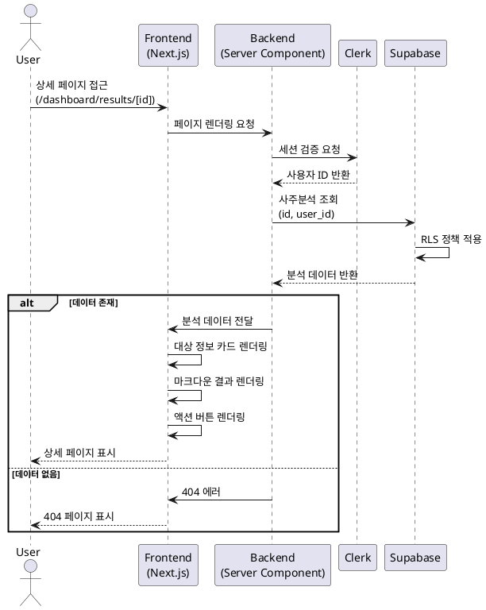
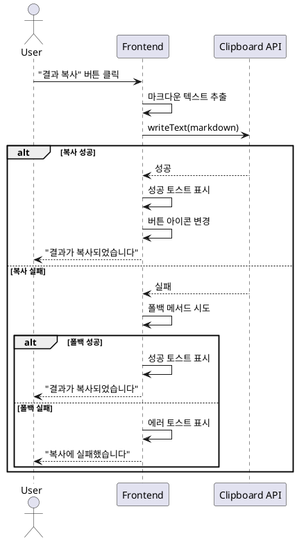

# 유스케이스: 사주분석 상세 조회

## 유스케이스 ID: UC-004

### 제목
사주분석 결과 상세 조회 및 활용

---

## 1. 개요

### 1.1 목적
사용자가 과거에 생성한 사주분석 결과를 상세하게 조회하고, 분석 결과를 복사하거나 추가 검사를 진행할 수 있도록 한다.

### 1.2 범위
- 특정 사주분석 결과의 상세 정보 조회
- 분석 대상 정보 표시 (이름, 생년월일, 출생시간, 성별, 분석 날짜)
- 마크다운 형식의 AI 분석 결과 렌더링
- 분석 결과 클립보드 복사 기능
- 본인 분석만 접근 가능하도록 권한 검증
- 다른 페이지로의 네비게이션 (목록, 새 검사)

**제외 사항**:
- 분석 결과 수정 기능
- 분석 결과 삭제 기능
- PDF 다운로드 기능
- 소셜 공유 기능

### 1.3 액터
- **주요 액터**: 로그인한 사용자 (본인의 분석 결과 조회)
- **부 액터**:
  - Clerk (사용자 인증 및 세션 검증)
  - Supabase (데이터베이스, RLS 기반 권한 제어)
  - 마크다운 렌더러 (분석 결과 HTML 변환)

---

## 2. 선행 조건

- 사용자가 Clerk를 통해 로그인된 상태여야 한다.
- 조회하려는 사주분석 ID가 존재해야 한다.
- 해당 사주분석이 현재 로그인한 사용자의 분석이어야 한다.
- 사용자가 대시보드 또는 직접 URL을 통해 상세 페이지에 접근한다.

---

## 3. 참여 컴포넌트

- **Frontend (Next.js)**:
  - 상세 페이지 UI 렌더링
  - 마크다운 결과 렌더링
  - 클립보드 복사 처리
  - 네비게이션 처리

- **Clerk Authentication**:
  - 사용자 세션 검증
  - 사용자 ID 제공

- **Supabase Database**:
  - saju_tests 테이블에서 분석 데이터 조회
  - RLS 정책으로 본인 데이터만 접근 허용

- **Markdown Renderer**:
  - AI 분석 결과를 HTML로 변환
  - 마크다운 구조 파싱 및 렌더링

---

## 4. Primary Actor
로그인한 사용자 (본인의 사주분석 결과를 조회하려는 사용자)

---

## 5. Precondition
- 사용자가 로그인되어 있다.
- 조회하려는 사주분석 결과가 데이터베이스에 존재한다.
- 해당 분석이 현재 사용자의 소유이다.

---

## 6. Trigger
- 사용자가 대시보드에서 이력 카드를 클릭한다.
- 사용자가 새 검사 완료 후 자동으로 리다이렉트된다.
- 사용자가 URL을 직접 입력하여 `/dashboard/results/[id]` 페이지에 접근한다.

---

## 7. Main Scenario

### 7.1 기본 흐름

1. **사용자**: 상세 페이지 URL (`/dashboard/results/[id]`)에 접근
   - 대시보드에서 이력 카드 클릭 또는
   - 새 검사 완료 후 자동 리다이렉트 또는
   - URL 직접 입력

2. **시스템 (Next.js)**:
   - 동적 라우트 파라미터에서 분석 ID 추출
   - Clerk 미들웨어를 통해 사용자 인증 상태 확인

3. **시스템 (Clerk)**:
   - 세션 유효성 검증
   - 세션 유효 → 사용자 ID 반환
   - 세션 무효 → 로그인 페이지로 리다이렉트 (현재 URL을 returnUrl로 저장)

4. **시스템 (Next.js Server Component)**:
   - Supabase 클라이언트 초기화 (사용자 세션 포함)
   - 분석 ID로 saju_tests 테이블 쿼리
   - WHERE 조건: `id = [분석ID] AND user_id = [현재사용자ID]`

5. **Supabase**:
   - RLS 정책 적용 (본인 데이터만 조회 가능)
   - 쿼리 실행
   - 결과 반환 (단일 레코드 또는 null)

6. **시스템 (Next.js)**:
   - 데이터 존재 여부 확인
   - 존재하지 않음 → 404 페이지 렌더링
   - 존재함 → 상세 페이지 컴포넌트에 데이터 전달

7. **시스템 (Frontend)**:
   - 분석 대상 정보 카드 렌더링
     - 이름: `data.name`
     - 생년월일: `data.birth_date` (포맷: YYYY-MM-DD)
     - 출생시간: `data.birth_time` (있을 경우, 포맷: HH:mm)
     - 성별: `data.gender` (남성/여성으로 표시)
     - 분석 날짜: `data.created_at` (포맷: YYYY-MM-DD HH:mm)

8. **시스템 (Markdown Renderer)**:
   - `data.result` (마크다운 텍스트) 파싱
   - HTML로 변환
   - 섹션별 렌더링:
     1. 천간(天干)과 지지(地支)
     2. 오행(五行) 분석
     3. 대운(大運)과 세운(歲運)
     4. 성격 분석
     5. 재운 분석
     6. 건강운 분석
     7. 연애운 분석

9. **시스템 (Frontend)**:
   - 액션 버튼 렌더링
     - "목록으로" 버튼 (좌측)
     - "새 검사하기" 버튼 (우측)
     - "결과 복사" 버튼 (상단 우측)

10. **사용자**: 렌더링된 사주분석 결과 확인

---

### 7.2 시퀀스 다이어그램



---

## 8. Edge Cases

### 8.1 비로그인 상태 접근
- **발생 조건**: 사용자가 로그인하지 않고 상세 페이지 URL에 접근
- **처리**:
  - Clerk 미들웨어가 세션 부재 감지
  - 현재 URL을 returnUrl로 저장
  - 로그인 페이지로 자동 리다이렉트
  - 로그인 후 원래 페이지로 복귀

### 8.2 존재하지 않는 분석 ID
- **발생 조건**: 잘못된 ID 또는 삭제된 분석 ID로 접근
- **처리**:
  - Supabase 쿼리 결과 null 반환
  - 404 페이지 렌더링
  - "대시보드로 돌아가기" 버튼 제공

### 8.3 타인의 분석 접근 시도
- **발생 조건**: 다른 사용자의 분석 ID로 접근
- **처리**:
  - Supabase RLS 정책이 쿼리 결과 차단
  - 결과 null 반환
  - 404 페이지 렌더링 (보안상 권한 없음 메시지 대신 404 사용)

### 8.4 데이터베이스 연결 실패
- **발생 조건**: Supabase 서비스 장애 또는 네트워크 에러
- **처리**:
  - try-catch로 에러 캐치
  - 에러 메시지 표시: "데이터를 불러오는 중 오류가 발생했습니다."
  - "다시 시도" 버튼 제공
  - "대시보드로 돌아가기" 버튼 제공

### 8.5 마크다운 렌더링 에러
- **발생 조건**: 잘못된 마크다운 형식 또는 렌더러 오류
- **처리**:
  - 렌더링 실패 시 원본 텍스트 표시
  - 사용자에게 "형식 오류" 안내 표시

### 8.6 세션 만료
- **발생 조건**: 페이지 로딩 중 또는 조회 중 세션 만료
- **처리**:
  - Clerk가 자동으로 감지
  - 현재 URL을 returnUrl로 저장
  - 로그인 페이지로 리다이렉트
  - 재로그인 후 원래 페이지로 복귀

### 8.7 클립보드 복사 실패
- **발생 조건**:
  - 클립보드 API 미지원 브라우저
  - HTTPS가 아닌 환경
  - 사용자 권한 거부
- **처리**:
  - 폴백 메서드 시도 (textarea 생성 → 복사 → 삭제)
  - 폴백도 실패 시 에러 토스트: "복사에 실패했습니다. 수동으로 복사해주세요."

---

## 9. Business Rules

### 9.1 권한 제어
- 사용자는 본인의 사주분석 결과만 조회할 수 있다.
- RLS 정책으로 데이터베이스 레벨에서 권한 제어한다.
- 타인의 분석 ID로 접근 시 404 페이지를 표시하여 데이터 존재 여부를 노출하지 않는다.

### 9.2 데이터 불변성
- 사주분석 결과는 생성 후 수정되지 않는다.
- 상세 페이지는 읽기 전용이다.

### 9.3 마크다운 렌더링
- AI 분석 결과는 마크다운 형식으로 저장되며, 렌더링 시 HTML로 변환된다.
- 헤딩, 리스트, 볼드, 이탤릭 등 기본 마크다운 구문을 지원한다.
- XSS 방지를 위해 마크다운 렌더러에 sanitize를 적용한다.

### 9.4 복사 기능
- 복사되는 내용은 렌더링된 HTML이 아닌 원본 마크다운 텍스트이다.
- 사용자가 다른 곳에 붙여넣기 시 마크다운 형식이 유지된다.

### 9.5 네비게이션
- "목록으로" 버튼: 대시보드(`/dashboard`)로 이동
- "새 검사하기" 버튼: 새 검사 페이지(`/dashboard/new`)로 이동
- 모든 네비게이션은 클라이언트 측 라우팅(Next.js Router)을 사용한다.

---

## 10. Alternative Flows

### 10.1 대안 플로우 1: 결과 복사

**시작 조건**: 사용자가 상세 페이지에서 "결과 복사" 버튼 클릭

**단계**:
1. 사용자가 "결과 복사" 버튼 클릭
2. 시스템이 `data.result` (마크다운 텍스트) 추출
3. `navigator.clipboard.writeText(data.result)` 호출
4. 클립보드 API 성공 시:
   - 성공 토스트 메시지 표시: "결과가 복사되었습니다."
   - 버튼 아이콘을 체크 표시로 변경
   - 2초 후 원래 아이콘으로 복구
5. 클립보드 API 실패 시:
   - 폴백 메서드 시도 (textarea 생성 → 선택 → 복사 → 삭제)
   - 폴백 성공 시 성공 토스트 표시
   - 폴백 실패 시 에러 토스트: "복사에 실패했습니다."

**결과**: 마크다운 텍스트가 클립보드에 복사됨

**시퀀스 다이어그램**:


---

### 10.2 대안 플로우 2: 목록으로 이동

**시작 조건**: 사용자가 "목록으로" 버튼 클릭

**단계**:
1. 사용자가 "목록으로" 버튼 클릭
2. `router.push('/dashboard')` 호출
3. 대시보드 페이지로 클라이언트 측 라우팅
4. 대시보드 페이지 렌더링

**결과**: 사용자가 대시보드 페이지로 이동

---

### 10.3 대안 플로우 3: 새 검사하기 이동

**시작 조건**: 사용자가 "새 검사하기" 버튼 클릭

**단계**:
1. 사용자가 "새 검사하기" 버튼 클릭
2. `router.push('/dashboard/new')` 호출
3. 새 검사하기 페이지로 클라이언트 측 라우팅
4. 새 검사하기 페이지 렌더링 (빈 폼 표시)

**결과**: 사용자가 새 검사하기 페이지로 이동

---

## 11. Exception Flows

### 11.1 예외 1: 세션 만료

**발생 조건**: 페이지 로딩 중 또는 접근 시 Clerk 세션이 만료됨

**처리 방법**:
1. Clerk 미들웨어가 세션 만료 감지
2. 현재 URL을 returnUrl 파라미터로 저장
3. 로그인 페이지로 리다이렉트 (`/sign-in?returnUrl=/dashboard/results/[id]`)
4. 사용자가 재로그인
5. 로그인 성공 시 원래 상세 페이지로 복귀

**에러 코드**: 401 Unauthorized (내부적으로 처리, 사용자에게는 리다이렉트만 표시)

**사용자 경험**: 자동으로 로그인 페이지로 이동, 재로그인 후 원래 위치로 복귀

---

### 11.2 예외 2: 권한 없음 (타인의 분석)

**발생 조건**: 다른 사용자의 분석 ID로 접근 시도

**처리 방법**:
1. Supabase RLS 정책이 쿼리 결과 차단
2. 쿼리 결과 null 반환
3. 404 Not Found 페이지 렌더링
4. "대시보드로 돌아가기" 버튼 제공

**에러 코드**: 404 Not Found

**사용자 메시지**: "페이지를 찾을 수 없습니다."

**보안 고려사항**: 권한 없음(403) 대신 404를 사용하여 데이터 존재 여부를 노출하지 않음

---

### 11.3 예외 3: 데이터베이스 연결 실패

**발생 조건**: Supabase 서비스 장애, 네트워크 에러, 연결 타임아웃

**처리 방법**:
1. 서버 컴포넌트에서 try-catch 블록으로 에러 캐치
2. 에러 타입 확인 (네트워크 에러, 타임아웃 등)
3. 에러 페이지 렌더링
4. "다시 시도" 버튼 (페이지 새로고침)
5. "대시보드로 돌아가기" 버튼

**에러 코드**: 503 Service Unavailable

**사용자 메시지**: "일시적인 오류가 발생했습니다. 잠시 후 다시 시도해주세요."

---

### 11.4 예외 4: 잘못된 분석 ID 형식

**발생 조건**: URL에 UUID가 아닌 값이 포함됨

**처리 방법**:
1. 서버 컴포넌트에서 ID 형식 검증
2. UUID 형식이 아닐 경우 404 페이지 렌더링

**에러 코드**: 404 Not Found

**사용자 메시지**: "페이지를 찾을 수 없습니다."

---

## 12. Post-conditions

### 12.1 성공 시

- **데이터베이스 변경**: 없음 (읽기 전용)
- **시스템 상태**: 사용자에게 분석 결과가 표시됨
- **사용자 상태**: 사용자가 분석 결과를 확인하고 다음 행동을 선택할 수 있음
- **외부 시스템**: 변경 없음

### 12.2 실패 시 (404, 권한 없음)

- **데이터베이스 변경**: 없음
- **시스템 상태**: 404 페이지 표시, 사용자가 대시보드로 돌아갈 수 있음
- **로그**: 접근 시도 로그 기록 (보안 모니터링용)

### 12.3 에러 시 (데이터베이스 연결 실패)

- **데이터베이스 변경**: 없음
- **시스템 상태**: 에러 페이지 표시
- **로그**: 서버 에러 로그 기록
- **사용자 경험**: 재시도 또는 대시보드 이동 옵션 제공

---

## 13. 비기능 요구사항

### 13.1 성능
- **페이지 로드 시간**: 3초 이내 (First Contentful Paint)
- **데이터 조회 응답**: 1초 이내
- **마크다운 렌더링**: 즉각 (클라이언트 측, 비동기)
- **클립보드 복사**: 200ms 이내

### 13.2 보안
- **인증**: Clerk JWT 기반 세션 검증
- **권한**: Supabase RLS로 본인 데이터만 접근 허용
- **데이터 암호화**: HTTPS 통신
- **XSS 방지**:
  - 마크다운 렌더러에 sanitize 적용
  - React 자동 이스케이프 활용
- **정보 노출 방지**: 타인의 분석 접근 시 403 대신 404 사용

### 13.3 가용성
- **에러 복구**: 데이터베이스 연결 실패 시 재시도 옵션 제공
- **세션 복구**: 세션 만료 시 자동 로그인 페이지 이동 및 원래 위치 복귀

### 13.4 확장성
- **서버리스**: Next.js App Router 서버 컴포넌트 활용
- **캐싱**: Vercel Edge Network 자동 캐싱
- **데이터베이스**: Supabase 자동 스케일링

---

## 14. UI/UX 요구사항

### 14.1 화면 구성

**헤더**:
- 로고 (좌측, 클릭 시 대시보드로 이동)
- 네비게이션 메뉴: 대시보드, 새 검사
- 사용자 프로필 버튼 (우측, Clerk UserButton)

**메인 컨텐츠**:
1. **분석 대상 정보 카드**
   - 이름: 텍스트, 볼드 처리
   - 생년월일: YYYY년 MM월 DD일 형식
   - 출생시간: HH시 mm분 형식 (있을 경우), 없으면 "미상" 표시
   - 성별: "남성" 또는 "여성"
   - 분석 날짜: YYYY년 MM월 DD일 HH시 mm분 형식
   - 카드 스타일: 배경색, 패딩, 라운드 코너

2. **사주분석 결과 섹션**
   - 마크다운 렌더링 영역
   - 헤딩, 리스트, 볼드, 이탤릭 등 스타일 적용
   - 섹션별 구분 (천간/지지, 오행, 대운/세운, 성격, 재운, 건강운, 연애운)
   - 가독성 높은 폰트, 줄간격

3. **액션 버튼 영역**
   - "목록으로" 버튼: 좌측, Secondary 스타일
   - "새 검사하기" 버튼: 우측, Primary 스타일
   - "결과 복사" 버튼: 상단 우측, Ghost 스타일, 복사 아이콘

### 14.2 사용자 경험

**로딩 상태**:
- 페이지 로드 중: 스켈레톤 로딩 표시
  - 정보 카드 스켈레톤
  - 결과 섹션 스켈레톤
- 로딩 시간: 1-3초 예상

**인터랙션**:
- 모든 버튼에 호버 효과 (배경색 변경, 커서 포인터)
- "결과 복사" 버튼 클릭 시:
  - 버튼 텍스트 변경: "복사 완료" (2초간)
  - 아이콘 변경: 체크 표시 (2초간)
  - 성공 토스트 메시지 하단 중앙에 표시
- 버튼 클릭 시 즉각 반응 (로딩 스피너 또는 비활성화)

**반응형 디자인**:
- 모바일 (320px ~ 767px):
  - 정보 카드: 세로 레이아웃
  - 버튼: 전체 너비, 세로 배치
- 태블릿 (768px ~ 1023px):
  - 정보 카드: 일부 가로 배치
  - 버튼: 가로 배치
- 데스크톱 (1024px 이상):
  - 정보 카드: 가로 레이아웃
  - 버튼: 가로 배치, 적절한 간격

**접근성**:
- 키보드 네비게이션: Tab 키로 모든 버튼 접근
- 스크린 리더: ARIA 라벨 적용 (섹션 제목, 버튼 설명)
- 색상 대비: WCAG AA 기준 준수
- 포커스 표시: 명확한 아웃라인

**에러 표시**:
- 404 페이지: 중앙 정렬, 아이콘, 메시지, "대시보드로 돌아가기" 버튼
- 연결 에러: 에러 아이콘, 메시지, "다시 시도" 버튼
- 토스트 메시지: 하단 중앙, 3초간 표시, 자동 사라짐

---

## 15. 테스트 시나리오

### 15.1 성공 케이스

| 테스트 케이스 ID | 전제 조건 | 테스트 단계 | 기대 결과 |
|----------------|----------|----------|----------|
| TC-004-01 | 로그인 상태, 본인의 유효한 분석 ID | 대시보드에서 이력 카드 클릭 | 상세 페이지 로드, 정보 카드 및 분석 결과 정상 표시 |
| TC-004-02 | 상세 페이지 표시 상태 | "결과 복사" 버튼 클릭 | 클립보드에 마크다운 텍스트 복사, 성공 토스트 표시 |
| TC-004-03 | 상세 페이지 표시 상태 | "목록으로" 버튼 클릭 | 대시보드 페이지로 이동 |
| TC-004-04 | 상세 페이지 표시 상태 | "새 검사하기" 버튼 클릭 | 새 검사하기 페이지로 이동 |
| TC-004-05 | 새 검사 완료 직후 | 자동 리다이렉트 | 방금 생성한 분석의 상세 페이지 표시 |
| TC-004-06 | 출생시간 없는 분석 | 상세 페이지 접근 | 출생시간 필드에 "미상" 표시 |

### 15.2 실패 케이스

| 테스트 케이스 ID | 전제 조건 | 테스트 단계 | 기대 결과 |
|----------------|----------|----------|----------|
| TC-004-07 | 비로그인 상태 | URL 직접 입력하여 상세 페이지 접근 | 로그인 페이지로 리다이렉트 |
| TC-004-08 | 로그인 상태 | 존재하지 않는 분석 ID로 접근 | 404 페이지 표시 |
| TC-004-09 | 로그인 상태 | 다른 사용자의 분석 ID로 접근 | 404 페이지 표시 |
| TC-004-10 | 로그인 상태 | 잘못된 UUID 형식으로 접근 | 404 페이지 표시 |
| TC-004-11 | Supabase 서비스 중단 | 상세 페이지 접근 | 에러 메시지 및 "다시 시도" 버튼 표시 |
| TC-004-12 | 클립보드 API 미지원 브라우저 | "결과 복사" 버튼 클릭 | 폴백 메서드로 복사 성공 또는 에러 토스트 |
| TC-004-13 | 페이지 로드 중 세션 만료 | 페이지 로딩 | 로그인 페이지로 리다이렉트, returnUrl 저장 |
| TC-004-14 | 마크다운 렌더링 에러 | 잘못된 마크다운 형식의 분석 결과 | 원본 텍스트 표시 또는 부분 렌더링 |

### 15.3 엣지 케이스

| 테스트 케이스 ID | 전제 조건 | 테스트 단계 | 기대 결과 |
|----------------|----------|----------|----------|
| TC-004-15 | 매우 긴 분석 결과 (10,000자 이상) | 상세 페이지 접근 | 스크롤 가능, 성능 저하 없이 렌더링 |
| TC-004-16 | 특수문자가 많은 이름 | 상세 페이지 접근 | XSS 없이 정상 표시 |
| TC-004-17 | 동시에 여러 브라우저 탭에서 접근 | 동일 분석 상세 페이지 접근 | 모든 탭에서 정상 표시 |
| TC-004-18 | 모바일 환경 | 상세 페이지 접근 및 복사 | 반응형 레이아웃, 터치 친화적 버튼 |

---

## 16. 관련 유스케이스

- **선행 유스케이스**:
  - UC-001: 로그인 (사용자 인증)
  - UC-003: 새 사주분석 요청 (분석 데이터 생성)

- **후행 유스케이스**:
  - UC-003: 새 사주분석 요청 ("새 검사하기" 버튼 클릭 시)
  - UC-002: 대시보드 조회 ("목록으로" 버튼 클릭 시)

- **연관 유스케이스**:
  - UC-002: 사주분석 이력 조회 (대시보드에서 상세로 이동)

---

## 17. 데이터 명세

### 17.1 조회 데이터 구조

**saju_tests 테이블 조회 결과**:
```typescript
interface SajuAnalysis {
  id: string;              // UUID
  user_id: string;         // Clerk user ID (text)
  name: string;            // 분석 대상 이름
  birth_date: string;      // YYYY-MM-DD 형식
  birth_time: string | null; // HH:mm 형식 또는 null
  gender: 'male' | 'female';
  result: string;          // 마크다운 텍스트
  created_at: string;      // ISO 8601 형식 타임스탬프
}
```

### 17.2 Supabase 쿼리

```typescript
const { data, error } = await supabase
  .from('saju_tests')
  .select('*')
  .eq('id', analysisId)
  .single();
```

### 17.3 RLS 정책

```sql
CREATE POLICY "saju_select_own"
  ON saju_tests FOR SELECT
  USING (user_id = auth.uid());
```

---

## 18. 변경 이력

| 버전 | 날짜 | 작성자 | 변경 내용 |
|------|------|--------|-----------|
| 1.0  | 2025-10-27 | Claude Code | 초기 작성 |

---

## 부록

### A. 용어 정의

- **RLS (Row Level Security)**: Supabase/PostgreSQL의 행 수준 보안 정책으로, 데이터 접근 권한을 행 단위로 제어
- **마크다운 (Markdown)**: 경량 마크업 언어, 텍스트 기반 포맷팅
- **Clerk**: 인증 및 사용자 관리 SaaS 플랫폼
- **서버 컴포넌트 (Server Component)**: Next.js App Router의 서버 측에서 렌더링되는 컴포넌트
- **XSS (Cross-Site Scripting)**: 악성 스크립트를 웹 페이지에 삽입하는 보안 취약점

### B. 참고 자료

- [Next.js App Router 문서](https://nextjs.org/docs/app)
- [Supabase RLS 문서](https://supabase.com/docs/guides/auth/row-level-security)
- [Clerk 인증 문서](https://clerk.com/docs)
- [MDN Clipboard API](https://developer.mozilla.org/en-US/docs/Web/API/Clipboard_API)
- [PRD 문서](/Users/leo/awesomedev/vmc1/vibe-fortune/docs/prd.md)
- [Userflow 문서](/Users/leo/awesomedev/vmc1/vibe-fortune/docs/userflow.md)
- [Database 설계](/Users/leo/awesomedev/vmc1/vibe-fortune/docs/database.md)
