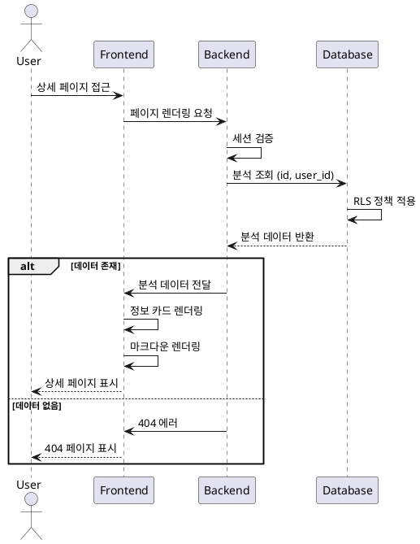
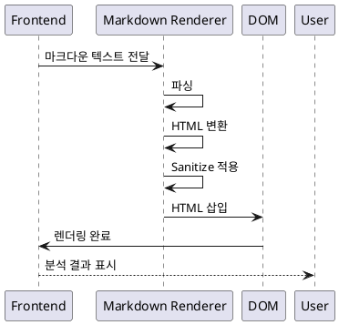
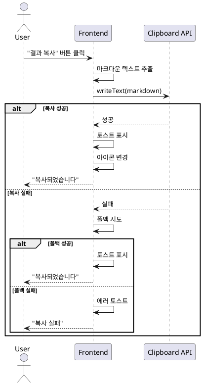
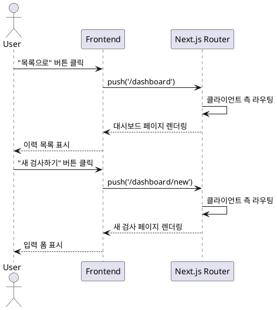

# UC-011: 사주분석 상세 페이지 접근

## 개요

사용자가 본인의 사주분석 결과 상세 페이지에 접근하여 분석 대상 정보와 AI 생성 결과를 확인한다.

## 사전 조건

- 사용자가 Clerk를 통해 로그인된 상태
- 조회하려는 사주분석 ID가 데이터베이스에 존재
- 해당 분석이 현재 사용자의 소유

## 액터

- **Primary Actor**: 로그인한 사용자
- **Secondary Actors**: Clerk (인증), Supabase (데이터베이스), Next.js (라우팅)

## 트리거

- 대시보드에서 이력 카드 클릭
- 새 검사 완료 후 자동 리다이렉트
- URL 직접 입력 (`/dashboard/results/[id]`)

## 주요 플로우

1. 사용자가 상세 페이지 URL에 접근한다
2. Next.js가 동적 라우트 파라미터에서 분석 ID를 추출한다
3. Clerk 미들웨어가 사용자 세션을 검증한다
4. 서버 컴포넌트가 Supabase에 분석 데이터를 조회한다
   - WHERE: `id = [분석ID] AND user_id = [현재사용자ID]`
5. Supabase RLS 정책이 본인 데이터만 접근하도록 필터링한다
6. 데이터 존재 여부를 확인한다
   - 존재하지 않으면 404 페이지 렌더링
   - 존재하면 상세 페이지 렌더링
7. 분석 대상 정보 카드를 표시한다
   - 이름, 생년월일, 출생시간, 성별, 분석 날짜
8. AI 분석 결과를 마크다운으로 렌더링한다
9. 액션 버튼들을 표시한다 (목록으로, 새 검사하기, 결과 복사)

## 대체 플로우 및 예외 상황

### 비로그인 상태 접근
- Clerk 미들웨어가 세션 부재를 감지
- 현재 URL을 returnUrl로 저장
- 로그인 페이지로 자동 리다이렉트
- 로그인 후 원래 페이지로 복귀

### 타인의 분석 접근
- Supabase RLS 정책이 쿼리 결과를 차단
- 404 페이지 렌더링 (권한 없음 정보 노출 방지)
- "대시보드로 돌아가기" 버튼 제공

### 존재하지 않는 분석 ID
- 쿼리 결과 null 반환
- 404 페이지 렌더링

### 데이터베이스 연결 실패
- try-catch로 에러 캐치
- 에러 메시지 표시: "데이터를 불러오는 중 오류가 발생했습니다"
- "다시 시도" 및 "대시보드로 돌아가기" 버튼 제공

### 세션 만료
- Clerk가 세션 만료를 감지
- 로그인 페이지로 리다이렉트
- returnUrl 저장하여 재로그인 후 복귀

## 비즈니스 룰

- 사용자는 본인의 분석 결과만 조회 가능
- RLS로 데이터베이스 레벨에서 권한 제어
- 타인의 분석 접근 시 404 표시 (데이터 존재 여부 노출 방지)
- 분석 결과는 읽기 전용 (수정 불가)

## 비기능 요구사항

### 성능
- 페이지 로드: 3초 이내 (FCP)
- 데이터베이스 조회: 1초 이내

### 보안
- Clerk JWT 기반 인증
- Supabase RLS로 본인 데이터만 접근
- HTTPS 통신 강제
- XSS 방지를 위한 마크다운 sanitize

### 가용성
- 데이터베이스 연결 실패 시 재시도 옵션
- 세션 만료 시 원래 위치로 복귀

## 성공 판정 기준

- 본인의 분석 결과가 3초 이내에 정상 표시됨
- 분석 대상 정보와 AI 결과가 모두 렌더링됨
- 타인의 분석 접근 시 404 페이지 표시
- 비로그인 상태에서 로그인 페이지로 리다이렉트

## 시퀀스 다이어그램

---

# UC-012: 분석 결과 마크다운 렌더링

## 개요

AI가 생성한 사주분석 결과를 마크다운 형식에서 HTML로 변환하여 사용자 친화적으로 표시한다.

## 사전 조건

- UC-011 (상세 페이지 접근)이 성공적으로 완료됨
- 분석 결과 데이터가 마크다운 형식으로 저장되어 있음

## 액터

- **Primary Actor**: 시스템 (마크다운 렌더러)
- **Secondary Actor**: 사용자 (결과 확인)

## 트리거

- 상세 페이지 렌더링 시 자동 실행

## 주요 플로우

1. 상세 페이지 컴포넌트가 마운트된다
2. 마크다운 렌더러가 `analysis_result` 텍스트를 파싱한다
3. 마크다운 구문을 HTML 요소로 변환한다
   - 헤딩 (##, ###)
   - 목록 (-, 1.)
   - 볼드 (**텍스트**)
   - 이탤릭 (*텍스트*)
4. XSS 방지를 위해 sanitize를 적용한다
5. 변환된 HTML을 DOM에 삽입한다
6. 스타일링을 적용한다
   - 가독성 높은 폰트
   - 적절한 줄간격
   - 섹션별 구분

## 대체 플로우 및 예외 상황

### 마크다운 파싱 에러
- 렌더링 실패 시 원본 텍스트 표시
- "형식 오류" 안내 표시

### 빈 결과
- 데이터가 비어있을 경우 "분석 결과가 없습니다" 메시지 표시

### 매우 긴 결과 (10,000자 이상)
- 스크롤 가능하게 렌더링
- 성능 저하 없이 처리

## 비즈니스 룰

- AI 결과는 마크다운 형식으로 저장
- 렌더링 시 HTML로 변환
- XSS 방지를 위한 sanitize 필수
- 섹션 구조 유지:
  1. 천간과 지지
  2. 오행 분석
  3. 대운과 세운
  4. 성격 분석
  5. 재운 분석
  6. 건강운 분석
  7. 연애운 분석

## 비기능 요구사항

### 성능
- 렌더링 시간: 즉각 (비동기)
- 10,000자까지 성능 저하 없이 처리

### 보안
- XSS 방지를 위한 sanitize 적용
- 악성 스크립트 필터링

### UI/UX
- 반응형 디자인 (모바일/태블릿/데스크톱)
- 가독성 높은 폰트 및 줄간격
- WCAG AA 색상 대비 기준 준수

## 성공 판정 기준

- 마크다운이 올바르게 HTML로 변환됨
- XSS 공격이 차단됨
- 모든 섹션이 구조적으로 표시됨
- 모바일 환경에서도 정상 렌더링

## 시퀀스 다이어그램

---

# UC-013: 분석 결과 복사

## 개요

사용자가 사주분석 결과를 클립보드에 복사하여 다른 곳에서 사용할 수 있도록 한다.

## 사전 조건

- UC-011 (상세 페이지 접근)이 완료됨
- 분석 결과가 화면에 표시되어 있음

## 액터

- **Primary Actor**: 로그인한 사용자
- **Secondary Actor**: 클립보드 API

## 트리거

- 사용자가 "결과 복사" 버튼 클릭

## 주요 플로우

1. 사용자가 "결과 복사" 버튼을 클릭한다
2. 시스템이 `analysis_result` (마크다운 텍스트)를 추출한다
3. `navigator.clipboard.writeText()` API를 호출한다
4. 클립보드에 텍스트가 복사된다
5. 성공 토스트 메시지를 표시한다: "결과가 복사되었습니다"
6. 버튼 아이콘을 체크 표시로 변경한다 (2초간)
7. 2초 후 원래 아이콘으로 복구한다

## 대체 플로우 및 예외 상황

### 클립보드 API 미지원
- 클립보드 API가 없는 브라우저 감지
- 폴백 메서드 실행:
  1. 숨겨진 textarea 요소 생성
  2. 마크다운 텍스트 삽입
  3. textarea 선택
  4. document.execCommand('copy') 실행
  5. textarea 삭제
- 성공 시 토스트 표시

### 클립보드 권한 거부
- HTTPS가 아닌 환경
- 사용자가 권한 거부
- 에러 토스트 표시: "복사에 실패했습니다"

### 폴백도 실패
- 에러 토스트 표시: "복사에 실패했습니다. 수동으로 복사해주세요"

## 비즈니스 룰

- 복사되는 내용은 원본 마크다운 텍스트 (HTML 아님)
- 사용자가 다른 곳에 붙여넣기 시 마크다운 형식 유지
- 클립보드 API 우선, 미지원 시 폴백

## 비기능 요구사항

### 성능
- 복사 실행: 200ms 이내
- 토스트 표시: 즉각

### 보안
- HTTPS 환경에서만 클립보드 API 사용 가능
- 권한 요청 및 처리

### UI/UX
- 버튼 클릭 시 즉각 피드백
- 성공/실패 토스트 메시지
- 버튼 상태 변경 (복사 완료 표시)

## 성공 판정 기준

- 클립보드에 마크다운 텍스트가 복사됨
- 성공 토스트가 표시됨
- 버튼 아이콘이 2초간 체크 표시로 변경됨
- 미지원 브라우저에서 폴백 동작

## 시퀀스 다이어그램

---

# UC-014: 네비게이션 (목록으로, 새 검사하기)

## 개요

사용자가 상세 페이지에서 다른 페이지로 이동할 수 있도록 네비게이션 기능을 제공한다.

## 사전 조건

- UC-011 (상세 페이지 접근)이 완료됨
- 액션 버튼이 화면에 표시되어 있음

## 액터

- **Primary Actor**: 로그인한 사용자
- **Secondary Actor**: Next.js Router

## 트리거

- 사용자가 "목록으로" 버튼 클릭
- 사용자가 "새 검사하기" 버튼 클릭

## 주요 플로우

### 목록으로 이동
1. 사용자가 "목록으로" 버튼을 클릭한다
2. `router.push('/dashboard')` 호출
3. 클라이언트 측 라우팅으로 대시보드 페이지 이동
4. 대시보드 페이지가 렌더링된다
5. 사주분석 이력 목록이 표시된다

### 새 검사하기 이동
1. 사용자가 "새 검사하기" 버튼을 클릭한다
2. `router.push('/dashboard/new')` 호출
3. 클라이언트 측 라우팅으로 새 검사 페이지 이동
4. 새 검사 페이지가 렌더링된다
5. 빈 입력 폼이 표시된다

## 대체 플로우 및 예외 상황

### 라우팅 실패
- 네트워크 에러 또는 라우팅 오류
- 브라우저 뒤로가기 버튼 사용 안내

### 세션 만료 중 이동
- 이동 중 세션 만료 감지
- 로그인 페이지로 리다이렉트
- returnUrl 저장하여 재로그인 후 복귀

## 비즈니스 룰

- 모든 네비게이션은 클라이언트 측 라우팅 사용 (페이지 새로고침 없음)
- "목록으로": `/dashboard`로 이동
- "새 검사하기": `/dashboard/new`로 이동
- 헤더 및 사이드바 메뉴와 동일한 동작

## 비기능 요구사항

### 성능
- 페이지 전환: 즉각 (클라이언트 측 라우팅)
- 부드러운 전환 애니메이션

### UI/UX
- 버튼 호버 효과
- 클릭 시 즉각 반응
- 로딩 상태 표시 (필요 시)

## 성공 판정 기준

- "목록으로" 클릭 시 대시보드로 이동
- "새 검사하기" 클릭 시 새 검사 페이지로 이동
- 페이지 전환이 즉각 발생
- 이전 페이지 상태가 유지됨 (브라우저 뒤로가기 시)

## 시퀀스 다이어그램

---

## 관련 유스케이스

- **UC-002**: 사주분석 이력 조회 (대시보드)
- **UC-003**: 새 사주분석 요청
- **UC-001**: 로그인 (인증)

## 참고 자료

- [PRD 문서](/Users/leo/awesomedev/vmc1/vibe-fortune/docs/prd.md)
- [Userflow 문서](/Users/leo/awesomedev/vmc1/vibe-fortune/docs/userflow.md) - 5. 사주분석 상세 조회 플로우
- [Database 설계](/Users/leo/awesomedev/vmc1/vibe-fortune/docs/database.md)
- [Next.js App Router](https://nextjs.org/docs/app)
- [Supabase RLS](https://supabase.com/docs/guides/auth/row-level-security)
- [Clipboard API](https://developer.mozilla.org/en-US/docs/Web/API/Clipboard_API)

## 변경 이력

| 버전 | 날짜 | 작성자 | 변경 내용 |
|------|------|--------|-----------|
| 1.0  | 2025-10-28 | Claude Code | 초기 작성 - UC-011, UC-012, UC-013, UC-014 |
