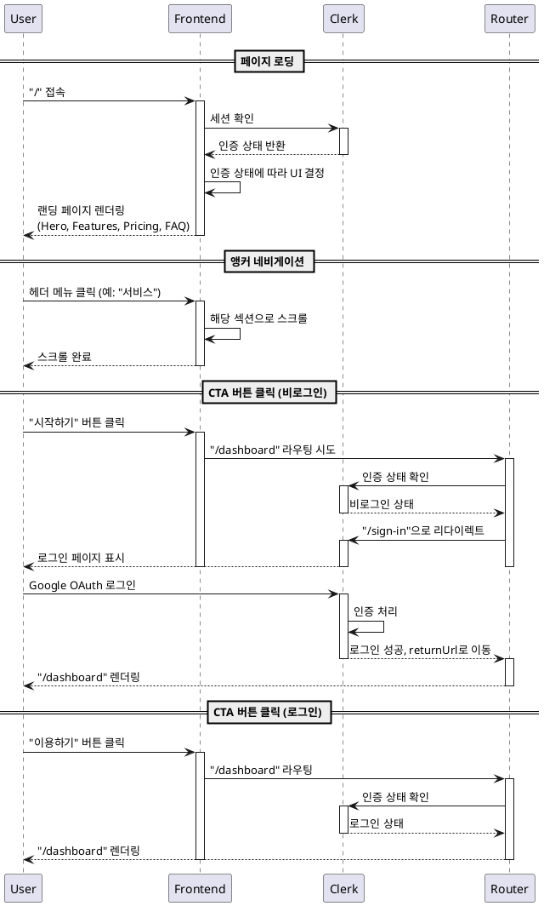

# 유스케이스: UC-005 랜딩 페이지

## 제목
랜딩 페이지 방문 및 서비스 시작

---

## 1. 개요

### 1.1 목적
신규 방문자에게 Vibe Fortune 서비스의 핵심 가치를 전달하고, 사용자 유입 및 회원가입을 유도한다.

### 1.2 범위
- 서비스 소개 및 주요 기능 안내
- Hero, Features, Pricing, FAQ 섹션 표시
- 로그인 여부에 따른 CTA 버튼 처리
- 앵커 네비게이션 제공

**제외 사항**:
- 실제 사주분석 기능 (별도 유스케이스)
- 회원가입/로그인 프로세스 상세 (별도 유스케이스)

### 1.3 액터
- **주요 액터**: 서비스 방문자 (신규 또는 재방문 사용자)
- **부 액터**: Clerk 인증 시스템

---

## 2. 선행 조건

- 사용자가 웹 브라우저로 서비스 URL에 접속 가능
- 랜딩 페이지가 배포되어 있음
- (선택) Google 계정 보유 (로그인 시)

---

## 3. 참여 컴포넌트

- **프론트엔드**: Next.js 기반 랜딩 페이지 컴포넌트
- **Clerk**: 인증 상태 확인 및 로그인 처리
- **라우터**: Next.js App Router

---

## 4. Primary Actor
서비스 방문자 (비로그인 또는 로그인 사용자)

---

## 5. Precondition
- 사용자가 브라우저를 통해 홈페이지(/)에 접속

---

## 6. Trigger
사용자가 Vibe Fortune 홈페이지 URL을 입력하거나 링크를 클릭하여 방문

---

## 7. Main Scenario

### 7.1 페이지 로딩
1. **사용자**: 브라우저에서 `/` 경로로 접속
2. **FE**: 랜딩 페이지 컴포넌트 렌더링 시작
3. **FE**: Clerk 세션 확인
4. **Clerk**: 인증 상태 반환 (로그인/비로그인)
5. **FE**: 인증 상태에 따라 헤더 UI 결정
   - 비로그인: "시작하기" 버튼 표시
   - 로그인: "이용하기" 버튼 표시
6. **FE**: 페이지 섹션 렌더링
   - Hero 섹션 (메인 헤드라인 + CTA)
   - Features 섹션 (주요 기능 4가지)
   - Pricing 섹션 (무료 이용 안내)
   - FAQ 섹션 (자주 묻는 질문)

### 7.2 앵커 네비게이션
1. **사용자**: 헤더 메뉴 중 특정 섹션 링크 클릭
   - 홈, 서비스, 가격, FAQ
2. **FE**: 해당 섹션으로 부드럽게 스크롤 이동
3. **FE**: 스크롤 완료 후 포커스 유지

### 7.3 CTA 버튼 클릭 (비로그인)
1. **사용자**: "시작하기" 버튼 클릭
2. **FE**: `/dashboard` 경로로 라우팅 시도
3. **Clerk Middleware**: 비로그인 상태 감지
4. **Clerk**: 로그인 페이지(`/sign-in`)로 리다이렉트
5. **Clerk**: 현재 URL(`/dashboard`)을 returnUrl로 저장
6. **사용자**: Clerk 로그인 페이지에서 Google OAuth 진행
7. **Clerk**: 로그인 성공 후 returnUrl(`/dashboard`)로 이동

### 7.4 CTA 버튼 클릭 (로그인)
1. **사용자**: "이용하기" 버튼 클릭
2. **FE**: `/dashboard` 경로로 라우팅
3. **Clerk Middleware**: 로그인 상태 확인
4. **FE**: 대시보드 페이지 렌더링
5. **사용자**: 대시보드에서 사주분석 이력 확인 가능

---

## 8. Edge Cases

### 8.1 네트워크 에러
- **발생 조건**: 페이지 로딩 중 네트워크 장애
- **처리**: 정적 컨텐츠는 표시, Clerk 상태 확인 실패 시 비로그인 상태로 간주

### 8.2 Clerk 세션 만료
- **발생 조건**: 이전에 로그인했으나 세션이 만료된 상태
- **처리**: 비로그인 상태로 처리, "시작하기" 버튼 표시

### 8.3 느린 네트워크
- **발생 조건**: 느린 인터넷 환경
- **처리**: 스켈레톤 UI 또는 로딩 표시, 점진적 렌더링

### 8.4 앵커 링크 실패
- **발생 조건**: 존재하지 않는 섹션 ID로 네비게이션 시도
- **처리**: 페이지 최상단으로 이동

### 8.5 로그인 취소
- **발생 조건**: 사용자가 로그인 페이지에서 뒤로가기 또는 취소
- **처리**: 홈페이지로 복귀, 비로그인 상태 유지

---

## 9. Business Rules

### 9.1 인증 상태별 UI
- 비로그인 사용자: "시작하기" 버튼 표시
- 로그인 사용자: "이용하기" 버튼 표시

### 9.2 접근 권한
- 랜딩 페이지는 누구나 접근 가능
- 인증 없이 모든 섹션 열람 가능

### 9.3 CTA 동작
- "시작하기" 또는 "이용하기" 버튼은 항상 `/dashboard`로 라우팅
- 비로그인 상태 시 자동으로 로그인 페이지로 리다이렉트

### 9.4 콘텐츠 표시
- Features 섹션: 4가지 핵심 기능 표시
  1. AI 기반 전문 분석
  2. 간편한 Google 로그인
  3. 분석 이력 관리
  4. 마크다운 기반 결과 렌더링
- Pricing 섹션: 무료 이용 강조
- FAQ 섹션: 자주 묻는 질문 및 답변

---

## 10. Sequence Diagram

---

## 11. 후행 조건

### 11.1 성공 시
- **시스템 상태**: 사용자가 서비스 개요를 이해
- **사용자 행동**:
  - 비로그인 사용자: 로그인 페이지로 이동 또는 페이지 탐색 계속
  - 로그인 사용자: 대시보드로 이동하여 서비스 이용 시작

### 11.2 탐색 중 종료
- **시스템 상태**: 변경 없음
- **사용자 상태**: 비로그인 상태 유지 (로그인하지 않은 경우)

---

## 12. 비기능 요구사항

### 12.1 성능
- 페이지 초기 로딩 시간(FCP): 1.5초 이내
- 전체 페이지 로드(LCP): 3초 이내
- 앵커 스크롤 애니메이션: 부드러운 스크롤, 500ms 이내 완료

### 12.2 반응형 디자인
- 모바일(320px~767px): 세로 스크롤, 섹션별 표시
- 태블릿(768px~1023px): 2컬럼 레이아웃
- 데스크톱(1024px~): 풀 레이아웃

### 12.3 접근성
- ARIA 라벨 적용 (네비게이션, 버튼)
- 키보드 네비게이션 지원
- 스크린 리더 호환

### 12.4 SEO
- 메타 태그 설정 (title, description, og:image)
- 의미론적 HTML 구조
- 검색 엔진 크롤링 가능

---

## 13. UI/UX 요구사항

### 13.1 헤더 구성
- **로고** (좌측): 클릭 시 홈으로 이동
- **앵커 메뉴** (중앙): 홈, 서비스, 가격, FAQ
- **CTA 버튼** (우측):
  - 비로그인: "시작하기"
  - 로그인: "이용하기"

### 13.2 Hero 섹션
- **메인 헤드라인**: 서비스 핵심 가치 전달 (예: "AI가 분석하는 나만의 사주팔자")
- **서브 헤드라인**: 상세 설명 (예: "Google 계정으로 1분 안에 시작하세요")
- **CTA 버튼**: 시작하기/이용하기, 크고 눈에 띄는 디자인

### 13.3 Features 섹션
4가지 주요 기능을 카드 형식으로 표시:
1. **AI 기반 전문 분석**: Gemini API 활용, 20년 경력 상담사 수준
2. **간편한 Google 로그인**: 클릭 한 번으로 시작
3. **분석 이력 관리**: 과거 분석 결과 언제든 재확인
4. **마크다운 렌더링**: 보기 쉬운 결과 표시

### 13.4 Pricing 섹션
- **무료 이용 강조**: 구독 없이 누구나 무료
- **간결한 안내**: 추가 비용 없음 명시

### 13.5 FAQ 섹션
- 아코디언 형식의 질문/답변
- 최소 4-6개 질문 포함:
  - 서비스 이용 방법
  - 비용 관련
  - 개인정보 보호
  - 분석 정확도 등

### 13.6 반응형 동작
- 모바일: 햄버거 메뉴, 세로 스크롤
- 데스크톱: 고정 헤더, 수평 네비게이션

---

## 14. 테스트 시나리오

### 14.1 성공 케이스

| 테스트 케이스 ID | 사용자 상태 | 행동 | 기대 결과 |
|----------------|-----------|------|----------|
| TC-005-01      | 비로그인   | 홈페이지 접속 | 랜딩 페이지 정상 렌더링, "시작하기" 버튼 표시 |
| TC-005-02      | 로그인     | 홈페이지 접속 | 랜딩 페이지 정상 렌더링, "이용하기" 버튼 표시 |
| TC-005-03      | 모두       | 헤더 "서비스" 클릭 | Features 섹션으로 스크롤 이동 |
| TC-005-04      | 비로그인   | "시작하기" 클릭 | 로그인 페이지로 리다이렉트 |
| TC-005-05      | 로그인     | "이용하기" 클릭 | 대시보드 페이지로 이동 |

### 14.2 엣지 케이스

| 테스트 케이스 ID | 조건 | 기대 결과 |
|----------------|------|----------|
| TC-005-06      | 네트워크 에러 발생 | 정적 컨텐츠는 표시, 인증 상태 미확인 시 비로그인으로 간주 |
| TC-005-07      | 세션 만료 상태 | "시작하기" 버튼 표시, 클릭 시 로그인 페이지로 이동 |
| TC-005-08      | 느린 네트워크 | 스켈레톤 UI 표시 후 점진적 렌더링 |
| TC-005-09      | 로그인 페이지에서 취소 | 홈페이지로 복귀, 비로그인 상태 유지 |

---

## 15. 관련 유스케이스

- **UC-001**: 회원가입/로그인 (CTA 버튼 클릭 시 연결)
- **UC-002**: 대시보드 조회 (로그인 후 이동 경로)
- **UC-003**: 새 사주분석 요청 (서비스 시작 후 첫 액션)

---

## 16. 변경 이력

| 버전 | 날짜 | 작성자 | 변경 내용 |
|------|------|--------|-----------|
| 1.0  | 2025-10-27 | Claude Code | 초기 작성 |

---

## 부록

### A. 용어 정의

- **CTA (Call To Action)**: 사용자 행동을 유도하는 버튼 또는 링크
- **Hero 섹션**: 랜딩 페이지 최상단의 메인 메시지 영역
- **앵커 네비게이션**: 페이지 내 특정 섹션으로 이동하는 링크
- **Clerk**: 인증 서비스 제공자 (Google OAuth 지원)

### B. 참고 자료

- `/docs/prd.md`: 제품 요구사항 명세서
- `/docs/userflow.md`: 사용자 플로우 명세서
- Clerk 문서: https://clerk.com/docs
- Next.js App Router: https://nextjs.org/docs/app
