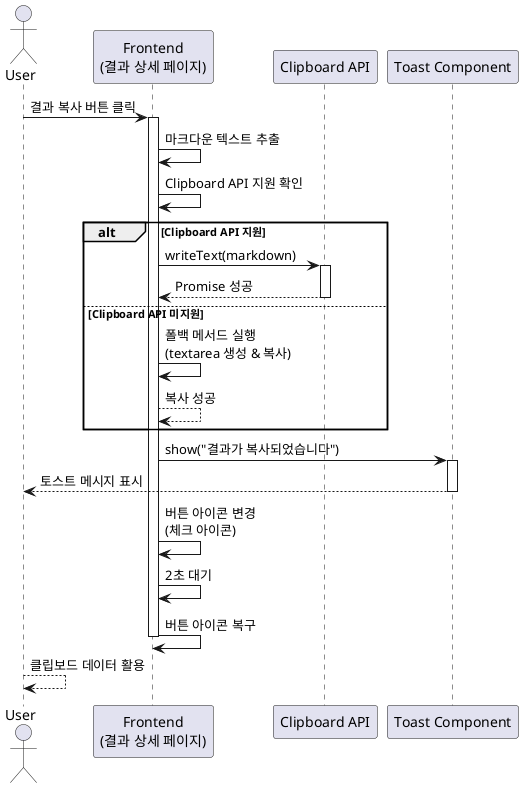

# 유스케이스: UC-006 사주분석 결과 복사

## 제목
사주분석 결과를 클립보드에 복사하여 다른 곳에 활용

---

## 1. 개요

### 1.1 목적
사용자가 사주분석 결과를 마크다운 형식으로 클립보드에 복사하여 메모장, 메시지 앱, 문서 등 다른 곳에 저장하거나 공유할 수 있도록 한다.

### 1.2 범위
- 사주분석 상세 페이지에서 결과 복사 기능 제공
- 클립보드 API를 사용한 복사 기능
- 복사 성공/실패에 대한 사용자 피드백
- 구형 브라우저를 위한 폴백 메서드 지원

**제외 사항:**
- 소셜 미디어 직접 공유 기능
- PDF 다운로드 기능
- 이메일 전송 기능

### 1.3 액터
- **주요 액터**: 로그인한 사용자
- **부 액터**: 브라우저 클립보드 API

---

## 2. 선행 조건

- 사용자가 로그인된 상태
- 사용자가 자신의 사주분석 상세 페이지에 접근한 상태
- 사주분석 결과 데이터가 정상적으로 로드됨
- 브라우저가 클립보드 API를 지원하거나 폴백 메서드를 사용할 수 있음

---

## 3. 참여 컴포넌트

- **결과 상세 페이지 (FE)**: 복사 버튼 UI 및 사용자 인터랙션 처리
- **클립보드 API**: 브라우저 제공 clipboard API 또는 폴백 메서드
- **토스트 컴포넌트 (FE)**: 복사 성공/실패 메시지 표시
- **마크다운 데이터**: saju_tests 테이블의 result 컬럼

---

## 4. 기본 플로우 (Basic Flow)

### 4.1 단계별 흐름

1. **사용자**: 사주분석 상세 페이지에서 "결과 복사" 버튼 클릭
   - 입력: 버튼 클릭 이벤트
   - 처리: onClick 이벤트 핸들러 실행
   - 출력: 복사 프로세스 시작

2. **FE 컴포넌트**: 분석 결과 마크다운 텍스트 추출
   - 입력: saju_tests.result 데이터
   - 처리: 메모리에서 마크다운 텍스트 추출
   - 출력: 순수 마크다운 텍스트 문자열

3. **FE 컴포넌트**: 클립보드 API 지원 여부 확인
   - 입력: navigator.clipboard 객체 존재 여부
   - 처리: API 지원 여부 체크
   - 출력: 지원 여부 boolean

4. **클립보드 API**: 텍스트를 클립보드에 복사
   - 입력: 마크다운 텍스트
   - 처리: navigator.clipboard.writeText() 호출
   - 출력: Promise 반환 (성공/실패)

5. **FE 컴포넌트**: 복사 성공 처리
   - 입력: Promise 성공 응답
   - 처리: 성공 토스트 메시지 표시, 버튼 아이콘 변경
   - 출력: "결과가 복사되었습니다" 토스트 메시지

6. **FE 컴포넌트**: 버튼 상태 복구
   - 입력: 2초 타이머
   - 처리: setTimeout으로 버튼 아이콘 원래대로 복구
   - 출력: 버튼 UI 원래 상태로 복귀

### 4.2 시퀀스 다이어그램



---

## 5. 대안 플로우 (Alternative Flows)

### 5.1 대안 플로우 1: 폴백 메서드 사용 (구형 브라우저)

**시작 조건**: 브라우저가 Clipboard API를 지원하지 않음

**단계**:
1. FE 컴포넌트가 navigator.clipboard 미지원 감지
2. 임시 textarea 엘리먼트 생성
3. 마크다운 텍스트를 textarea에 삽입
4. textarea를 DOM에 추가 (화면 밖으로 위치)
5. textarea 내용 선택 (select())
6. document.execCommand('copy') 실행
7. textarea를 DOM에서 제거
8. 성공 토스트 메시지 표시

**결과**: 구형 브라우저에서도 복사 기능 정상 작동

---

## 6. 예외 플로우 (Exception Flows)

### 6.1 예외 상황 1: 클립보드 권한 거부

**발생 조건**:
- 브라우저가 클립보드 접근 권한을 거부
- HTTPS가 아닌 HTTP 환경에서 실행

**처리 방법**:
1. Promise reject 또는 에러 catch
2. 에러 타입 확인 (NotAllowedError)
3. 에러 토스트 메시지 표시
4. 콘솔에 에러 로그 기록

**사용자 메시지**: "클립보드 접근 권한이 필요합니다. 브라우저 설정을 확인해주세요."

---

### 6.2 예외 상황 2: 복사 실패 (일반 에러)

**발생 조건**:
- 알 수 없는 이유로 복사 실패
- 브라우저 버그 또는 시스템 제약

**처리 방법**:
1. catch 블록에서 에러 캐치
2. 에러 토스트 메시지 표시
3. 콘솔에 에러 상세 로그 기록
4. 버튼 상태 원래대로 복구

**사용자 메시지**: "복사에 실패했습니다. 다시 시도해주세요."

---

### 6.3 예외 상황 3: 빈 결과 데이터

**발생 조건**:
- saju_tests.result가 null 또는 빈 문자열

**처리 방법**:
1. 복사 버튼 클릭 전 결과 데이터 유효성 검증
2. 빈 데이터 감지 시 복사 버튼 비활성화
3. 또는 경고 토스트 메시지 표시

**사용자 메시지**: "복사할 결과가 없습니다."

---

## 7. 후행 조건 (Post-conditions)

### 7.1 성공 시

- **클립보드 상태**: 사용자의 시스템 클립보드에 마크다운 텍스트 저장됨
- **UI 상태**:
  - 성공 토스트 메시지 표시
  - 복사 버튼 아이콘이 체크 표시로 변경 (2초간)
  - 2초 후 원래 아이콘으로 복구
- **데이터베이스 변경**: 없음 (읽기 전용 작업)
- **외부 시스템**: 없음

### 7.2 실패 시

- **클립보드 상태**: 변경 없음
- **UI 상태**:
  - 에러 토스트 메시지 표시
  - 버튼 상태 원래대로 유지
- **로그**: 콘솔에 에러 로그 기록

---

## 8. 비기능 요구사항

### 8.1 성능
- 복사 작업 완료 시간: 100ms 이내
- 토스트 메시지 표시 지연: 즉시 (0ms)
- 버튼 아이콘 변경 애니메이션: 200ms 이내

### 8.2 보안
- 클립보드 접근 시 HTTPS 환경 권장
- 사용자 본인의 분석 결과만 복사 가능 (상세 페이지 접근 권한으로 보장)
- XSS 방지를 위해 마크다운 텍스트 이스케이프 불필요 (읽기 전용)

### 8.3 호환성
- 최신 브라우저: Clipboard API 사용
- 구형 브라우저: execCommand 폴백
- 모바일 브라우저: 터치 이벤트 지원
- 최소 지원 브라우저:
  - Chrome 66+
  - Firefox 63+
  - Safari 13.1+
  - Edge 79+

---

## 9. UI/UX 요구사항

### 9.1 화면 구성

**복사 버튼**:
- 위치: 사주분석 상세 페이지 상단 우측 (또는 결과 영역 상단)
- 아이콘: 복사 아이콘 (예: 두 장의 종이 겹친 모양)
- 텍스트: "결과 복사" 또는 아이콘만
- 스타일: Secondary 또는 Ghost 버튼
- 크기: 중간 크기 (모바일에서도 터치하기 쉬운 크기)

**토스트 메시지**:
- 위치: 화면 상단 중앙 또는 우측 상단
- 지속 시간: 3초
- 타입:
  - 성공: 초록색 배경, 체크 아이콘
  - 실패: 빨간색 배경, 경고 아이콘

### 9.2 사용자 경험

**인터랙션**:
1. 버튼 호버 시 배경색 변화
2. 버튼 클릭 시 즉시 반응 (로딩 없음)
3. 복사 성공 시:
   - 토스트 메시지 슬라이드 인 애니메이션
   - 버튼 아이콘 변경 (복사 → 체크)
   - 2초 후 원래 아이콘으로 복귀
4. 복사 실패 시:
   - 에러 토스트 메시지 표시
   - 버튼 약간 흔들림 애니메이션 (선택사항)

**접근성**:
- 버튼에 aria-label="사주분석 결과 복사" 속성
- 복사 성공 시 스크린 리더 알림 (aria-live)
- 키보드 포커스 가능 (Tab 키)
- Enter 또는 Space 키로 활성화

---

## 10. 비즈니스 규칙

### 10.1 권한
- 로그인한 사용자만 복사 가능
- 본인의 사주분석 결과만 복사 가능 (페이지 접근 권한으로 보장)

### 10.2 데이터
- 복사되는 데이터: saju_tests.result 컬럼 전체 (마크다운 형식)
- 개인정보 포함 여부: 분석 대상 이름, 생년월일 등 포함 (사용자 본인이 입력한 정보)
- 데이터 가공: 원본 마크다운 그대로 복사 (가공 없음)

### 10.3 사용 제한
- 복사 횟수 제한: 없음
- 동시 복사 제한: 없음 (클라이언트 측 작업)

---

## 11. 테스트 시나리오

### 11.1 성공 케이스

| 테스트 케이스 ID | 입력값 | 기대 결과 |
|----------------|--------|----------|
| TC-006-01 | 최신 Chrome에서 복사 버튼 클릭 | Clipboard API 사용, 성공 토스트 표시 |
| TC-006-02 | 최신 Safari에서 복사 버튼 클릭 | Clipboard API 사용, 성공 토스트 표시 |
| TC-006-03 | 모바일 브라우저에서 복사 버튼 터치 | 복사 성공, 토스트 표시 |
| TC-006-04 | 복사 후 다른 앱에 붙여넣기 | 마크다운 텍스트 정상 붙여넣기 |
| TC-006-05 | 키보드로 버튼 포커스 후 Enter | 복사 성공 |

### 11.2 실패 케이스

| 테스트 케이스 ID | 입력값 | 기대 결과 |
|----------------|--------|----------|
| TC-006-06 | HTTP 환경에서 복사 시도 | 권한 에러 토스트 표시 |
| TC-006-07 | 클립보드 권한 거부 후 복사 시도 | 권한 에러 토스트 표시 |
| TC-006-08 | 빈 결과 데이터에서 복사 시도 | 복사 버튼 비활성화 또는 경고 메시지 |
| TC-006-09 | 구형 IE11에서 복사 시도 | 폴백 메서드 사용 또는 미지원 안내 |

### 11.3 예외 케이스

| 테스트 케이스 ID | 입력값 | 기대 결과 |
|----------------|--------|----------|
| TC-006-10 | 복사 중 네트워크 끊김 | 영향 없음 (클라이언트 작업) |
| TC-006-11 | 매우 긴 결과 텍스트 (10,000자 이상) | 복사 성공, 성능 저하 없음 |
| TC-006-12 | 특수문자 포함 마크다운 | 원본 그대로 복사됨 |

---

## 12. 관련 유스케이스

- **선행 유스케이스**: UC-004 사주분석 상세 조회 (상세 페이지 접근)
- **후행 유스케이스**: 없음 (복사 후 사용자가 외부에서 활용)
- **연관 유스케이스**:
  - UC-004 사주분석 상세 조회
  - (향후) UC-007 사주분석 결과 PDF 다운로드
  - (향후) UC-008 사주분석 결과 공유

---

## 13. 구현 참고사항

### 13.1 Clipboard API 사용 예시

```typescript
async function copyResultToClipboard(markdownText: string) {
  try {
    if (navigator.clipboard && window.isSecureContext) {
      // Clipboard API 사용
      await navigator.clipboard.writeText(markdownText);
      showToast('결과가 복사되었습니다', 'success');
    } else {
      // 폴백 메서드
      fallbackCopy(markdownText);
    }

    // 버튼 아이콘 변경
    setButtonIcon('check');
    setTimeout(() => setButtonIcon('copy'), 2000);

  } catch (error) {
    if (error.name === 'NotAllowedError') {
      showToast('클립보드 접근 권한이 필요합니다', 'error');
    } else {
      showToast('복사에 실패했습니다', 'error');
    }
    console.error('Clipboard copy failed:', error);
  }
}

function fallbackCopy(text: string) {
  const textarea = document.createElement('textarea');
  textarea.value = text;
  textarea.style.position = 'fixed';
  textarea.style.left = '-999999px';
  document.body.appendChild(textarea);
  textarea.select();

  try {
    document.execCommand('copy');
    showToast('결과가 복사되었습니다', 'success');
  } catch (error) {
    showToast('복사에 실패했습니다', 'error');
  } finally {
    document.body.removeChild(textarea);
  }
}
```

### 13.2 컴포넌트 구조 예시

```tsx
// ResultDetailPage.tsx
export default function ResultDetailPage({ result }: Props) {
  const [copyIcon, setCopyIcon] = useState<'copy' | 'check'>('copy');

  const handleCopy = async () => {
    await copyResultToClipboard(result.result);
  };

  return (
    <div>
      {/* 분석 결과 헤더 */}
      <div className="flex justify-between items-center">
        <h1>사주분석 결과</h1>
        <Button onClick={handleCopy} variant="ghost">
          {copyIcon === 'copy' ? <CopyIcon /> : <CheckIcon />}
          <span className="ml-2">결과 복사</span>
        </Button>
      </div>

      {/* 마크다운 렌더링 */}
      <MarkdownRenderer content={result.result} />
    </div>
  );
}
```

---

## 14. 변경 이력

| 버전 | 날짜 | 작성자 | 변경 내용 |
|------|------|--------|-----------|
| 1.0  | 2025-10-27 | Claude Code | 초기 작성 |

---

## 부록

### A. 용어 정의

- **Clipboard API**: 브라우저에서 제공하는 클립보드 접근 API (navigator.clipboard)
- **폴백 메서드**: Clipboard API를 지원하지 않는 구형 브라우저를 위한 대체 방법 (execCommand)
- **마크다운**: 경량 마크업 언어 (Gemini API가 생성한 사주분석 결과 형식)
- **토스트 메시지**: 화면에 일시적으로 표시되는 알림 메시지

### B. 참고 자료

- [MDN: Clipboard API](https://developer.mozilla.org/en-US/docs/Web/API/Clipboard_API)
- [MDN: execCommand (deprecated)](https://developer.mozilla.org/en-US/docs/Web/API/Document/execCommand)
- [Can I Use: Clipboard API](https://caniuse.com/mdn-api_clipboard_writetext)
- PRD: `/docs/prd.md` - 3.2.4 사주분석 상세 페이지
- Userflow: `/docs/userflow.md` - 5.2 결과 복사
