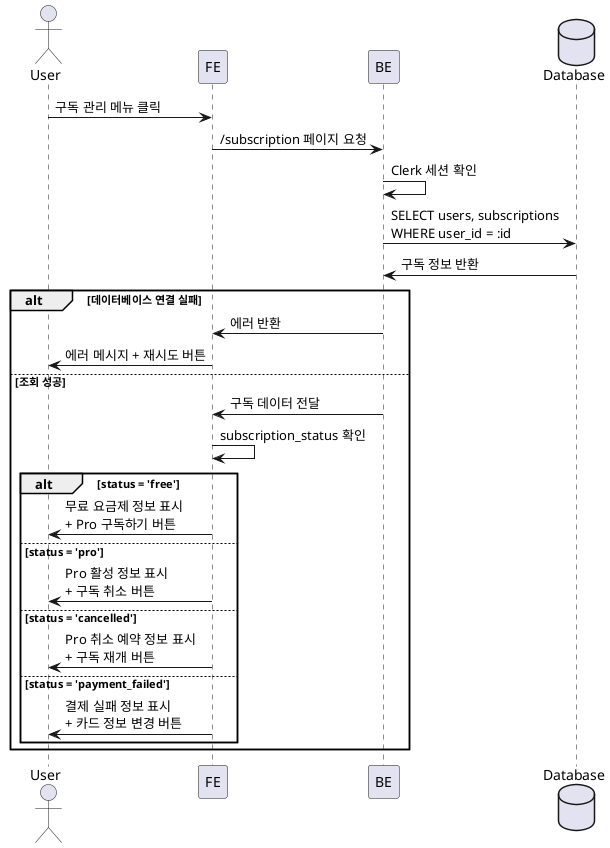
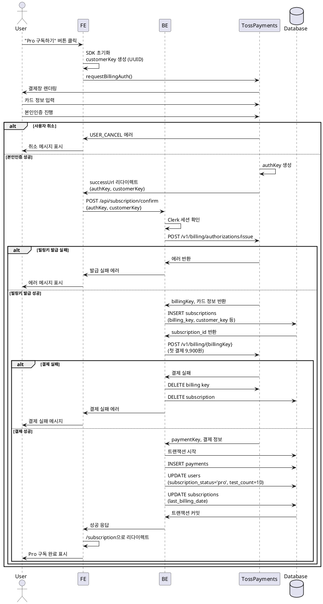
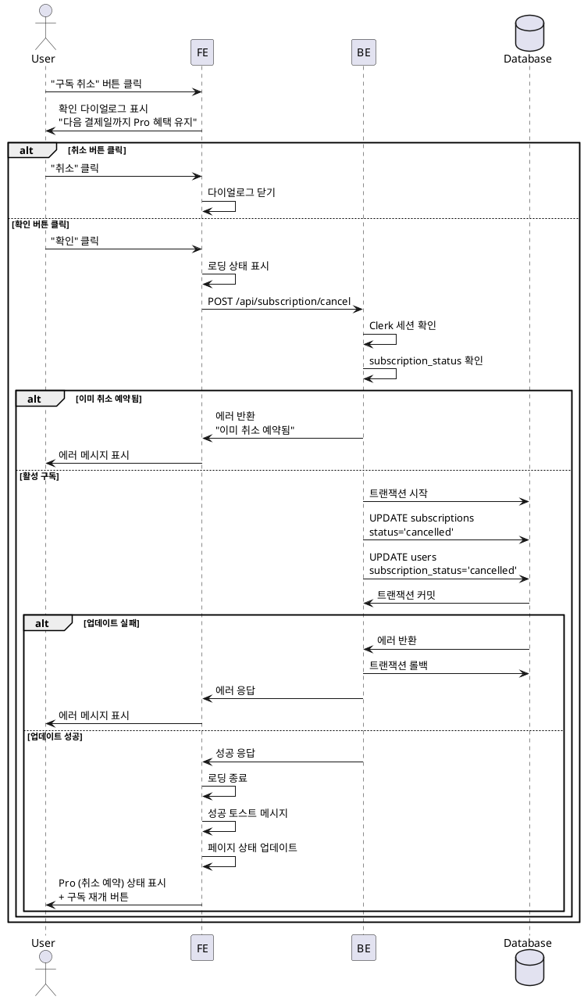
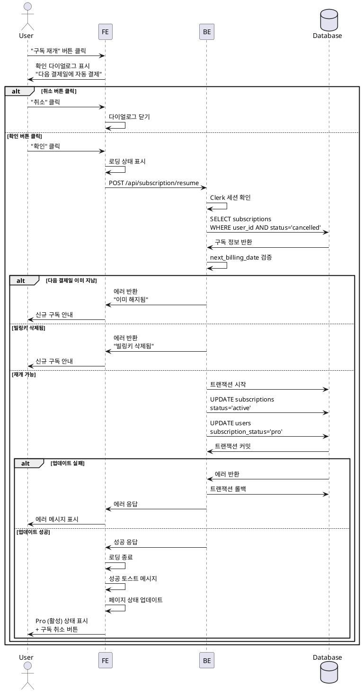
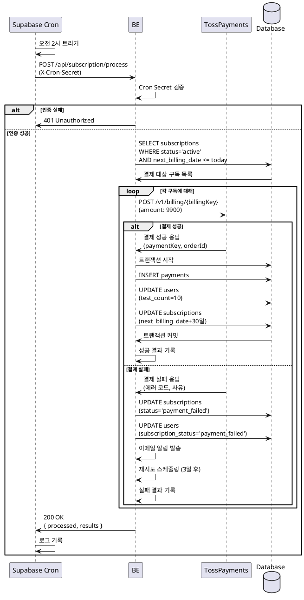
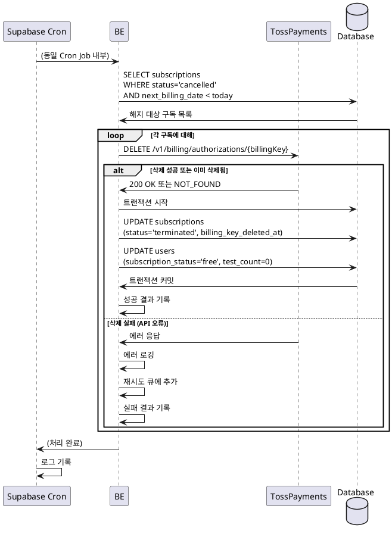

# 구독 관리 기능 유스케이스

---

# UC-015: 구독 관리 페이지 접근

## Primary Actor
로그인한 사용자

## Precondition
- 사용자가 Clerk를 통해 Google 계정으로 로그인되어 있음
- Supabase users 테이블에 사용자 레코드 존재

## Trigger
- 헤더 메뉴에서 "구독관리" 클릭
- 사이드바 구독 상태 영역 클릭
- 검사 횟수 부족 시 "구독하기" 버튼 클릭

## Main Scenario

### 1. 페이지 접근
**User**: 헤더 메뉴 또는 사이드바에서 구독 관리 클릭
**FE**: `/subscription` 페이지로 라우팅
**BE**: 서버 컴포넌트에서 데이터 페칭
- Clerk 세션 확인 및 user_id 추출
- Supabase users 테이블 조회 (subscription_status, test_count)
- subscriptions 테이블 조회 (구독 정보, LEFT JOIN)

**Database**: 다음 쿼리 실행
```sql
SELECT u.*, s.*
FROM users u
LEFT JOIN subscriptions s ON u.id = s.user_id
WHERE u.id = :user_id
```

### 2. 구독 상태별 UI 렌더링
**BE**: 조회된 데이터를 클라이언트 컴포넌트로 전달
**FE**: subscription_status에 따라 UI 렌더링

**무료 사용자 (subscription_status = 'free')**
- 이메일 주소 표시
- 현재 요금제: 무료
- 잔여 검사 횟수: X회
- Pro 요금제 혜택 안내
  - 월 9,900원
  - 월 10회 분석
  - gemini-2.5-pro 모델 사용
  - 고급 분석 (직업운, 사업운, 월별 운세)
- "Pro 구독하기" 버튼 표시

**Pro 구독자 활성 (subscription_status = 'pro')**
- 이메일 주소 표시
- 현재 요금제: Pro (활성)
- 잔여 검사 횟수: X회
- 다음 결제일: YYYY-MM-DD
- 구독 시작일: YYYY-MM-DD
- 카드 정보: **** **** **** 1234 (카드사명)
- "구독 취소" 버튼 표시

**Pro 구독자 취소 예약 (subscription_status = 'cancelled')**
- 이메일 주소 표시
- 현재 요금제: Pro (취소 예약)
- 잔여 검사 횟수: X회
- 다음 결제일: YYYY-MM-DD (해지 예정)
- 안내 메시지: "다음 결제일까지 Pro 혜택이 유지됩니다"
- "구독 재개" 버튼 표시

**결제 실패 (subscription_status = 'payment_failed')**
- 이메일 주소 표시
- 현재 요금제: Pro (결제 실패)
- 경고 메시지: "결제에 실패했습니다. 3일 후 재시도됩니다"
- 카드 정보 업데이트 안내
- "카드 정보 변경" 버튼 표시

**FE**: 렌더링된 페이지를 사용자에게 표시

## Edge Cases

### EC-1: 비로그인 상태 접근
**발생**: 사용자가 로그인하지 않고 구독 관리 페이지 접근
**처리**:
- Next.js 미들웨어에서 감지
- Clerk 로그인 페이지로 자동 리다이렉트
- returnUrl에 `/subscription` 설정

### EC-2: 데이터베이스 연결 실패
**발생**: Supabase 연결 오류
**처리**:
- 에러 메시지 표시
- "다시 시도" 버튼 제공
- 메시지: "일시적인 오류가 발생했습니다. 잠시 후 다시 시도해주세요."

### EC-3: 데이터 불일치
**발생**: subscription_status와 subscriptions 테이블 데이터 불일치
**처리**:
- 서버에서 데이터 정합성 체크
- 불일치 시 자동 동기화 시도
- 동기화 실패 시 에러 로깅 및 고객센터 안내

## Business Rules

### BR-1: 구독 상태 종류
- `free`: 무료 요금제 (초기 3회)
- `pro`: Pro 구독 활성
- `cancelled`: Pro 구독 취소 예약 (다음 결제일까지 유지)
- `payment_failed`: 결제 실패 (3일 후 재시도)

### BR-2: 접근 권한
- 본인 구독 정보만 조회 가능
- Supabase RLS로 권한 검증

### BR-3: UI 표시 기준
- 구독 상태에 따라 다른 액션 버튼 표시
- 무료 사용자는 구독 이력 없음 (subscriptions 테이블에 레코드 없음)

## Sequence Diagram



## Post-conditions

### 성공 시
- 사용자가 현재 구독 상태를 정확히 확인
- 구독 상태에 따른 적절한 액션 버튼 표시
- 다음 유스케이스로 진행 가능

### 실패 시
- 에러 메시지 표시
- 재시도 버튼 제공
- 사용자는 구독 정보 확인 불가

## UI/UX 요구사항

### 레이아웃
- 상단: 페이지 제목 "구독 관리"
- 현재 구독 정보 카드
  - 이메일
  - 요금제
  - 잔여 횟수
  - 다음 결제일 (Pro인 경우)
  - 카드 정보 (Pro인 경우)
- 하단: 액션 버튼 (상태에 따라 변경)

### 반응형 디자인
- 모바일: 단일 컬럼 레이아웃
- 데스크톱: 최대 너비 800px로 중앙 정렬

---

# UC-016: Pro 구독 신청 (토스페이먼츠 결제)

## Primary Actor
무료 사용자

## Precondition
- 사용자가 로그인되어 있음
- 현재 subscription_status = 'free'
- 구독 관리 페이지에 접근한 상태

## Trigger
사용자가 "Pro 구독하기" 버튼 클릭

## Main Scenario

### 1. 결제 프로세스 시작
**User**: "Pro 구독하기" 버튼 클릭
**FE**: 토스페이먼츠 SDK 초기화
- clientKey 로드 (NEXT_PUBLIC_TOSS_CLIENT_KEY)
- customerKey 생성 (UUID v4)
- sessionStorage에 customerKey 임시 저장

**FE**: payment 객체 생성
```typescript
const tossPayments = await loadTossPayments(clientKey);
const payment = tossPayments.payment({ customerKey });
```

### 2. 카드 등록 및 본인인증
**FE**: requestBillingAuth() 호출
```typescript
await payment.requestBillingAuth({
  method: 'CARD',
  successUrl: `${origin}/subscription/success`,
  failUrl: `${origin}/subscription/fail`,
  customerEmail: user.email,
  customerName: user.name,
});
```

**토스페이먼츠**: 결제창 렌더링
**User**: 카드 정보 입력
- 카드 번호 (16자리)
- 유효기간 (MM/YY)
- CVC (3자리)
- 카드 소유자 이름

**토스페이먼츠**: 본인인증 진행
**User**: 본인인증 완료 (휴대폰, 간편인증 등)

### 3. authKey 수신 및 리다이렉트
**토스페이먼츠**: 본인인증 성공
**토스페이먼츠**: successUrl로 리다이렉트
- 쿼리 파라미터: authKey, customerKey

**FE**: `/subscription/success` 페이지 로드
**FE**: 쿼리 파라미터 추출
- authKey: 빌링키 발급에 필요한 인증 키
- customerKey: 고객 식별자 (UUID)

### 4. 빌링키 발급 API 호출
**FE**: `/api/subscription/confirm` POST 요청
```json
{
  "authKey": "string",
  "customerKey": "uuid"
}
```

**BE**: 요청 검증
- authKey, customerKey 존재 확인
- Clerk 세션 확인

**BE**: 토스페이먼츠 빌링키 발급 API 호출
- Endpoint: `POST https://api.tosspayments.com/v1/billing/authorizations/issue`
- Authorization: Basic (시크릿 키 Base64 인코딩)
- Body: `{ authKey, customerKey }`

**토스페이먼츠**: 빌링키 발급
**토스페이먼츠**: 카드 정보 및 빌링키 반환
```json
{
  "billingKey": "string",
  "customerKey": "uuid",
  "card": {
    "number": "1234",
    "cardType": "신용",
    "cardCompany": "신한"
  }
}
```

### 5. 빌링키 저장
**BE**: Supabase subscriptions INSERT
```sql
INSERT INTO subscriptions (
  user_id,
  billing_key,
  customer_key,
  card_number,
  card_type,
  card_company,
  status,
  next_billing_date,
  created_at
) VALUES (
  :user_id,
  :billing_key,
  :customer_key,
  :card_number,
  :card_type,
  :card_company,
  'active',
  NOW() + INTERVAL '30 days',
  NOW()
)
```

**Database**: INSERT 실행
**Database**: 생성된 subscription_id 반환

### 6. 첫 결제 진행
**BE**: 자동결제 승인 API 호출
- Endpoint: `POST https://api.tosspayments.com/v1/billing/{billingKey}`
- Body:
```json
{
  "customerKey": "uuid",
  "amount": 9900,
  "orderId": "ORDER_{timestamp}_{random}",
  "orderName": "Vibe Fortune Pro 구독",
  "customerEmail": "user@example.com",
  "customerName": "홍길동"
}
```

**토스페이먼츠**: 카드 결제 승인
**토스페이먼츠**: 결제 결과 반환
```json
{
  "paymentKey": "string",
  "orderId": "string",
  "totalAmount": 9900,
  "status": "DONE"
}
```

### 7. 결제 성공 처리
**BE**: Supabase 트랜잭션 시작

**BE**: payments 테이블 INSERT
```sql
INSERT INTO payments (
  user_id,
  subscription_id,
  payment_key,
  order_id,
  amount,
  status,
  paid_at
) VALUES (
  :user_id,
  :subscription_id,
  :payment_key,
  :order_id,
  9900,
  'done',
  NOW()
)
```

**BE**: users 테이블 UPDATE
```sql
UPDATE users
SET
  subscription_status = 'pro',
  test_count = 10,
  updated_at = NOW()
WHERE id = :user_id
```

**BE**: subscriptions 테이블 UPDATE
```sql
UPDATE subscriptions
SET
  last_billing_date = NOW(),
  updated_at = NOW()
WHERE id = :subscription_id
```

**Database**: 트랜잭션 커밋
**BE**: 성공 응답 반환

### 8. 구독 관리 페이지 이동
**FE**: 성공 응답 수신
**FE**: 성공 토스트 메시지 표시
**FE**: `/subscription` 페이지로 리다이렉트
**FE**: Pro 구독 상태 표시
**User**: Pro 구독 완료 확인

## Edge Cases

### EC-1: 사용자가 결제창 닫기
**발생**: 카드 등록 중 사용자가 창 닫음
**처리**:
- SDK에서 USER_CANCEL 에러 발생
- 구독 관리 페이지로 복귀
- 구독 미완료 상태 유지
- 메시지: "카드 등록이 취소되었습니다"

### EC-2: 카드 정보 오류
**발생**: 잘못된 카드 번호, 유효기간 등
**처리**:
- 토스페이먼츠에서 에러 메시지 표시
- 사용자가 재입력 가능
- 메시지: "카드 정보가 올바르지 않습니다. 다시 확인해주세요"

### EC-3: 본인인증 실패
**발생**: 본인인증 시간 초과, 인증 거부 등
**처리**:
- 토스페이먼츠에서 인증 실패 메시지 표시
- 재시도 안내
- failUrl로 리다이렉트 (선택 사항)

### EC-4: 빌링키 발급 실패
**발생**: authKey 만료, API 오류 등
**처리**:
- 에러 코드 확인 (INVALID_BILLING_AUTH 등)
- 사용자에게 에러 메시지 표시
- 고객센터 안내
- 메시지: "카드 등록에 실패했습니다. 고객센터로 문의해주세요"

### EC-5: 첫 결제 실패
**발생**: 카드 한도 초과, 잔액 부족 등
**처리**:
- 발급된 빌링키 삭제 (토스페이먼츠 API 호출)
- subscriptions 레코드 삭제
- 트랜잭션 롤백
- 사용자에게 에러 메시지 표시
- 메시지: "결제에 실패했습니다. 카드 한도 또는 잔액을 확인해주세요"

### EC-6: 중복 구독 시도
**발생**: 이미 Pro 구독 중인 사용자가 다시 구독 시도
**처리**:
- 서버에서 subscription_status 확인
- 이미 구독 중이면 에러 반환
- 메시지: "이미 Pro 구독 중입니다"
- 현재 구독 정보 표시

### EC-7: 네트워크 에러
**발생**: API 호출 중 네트워크 오류
**처리**:
- 에러 로깅
- 사용자에게 재시도 버튼 제공
- 메시지: "네트워크 오류가 발생했습니다. 다시 시도해주세요"

### EC-8: SDK 로드 실패
**발생**: 토스페이먼츠 SDK 스크립트 로드 실패
**처리**:
- 페이지 새로고침 안내
- 메시지: "결제 시스템 로딩 중 오류가 발생했습니다. 페이지를 새로고침해주세요"

## Business Rules

### BR-1: Pro 요금제 정책
- 월 9,900원 (자동결제)
- 월 10회 분석
- gemini-2.5-pro 모델 사용
- 고급 분석 (직업운, 사업운, 월별 운세)

### BR-2: customerKey 보안
- UUID v4 사용 (유추 불가능)
- 이메일, 전화번호 사용 금지
- sessionStorage에만 임시 저장

### BR-3: 빌링키 보안
- 암호화하여 저장
- 로그에 노출 금지
- 한 번 발급되면 재조회 불가

### BR-4: 결제 프로세스
- 빌링키 발급 → 첫 결제 → DB 업데이트 순서
- 첫 결제 실패 시 빌링키 삭제 및 롤백
- 트랜잭션으로 데이터 정합성 보장

### BR-5: 다음 결제일
- 구독 시작일 + 30일
- 매월 동일한 날짜에 결제 (Cron Job)

## Sequence Diagram



## Post-conditions

### 성공 시
- subscriptions 테이블에 새 레코드 생성
- payments 테이블에 첫 결제 기록
- users.subscription_status = 'pro'
- users.test_count = 10
- 사용자는 Pro 구독자로 전환

### 실패 시
- 빌링키 발급된 경우 삭제
- 데이터베이스 변경 사항 롤백
- 사용자는 무료 요금제 유지
- 에러 메시지 표시

---

# UC-017: Pro 구독 취소

## Primary Actor
Pro 구독자 (활성)

## Precondition
- 사용자가 로그인되어 있음
- subscription_status = 'pro'
- subscriptions 테이블에 활성 구독 존재

## Trigger
사용자가 "구독 취소" 버튼 클릭

## Main Scenario

### 1. 취소 확인 다이얼로그 표시
**User**: "구독 취소" 버튼 클릭
**FE**: 확인 다이얼로그 렌더링
- 제목: "구독을 취소하시겠습니까?"
- 메시지: "다음 결제일(YYYY-MM-DD)까지 Pro 혜택이 유지됩니다"
- 안내: "다음 결제일 전까지 언제든지 구독을 재개할 수 있습니다"
- 버튼: "취소", "확인"

**FE**: 사용자 선택 대기

### 2. 구독 취소 처리
**User**: "확인" 버튼 클릭
**FE**: 다이얼로그 닫기
**FE**: 로딩 상태 표시
**FE**: `/api/subscription/cancel` POST 요청

**BE**: 요청 검증
- Clerk 세션 확인
- subscription_status = 'pro' 확인

**BE**: Supabase 업데이트
```sql
BEGIN TRANSACTION;

UPDATE subscriptions
SET
  status = 'cancelled',
  updated_at = NOW()
WHERE user_id = :user_id AND status = 'active';

UPDATE users
SET
  subscription_status = 'cancelled',
  updated_at = NOW()
WHERE id = :user_id;

COMMIT;
```

**Database**: 트랜잭션 실행
**Database**: 업데이트 성공 반환

### 3. 페이지 업데이트
**BE**: 성공 응답 반환
**FE**: 로딩 상태 종료
**FE**: 성공 토스트 메시지 표시
**FE**: 페이지 리로드 또는 상태 업데이트
**FE**: Pro (취소 예약) 상태 표시
- 다음 결제일까지 Pro 혜택 유지 안내
- "구독 재개" 버튼 표시
**User**: 취소 예약 상태 확인

## Edge Cases

### EC-1: 다이얼로그에서 "취소" 버튼 클릭
**발생**: 사용자가 취소 확인 다이얼로그에서 "취소" 선택
**처리**:
- 다이얼로그 닫기
- 구독 상태 유지
- 아무 변경 없음

### EC-2: 다이얼로그 외부 클릭
**발생**: 사용자가 다이얼로그 외부 영역 클릭
**처리**:
- 다이얼로그 닫기
- 구독 상태 유지

### EC-3: 이미 취소 예약된 구독
**발생**: subscription_status = 'cancelled'인데 취소 버튼 클릭
**처리**:
- 서버에서 상태 확인
- 에러 반환
- 메시지: "이미 취소 예약된 구독입니다"
- 페이지 새로고침

### EC-4: 네트워크 에러
**발생**: API 호출 중 네트워크 오류
**처리**:
- 로딩 상태 종료
- 에러 토스트 메시지
- 재시도 버튼 제공
- 메시지: "취소 처리 중 오류가 발생했습니다. 다시 시도해주세요"

### EC-5: 데이터베이스 업데이트 실패
**발생**: 트랜잭션 실행 중 오류
**처리**:
- 트랜잭션 롤백
- 에러 로깅
- 사용자에게 에러 메시지
- 메시지: "일시적인 오류가 발생했습니다. 잠시 후 다시 시도해주세요"

### EC-6: 다음 결제일 당일 취소
**발생**: 결제일 당일에 사용자가 취소 시도
**처리**:
- 정상 처리 (당일까지 Pro 혜택 유지)
- 다음 날 Cron Job에서 해지 처리

## Business Rules

### BR-1: 취소 정책
- 즉시 해지 불가
- 다음 결제일까지 Pro 혜택 유지
- 다음 결제일 전까지 재개 가능

### BR-2: 상태 변경
- subscriptions.status: 'active' → 'cancelled'
- users.subscription_status: 'pro' → 'cancelled'

### BR-3: 빌링키 유지
- 취소 예약 시 빌링키는 유지
- 다음 결제일에 Cron Job이 빌링키 삭제

### BR-4: 검사 횟수 유지
- 취소 예약 시 test_count 유지
- 다음 결제일까지 사용 가능

## Sequence Diagram



## Post-conditions

### 성공 시
- subscriptions.status = 'cancelled'
- users.subscription_status = 'cancelled'
- 다음 결제일까지 Pro 혜택 유지
- 구독 재개 가능

### 실패 시
- 데이터베이스 변경 없음
- 구독 상태 유지
- 에러 메시지 표시

---

# UC-018: Pro 구독 재개

## Primary Actor
Pro 구독자 (취소 예약)

## Precondition
- 사용자가 로그인되어 있음
- subscription_status = 'cancelled'
- subscriptions.status = 'cancelled'
- 다음 결제일이 아직 도래하지 않음

## Trigger
사용자가 "구독 재개" 버튼 클릭

## Main Scenario

### 1. 재개 확인 다이얼로그 표시
**User**: "구독 재개" 버튼 클릭
**FE**: 확인 다이얼로그 렌더링
- 제목: "구독을 재개하시겠습니까?"
- 메시지: "다음 결제일(YYYY-MM-DD)에 자동 결제가 진행됩니다"
- 버튼: "취소", "확인"

**FE**: 사용자 선택 대기

### 2. 구독 재개 처리
**User**: "확인" 버튼 클릭
**FE**: 다이얼로그 닫기
**FE**: 로딩 상태 표시
**FE**: `/api/subscription/resume` POST 요청

**BE**: 요청 검증
- Clerk 세션 확인
- subscription_status = 'cancelled' 확인
- next_billing_date가 미래인지 확인

**BE**: Supabase 업데이트
```sql
BEGIN TRANSACTION;

UPDATE subscriptions
SET
  status = 'active',
  updated_at = NOW()
WHERE user_id = :user_id AND status = 'cancelled';

UPDATE users
SET
  subscription_status = 'pro',
  updated_at = NOW()
WHERE id = :user_id;

COMMIT;
```

**Database**: 트랜잭션 실행
**Database**: 업데이트 성공 반환

### 3. 페이지 업데이트
**BE**: 성공 응답 반환
**FE**: 로딩 상태 종료
**FE**: 성공 토스트 메시지 표시
**FE**: 페이지 리로드 또는 상태 업데이트
**FE**: Pro (활성) 상태 표시
- 다음 결제일 자동 결제 안내
- "구독 취소" 버튼 표시
**User**: 활성 상태 확인

## Edge Cases

### EC-1: 다이얼로그에서 "취소" 버튼 클릭
**발생**: 사용자가 재개 확인 다이얼로그에서 "취소" 선택
**처리**:
- 다이얼로그 닫기
- 취소 예약 상태 유지

### EC-2: 다음 결제일 이후 재개 시도
**발생**: next_billing_date < 오늘
**처리**:
- 서버에서 날짜 검증
- 에러 반환
- 메시지: "이미 해지된 구독입니다. 신규 구독이 필요합니다"
- "Pro 구독하기" 버튼 안내

### EC-3: 빌링키 만료/삭제
**발생**: 빌링키가 이미 삭제된 경우
**처리**:
- 서버에서 billing_key_deleted_at 확인
- 에러 반환
- 메시지: "구독 재개가 불가능합니다. 신규 구독이 필요합니다"

### EC-4: 이미 활성 구독
**발생**: subscription_status = 'pro'인데 재개 버튼 클릭
**처리**:
- 서버에서 상태 확인
- 에러 반환
- 메시지: "이미 활성 구독입니다"
- 페이지 새로고침

### EC-5: 네트워크 에러
**발생**: API 호출 중 네트워크 오류
**처리**:
- 로딩 상태 종료
- 에러 토스트 메시지
- 재시도 버튼 제공

## Business Rules

### BR-1: 재개 정책
- 다음 결제일 전까지만 재개 가능
- 재개 즉시 Pro 상태로 전환
- 다음 결제일에 자동 결제 재개

### BR-2: 상태 변경
- subscriptions.status: 'cancelled' → 'active'
- users.subscription_status: 'cancelled' → 'pro'

### BR-3: 빌링키 확인
- 빌링키가 유효해야 재개 가능
- billing_key_deleted_at이 NULL이어야 함

### BR-4: 다음 결제일 유지
- next_billing_date는 변경하지 않음
- 기존 예정된 결제일에 자동 결제

## Sequence Diagram



## Post-conditions

### 성공 시
- subscriptions.status = 'active'
- users.subscription_status = 'pro'
- 다음 결제일에 자동 결제 재개
- 구독 취소 가능

### 실패 시
- 데이터베이스 변경 없음
- 취소 예약 상태 유지
- 에러 메시지 표시

---

# UC-019: 정기 결제 자동 실행 (Cron Job)

## Primary Actor
Supabase Cron Job (시스템)

## Precondition
- Supabase pg_cron, pg_net 확장 활성화
- Cron Job 등록 완료 (매일 오전 2시)
- Vault에 CRON_SECRET 저장
- subscriptions 테이블에 활성 구독 존재

## Trigger
매일 오전 2시 Cron Job 실행

## Main Scenario

### 1. Cron Job 실행
**Supabase Cron**: 스케줄된 시간 도래 (매일 오전 2시)
**Supabase Cron**: process_subscription_payments() 함수 실행

**Supabase Function**: pg_net.http_post() 호출
- URL: `https://your-domain.com/api/subscription/process`
- Headers:
  - Content-Type: application/json
  - X-Cron-Secret: {from vault}
- Body: `{ "date": "YYYY-MM-DD" }`

### 2. Cron 엔드포인트 검증
**BE**: `/api/subscription/process` POST 요청 수신
**BE**: 헤더에서 X-Cron-Secret 추출
**BE**: 환경 변수 CRON_SECRET과 비교

**BE**: 인증 실패 시
- 401 Unauthorized 반환
- 에러 로깅
- 종료

**BE**: 인증 성공 시 계속 진행

### 3. 결제 대상 구독 조회
**BE**: Supabase 쿼리 실행
```sql
SELECT *
FROM subscriptions
WHERE status = 'active'
  AND next_billing_date <= CURRENT_DATE
ORDER BY next_billing_date ASC
```

**Database**: 결제 대상 구독 목록 반환

**BE**: 조회 결과 확인
- 0건인 경우: 성공 응답 반환 및 종료
- 1건 이상인 경우: 각 구독에 대해 순회 처리

### 4. 각 구독에 대한 결제 처리

**BE**: 구독 정보 추출
- subscription_id
- user_id
- billing_key
- customer_key

**BE**: 토스페이먼츠 자동결제 승인 API 호출
- Endpoint: `POST https://api.tosspayments.com/v1/billing/{billingKey}`
- Authorization: Basic (시크릿 키 Base64 인코딩)
- Body:
```json
{
  "customerKey": "uuid",
  "amount": 9900,
  "orderId": "ORDER_{user_id}_{timestamp}",
  "orderName": "Vibe Fortune Pro 구독",
  "customerEmail": "user@example.com",
  "customerName": "홍길동"
}
```

**토스페이먼츠**: 카드 결제 승인 처리

### 5-A. 결제 성공 시
**토스페이먼츠**: 결제 성공 응답
```json
{
  "paymentKey": "string",
  "orderId": "string",
  "totalAmount": 9900,
  "status": "DONE"
}
```

**BE**: Supabase 트랜잭션 시작

**BE**: payments 테이블 INSERT
```sql
INSERT INTO payments (
  user_id,
  subscription_id,
  payment_key,
  order_id,
  amount,
  status,
  paid_at
) VALUES (
  :user_id,
  :subscription_id,
  :payment_key,
  :order_id,
  9900,
  'done',
  NOW()
)
```

**BE**: users 테이블 UPDATE
```sql
UPDATE users
SET
  test_count = 10,
  updated_at = NOW()
WHERE id = :user_id
```

**BE**: subscriptions 테이블 UPDATE
```sql
UPDATE subscriptions
SET
  next_billing_date = next_billing_date + INTERVAL '30 days',
  last_billing_date = NOW(),
  updated_at = NOW()
WHERE id = :subscription_id
```

**Database**: 트랜잭션 커밋

**BE**: 결과 기록
- 처리 결과 배열에 추가
- `{ subscriptionId, userId, success: true }`

### 5-B. 결제 실패 시
**토스페이먼츠**: 결제 실패 응답
- 에러 코드: REJECT_CARD_PAYMENT 등
- 사유: 한도 초과, 잔액 부족, 카드 만료 등

**BE**: Supabase 업데이트
```sql
BEGIN TRANSACTION;

UPDATE subscriptions
SET
  status = 'payment_failed',
  updated_at = NOW()
WHERE id = :subscription_id;

UPDATE users
SET
  subscription_status = 'payment_failed',
  updated_at = NOW()
WHERE id = :user_id;

COMMIT;
```

**Database**: 트랜잭션 커밋

**BE**: 이메일 알림 발송
- 제목: "Vibe Fortune 결제 실패 안내"
- 내용: 결제 실패 사유, 3일 후 재시도 안내
- 카드 정보 확인 요청

**BE**: 결과 기록
- `{ subscriptionId, userId, success: false, error: "결제 실패" }`

**BE**: 3일 후 재시도 스케줄링
- 별도 테이블 또는 재시도 큐에 추가

### 6. 전체 처리 결과 반환
**BE**: 모든 구독 처리 완료
**BE**: 처리 결과 집계
- 총 처리 건수
- 성공 건수
- 실패 건수
- 각 구독별 상세 결과

**BE**: 200 OK 응답 반환
```json
{
  "success": true,
  "processed": 10,
  "results": [
    { "subscriptionId": "uuid", "success": true },
    { "subscriptionId": "uuid", "success": false, "error": "결제 실패" }
  ]
}
```

**Supabase Cron**: 응답 수신 및 로그 기록

## Edge Cases

### EC-1: Cron 인증 실패
**발생**: X-Cron-Secret 불일치
**처리**:
- 401 응답 반환
- 에러 로깅 (무단 접근 시도)
- 알림 발송 (보안 담당자)

### EC-2: 결제 대상 없음
**발생**: 오늘 결제할 구독이 없음
**처리**:
- 정상 응답 반환
- 로그: "처리 대상 없음"
- 종료

### EC-3: 토스페이먼츠 API 장애
**발생**: 토스페이먼츠 서버 오류
**처리**:
- 재시도 큐에 추가
- 다음 Cron 실행 시 재시도
- 알림 발송 (관리자)

### EC-4: 카드 한도 초과
**발생**: 결제 실패 (REJECT_CARD_PAYMENT)
**처리**:
- subscription 상태 변경 (payment_failed)
- 이메일 알림 발송
- 3일 후 재시도 스케줄링

### EC-5: 카드 만료
**발생**: 결제 실패 (INVALID_CARD)
**처리**:
- subscription 상태 변경 (payment_failed)
- 카드 정보 업데이트 요청 이메일
- 재시도하지 않음 (사용자 액션 필요)

### EC-6: 동시 다중 결제 방지
**발생**: 같은 구독에 대해 중복 결제 시도
**처리**:
- 데이터베이스 트랜잭션으로 방지
- orderId에 타임스탬프 포함하여 고유성 보장

### EC-7: Cron Job 실행 실패
**발생**: Supabase Cron이 실행되지 않음
**처리**:
- 다음 날 실행 시 누락된 결제 처리
- next_billing_date <= 오늘 조건으로 자동 포함
- 모니터링 알림

## Business Rules

### BR-1: Cron 실행 시간
- 매일 오전 2시 (한국 시간)
- Cron 표현식: `0 2 * * *`

### BR-2: 결제 대상 선정
- status = 'active'
- next_billing_date <= 오늘

### BR-3: 결제 금액
- 고정 금액: 9,900원
- Pro 요금제 월 구독료

### BR-4: 결제 성공 시 처리
- test_count 10으로 재설정
- next_billing_date +30일
- last_billing_date 현재 시각

### BR-5: 결제 실패 시 처리
- subscription 상태 변경 (payment_failed)
- 이메일 알림 발송
- 3일 후 재시도 스케줄링

### BR-6: 재시도 정책
- 최대 1회 재시도 (3일 후)
- 재시도 실패 시 구독 해지

### BR-7: 보안
- Cron Secret으로 엔드포인트 보호
- Supabase Vault에 시크릿 저장
- service_role 키로 데이터베이스 접근

## Sequence Diagram



## Post-conditions

### 성공 시
- 해당 구독의 결제 완료
- payments 테이블에 결제 기록
- users.test_count = 10
- subscriptions.next_billing_date +30일
- 사용자는 지속적으로 Pro 혜택 이용

### 실패 시
- subscriptions.status = 'payment_failed'
- users.subscription_status = 'payment_failed'
- 이메일 알림 발송
- 3일 후 재시도 스케줄링

---

# UC-020: 구독 자동 해지 (Cron Job)

## Primary Actor
Supabase Cron Job (시스템)

## Precondition
- Supabase pg_cron, pg_net 확장 활성화
- Cron Job 등록 완료 (매일 오전 2시)
- subscriptions 테이블에 취소 예약 구독 존재

## Trigger
매일 오전 2시 Cron Job 실행 (UC-019와 동일 Cron)

## Main Scenario

### 1. 해지 대상 구독 조회
**BE**: `/api/subscription/process` 엔드포인트 내부
**BE**: Supabase 쿼리 실행
```sql
SELECT *
FROM subscriptions
WHERE status = 'cancelled'
  AND next_billing_date < CURRENT_DATE
ORDER BY next_billing_date ASC
```

**Database**: 해지 대상 구독 목록 반환

**BE**: 조회 결과 확인
- 0건인 경우: 종료
- 1건 이상인 경우: 각 구독에 대해 순회 처리

### 2. 각 구독에 대한 해지 처리

**BE**: 구독 정보 추출
- subscription_id
- user_id
- billing_key
- customer_key

### 3. 빌링키 삭제 API 호출
**BE**: 토스페이먼츠 빌링키 삭제 API 호출
- Endpoint: `DELETE https://api.tosspayments.com/v1/billing/authorizations/{billingKey}`
- Authorization: Basic (시크릿 키 Base64 인코딩)

**토스페이먼츠**: 빌링키 삭제 처리

### 4-A. 빌링키 삭제 성공
**토스페이먼츠**: 200 OK 응답

**BE**: Supabase 트랜잭션 시작

**BE**: subscriptions 테이블 UPDATE
```sql
UPDATE subscriptions
SET
  status = 'terminated',
  billing_key_deleted_at = NOW(),
  updated_at = NOW()
WHERE id = :subscription_id
```

**BE**: users 테이블 UPDATE
```sql
UPDATE users
SET
  subscription_status = 'free',
  test_count = 0,
  updated_at = NOW()
WHERE id = :user_id
```

**Database**: 트랜잭션 커밋

**BE**: 결과 기록
- `{ subscriptionId, userId, success: true, action: "terminated" }`

### 4-B. 빌링키 삭제 실패
**토스페이먼츠**: 에러 응답
- 이미 삭제된 경우
- API 오류

**BE**: 에러 코드 확인

**BE**: 이미 삭제된 경우 (NOT_FOUND 등)
- 정상 처리로 간주
- subscriptions 상태만 업데이트
- users 상태 업데이트

**BE**: API 오류인 경우
- 에러 로깅
- 재시도 큐에 추가
- 다음 Cron 실행 시 재시도
- 결과 기록 (failed)

### 5. 전체 처리 결과 반환
**BE**: 모든 해지 처리 완료
**BE**: 처리 결과 집계
- 총 해지 건수
- 성공 건수
- 실패 건수

**BE**: 로그 기록 및 모니터링

## Edge Cases

### EC-1: 해지 대상 없음
**발생**: 오늘 해지할 구독이 없음
**처리**:
- 정상 종료
- 로그: "해지 대상 없음"

### EC-2: 빌링키 이미 삭제됨
**발생**: 토스페이먼츠에서 NOT_FOUND 응답
**처리**:
- 정상 처리로 간주
- subscriptions, users 상태 업데이트
- 성공으로 기록

### EC-3: 토스페이먼츠 API 장애
**발생**: API 서버 오류
**처리**:
- 재시도 큐에 추가
- 다음 Cron 실행 시 재시도
- 최대 3회 재시도

### EC-4: 사용자가 해지 당일 서비스 이용 중
**발생**: 해지 처리 중 사용자가 분석 진행
**처리**:
- 데이터베이스 트랜잭션으로 순서 보장
- 사용자 요청 완료 후 상태 변경

### EC-5: 동시 다중 해지
**발생**: 같은 날 여러 구독 해지
**처리**:
- 각각 독립적으로 처리
- 순차 또는 병렬 처리 (설정에 따라)

### EC-6: Cron Job 실행 실패
**발생**: Cron이 실행되지 않음
**처리**:
- 다음 날 실행 시 누락된 해지 처리
- next_billing_date < 오늘 조건으로 자동 포함

## Business Rules

### BR-1: 해지 대상 선정
- status = 'cancelled'
- next_billing_date < 오늘 (지난 구독)

### BR-2: 해지 처리 순서
1. 빌링키 삭제 (토스페이먼츠)
2. subscriptions 상태 변경 (terminated)
3. users 상태 변경 (free, test_count=0)

### BR-3: 무료 전환 시 검사 횟수
- test_count = 0 (초기 3회는 가입 시에만 제공)
- Pro 구독을 다시 시작해야 검사 가능

### BR-4: 빌링키 삭제 시각
- billing_key_deleted_at에 현재 시각 기록
- 추후 감사 및 추적용

### BR-5: 재구독
- 해지 후 재구독 시 신규 빌링키 발급 필요
- UC-016 프로세스 처음부터 진행

## Sequence Diagram



## Post-conditions

### 성공 시
- subscriptions.status = 'terminated'
- subscriptions.billing_key_deleted_at = 현재 시각
- users.subscription_status = 'free'
- users.test_count = 0
- 사용자는 무료 요금제로 전환
- 빌링키 완전 삭제

### 실패 시
- 구독 상태 유지 (cancelled)
- 재시도 큐에 추가
- 다음 Cron 실행 시 재시도

---

## 변경 이력

| 버전 | 날짜 | 작성자 | 변경 내용 |
|------|------|--------|-----------|
| 1.0  | 2025-10-28 | Claude Code | 초기 작성 - UC-015 ~ UC-020 |
